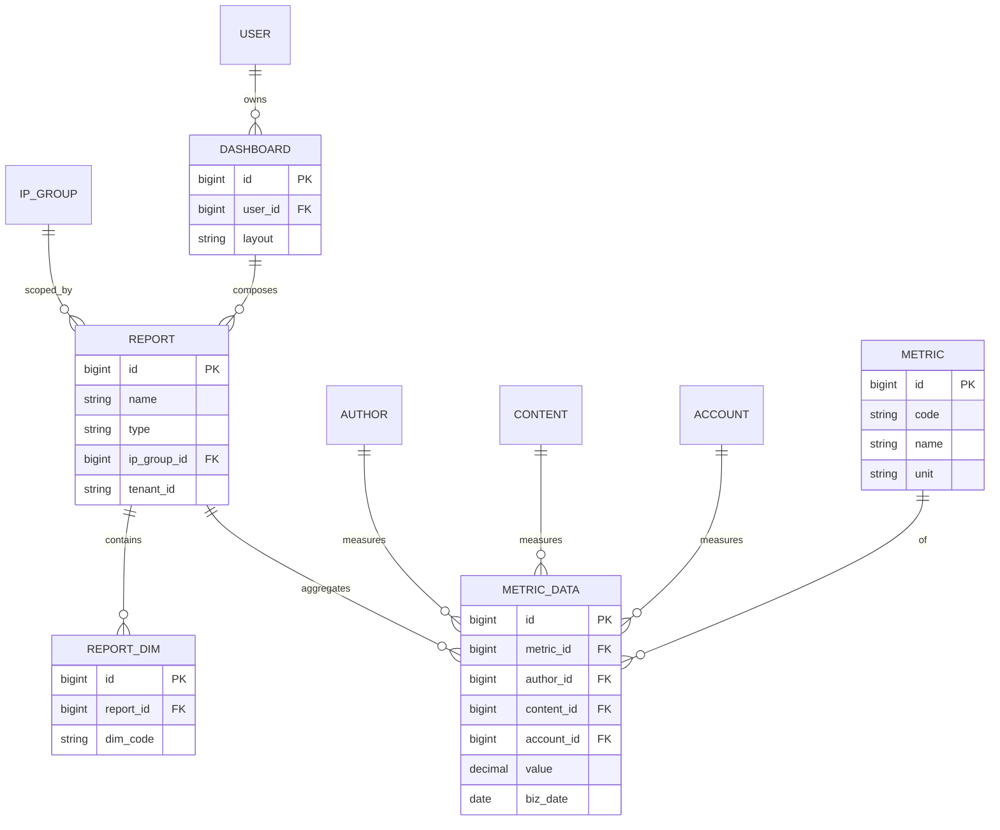

# PRD-M6-数据分析

> **业务域**：M6 数据分析
> **功能模块**：指标管理 + 8 张报表 + 漏斗 + 自定义查询 + 大屏
> **详细设计章节**：5.25、5.26、5.27、5.28、5.29、5.30、5.31
> **版本**：v1.0 | 2026-06-07
> **状态**：Draft
> **全局规范**：[`docs/engineering/GLOBAL-CONVENTIONS.md`](./../engineering/GLOBAL-CONVENTIONS.md)

---

## 0. 元信息

| 字段 | 值 |
|------|---|
| 模块 | M6 数据分析 |
| 业务域 | 数据分析（ANALYSIS） |
| 详细设计 | `## 5.25~5.31` |

---

## 1. 概述

### 1.1 一句话描述

平台**数据中心**：统一管理指标定义、提供 8+ 张预置报表、漏斗分析、自定义查询、可视化大屏，覆盖运营/财务/管理决策需求。

### 1.2 目标

| 维度 | 目标 |
|------|------|
| 替代 Excel | 8 张报表替代 8 个 Excel |
| 灵活分析 | 漏斗 + 自定义查询 |
| 可视化 | 大屏实时呈现 |

### 1.3 术语表

| 术语 | 定义 |
|------|------|
| **基础指标** | 直接映射数据库字段（BASIC） |
| **计算指标** | 由基础指标公式计算（CALCULATED） |
| **派生指标** | 由其他指标进一步计算（DERIVED） |
| **漏斗** | 多步骤转化分析（如关注→阅读→互动→订单） |
| **预置漏斗** | 系统提供 4 个（关注/阅读/互动/订单） |
| **自定义漏斗** | 用户自行配置步骤 |
| **自定义查询** | 自由拼接 SQL 或可视化查询 |
| **大屏** | 数据可视化展示（实时/业务/汇报/监控） |

---

## 2. 范围

### 3.1 In Scope（7 个 FR 模块）

| FR 编号 | 名称 | 优先级 | 详细设计 |
|---------|------|--------|---------|
| FR-M6-001 | 指标管理 | P0 | 5.25 |
| FR-M6-002 | 数据报表（8 张：账号统一视图/状态监控/短视频产出/直播时长/成本分摊/ROI/IP 团队/异常预警） | P0 | 5.26 |
| FR-M6-003 | 财务概览 | P0 | 5.27 |
| FR-M6-004 | 漏斗分析（预置 + 自定义） | P0 | 5.28 |
| FR-M6-005 | 自定义查询 | P0 | 5.29 |
| FR-M6-006 | 数据大屏 | P0 | 5.30 |
| FR-M6-007 | 大屏配置 | P1 | 5.31 |

---

## 3. 关键 FR 详述（节选）

### FR-M6-001 指标管理（5.25）

#### 数据项

| 字段 | 控件 | 字典 |
|------|------|------|
| `metric_name` | `<Input />` | - |
| `metric_code` | `<Input />` | -（英文+下划线+唯一） |
| `metric_formula` | `<CodeEditor language="sql" />` | - |
| `data_source` | `<Select />` | 预定义表名 |
| `metric_type` | `<DictSelect dict-type="dict_perf_metric_type" />` | 字典 |
| `unit` | `<Input />` | - |
| `description` | `<TextArea />` | - |

#### 业务规则

- 指标编码全局唯一
- 基础/计算/派生 三种类型
- 被引用时不可删除（错误码 1502）

#### 验收

**AC-M6-001-1**（创建指标）
**AC-M6-001-2**（指标类型字典）
**AC-M6-001-3**（被引用不可删）

---

### FR-M6-002 数据报表（5.26，8 张）

8 张报表：全平台账号视图、账号状态监控、短视频产出、直播时长、账号成本分摊、ROI 分析、IP 团队人员配置、账号异常预警。

通用模式：

| 控件 | 类型 |
|------|------|
| `ipGroupId` | `<IpGroupTreeSelect />` |
| `accountId` | `<AccountSelect />` |
| `platformType` | `<DictSelect dict-type="dict_platform_type" />` |
| `dateRange` | `<DateRangePicker />` |
| `timeDimension` | `<Select />`（DAY/WEEK/MONTH） |
| 表格/图表/导出 | - |

详细字段见 5.26.x 子章节。

---

### FR-M6-004 漏斗分析（5.28）

#### 预置漏斗

| 漏斗 | 步骤 |
|------|------|
| 关注转化 | 曝光 → 关注 → 二次访问 |
| 阅读转化 | 推送 → 阅读 → 完读 |
| 互动转化 | 阅读 → 点赞 → 评论 → 转发 |
| 订单转化 | 加购 → 提交订单 → 支付 |

#### 自定义漏斗

- 用户配置步骤（每步一个事件）
- 计算每步转化率

#### 验收

**AC-M6-004-1**（预置漏斗查看）
**AC-M6-004-2**（自定义漏斗）
**AC-M6-004-3**（漏斗类型字典）
- 字段：`funnelType` 用 `<DictSelect dict-type="dict_funnel_type" />`

---

### FR-M6-005 自定义查询（5.29）

#### 描述

自由拼接 SQL 或可视化拖拽生成查询。

#### 验收

**AC-M6-005-1**（SQL 查询）
**AC-M6-005-2**（保存查询）
**AC-M6-005-3**（查询状态字典）
- 字段：`status` 用 `<DictSelect dict-type="dict_query_status" />`

---

### FR-M6-006/007 大屏（5.30/5.31）

#### 大屏类型

- 实时大屏 / 业务大屏 / 汇报大屏 / 监控大屏

#### 验收

**AC-M6-006-1**（大屏展示）
**AC-M6-006-2**（大屏类型字典）
- 字段：`dashboardType` 用 `<DictSelect dict-type="dict_dashboard_type" />`

---

## 4. 关联属性（🔴 必查）

| 字段 | 选择器 |
|------|--------|
| `ipGroupId` | `<IpGroupTreeSelect />` |
| `accountId` | `<AccountSelect />` |
| `platformType` | `<DictSelect dict-type="dict_platform_type" />` |
| `contentType` | `<DictSelect dict-type="dict_content_type" />` |
| `reportType` | `<DictSelect dict-type="dict_report_type" />` |
| `reportPeriod` | `<DictSelect dict-type="dict_report_period" />` |
| `funnelType` | `<DictSelect dict-type="dict_funnel_type" />` |
| `queryStatus` | `<DictSelect dict-type="dict_query_status" />` |
| `dashboardType` | `<DictSelect dict-type="dict_dashboard_type" />` |
| `metricType` | `<DictSelect dict-type="dict_perf_metric_type" />` |
| `alertType` | `<DictSelect dict-type="dict_alert_type" />` |
| `alertLevel` | `<DictSelect dict-type="dict_alert_level" />` |
| `alertStatus` | `<DictSelect dict-type="dict_alert_status" />` |

---

*下一步：UX / API / STATE / SLICES / CHECKLIST / TESTCASES。*

---

## 核心 ER 图

详见 [`GLOBAL-CONVENTIONS.md § 1`](../engineering/GLOBAL-CONVENTIONS.md) (铁律)
