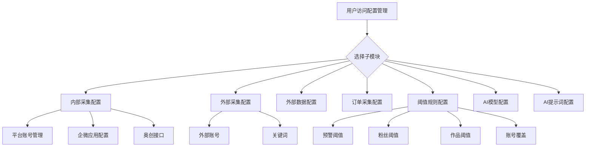
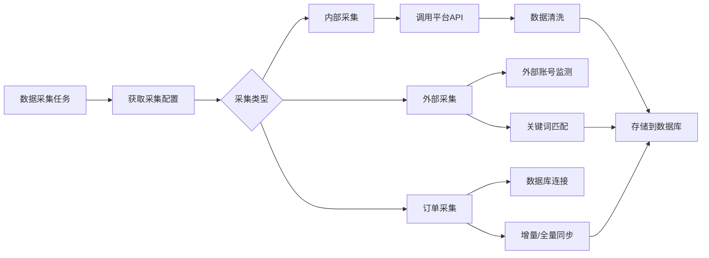
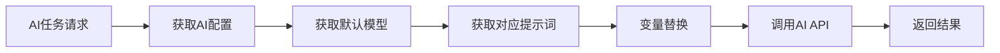

# PRD-M8-配置管理

> **业务域**：M8 配置管理
> **合并来源**：`配置管理模块PRD.md` v1.0 → 本文档（SSOT）
> **数据模型 ADR**：[`ADR-014`](../adr/ADR-014-M8-配置管理数据模型.md)
> **API 规格**：[`API-M8-配置管理.md`](../engineering/API-M8-配置管理.md)
> **版本**：v2.2 | 2026-06-11（根 PRD 全量合并 + 实现对齐）
> **全局规范**：[`GLOBAL-CONVENTIONS.md`](../engineering/GLOBAL-CONVENTIONS.md)

---

## 0. 元信息

| 字段 | 值 |
|------|---|
| 模块 | M8 配置管理 |
| 子模块数 | 7 |
| 功能点 | CFG-001 ~ CFG-036 |
| 状态 | 已实现（订单连接测试、奥创后端权限为 stub/待补） |

---

## 1. 文档概述

### 1.1 背景与目的

配置管理是平台基础支撑模块，为**数据采集**、**AI 智能分析**、**阈值预警**等核心功能提供系统级配置能力。

### 1.2 业务范围

| # | 子模块 | FR | 功能定位 |
|---|--------|-----|----------|
| 1 | 内部采集配置 | FR-M8-001 | 内部平台账号采集配置 |
| 2 | 外部采集配置 | FR-M8-002 | 外部账号监控、关键词配置 |
| 3 | 外部数据配置 | FR-M8-003 | 第三方 API 数据源接入 |
| 4 | 订单采集配置 | FR-M8-004 | 订单数据库连接与采集规则 |
| 5 | 阈值规则配置 | FR-M8-005 | 预警/粉丝/作品阈值及账号覆盖 |
| 6 | AI 模型配置 | FR-M8-006 | AI 大模型接入参数 |
| 7 | AI 提示词配置 | FR-M8-007 | AI 任务提示词模板 |

---

## 2. 产品功能架构

### 2.1 功能架构图

```
┌─────────────────────────────────────────────────────────────┐
│                    配置管理模块                              │
├─────────────┬─────────────┬─────────────┬─────────────────┤
│  数据采集配置  │  业务规则配置  │  AI能力配置  │  外部数据配置   │
├─────────────┼─────────────┼─────────────┼─────────────────┤
│内部采集配置  │阈值规则配置  │AI模型配置   │外部数据配置    │
│外部采集配置  │            │AI提示词配置 │                │
│订单采集配置  │            │           │                │
└─────────────┴─────────────┴─────────────┴─────────────────┘
```

### 2.2 功能点总览

| 模块 | 功能点 | CFG | 功能说明 |
|------|--------|-----|----------|
| 内部采集 | 平台 Tab + 账号管理 | CFG-001~007 | 按平台管理采集账号；**平台类 Tab 关联 M4 账号** |
| 内部采集 | 企业微信应用配置 | CFG-008a | 企微 Tab，复用 `WeworkAppConfigPanel` |
| 内部采集 | 奥创接口配置 | CFG-008b | 个微 Tab **仅**奥创表单（管理员） |
| 内部采集 | 快手特殊字段 | CFG-009 | Cookie/AuthToken/字段映射/直播号 |
| 外部采集 | 外部账号 / 关键词 / 导入 | CFG-010~013 | 双 Tab + CSV 导入 |
| 外部数据 | 数据源管理 | CFG-014~016 | 第三方 API 接入 |
| 订单采集 | DB 配置 / 连接测试 / 采集模式 | CFG-017~019 | 增量/全量 |
| 阈值规则 | 四类阈值 + 账号覆盖 | CFG-020~024 | 覆盖优先级高于全局 |
| AI 模型 | 模型管理 / 测试 / 默认 | CFG-025~030 | 同时仅一个默认 |
| AI 提示词 | 提示词 / 版本 / 占位符 | CFG-031~036 | 编辑 version +1 |

### 2.3 实现映射（必读）

根 PRD 示例路径 `/api/config/*`、表名 `config_*` **不采用**。实现见 ADR-014：

| PRD 概念 | 实现表 | API 前缀 |
|----------|--------|----------|
| `config_internal_account` | `oa_collect_config` (INTERNAL) + `account_id` | `/admin-api/oa/config/internal-collect/*` |
| `config_aocreate_api` | `oa_aocreate_api` | `/admin-api/oa/config/internal-collect/aocreate` |
| 企微应用 | `oa_wework_account` | `/admin-api/oa/internal/wework/*` |
| `config_external_account` | `oa_collect_config` (EXTERNAL, sub_type=account) | `/admin-api/oa/config/external-collect/*` |
| `config_keyword` | `oa_config_keyword` | `/admin-api/oa/config/external-collect/keyword/*` |
| `config_order_db` | `oa_collect_config` (GENERAL) | `/admin-api/oa/config/order-collect/*` |
| 外部数据源 | `oa_collect_config` (EXTERNAL_SOURCE) | `/admin-api/oa/config/external-source/*` |
| 四类阈值 | `oa_threshold_config` | `/admin-api/oa/config/threshold/*` |
| `config_ai_model` | `oa_ai_model_config` | `/admin-api/oa/config/ai-model/*` |
| `config_ai_prompt` | `oa_ai_prompt_config` | `/admin-api/oa/config/ai-prompt/*` |

---

## 3. 详细功能需求

---

### 3.1 FR-M8-001 内部采集配置

#### 3.1.1 功能概述

管理内部平台（公众号、抖音、快手、视频号、服务号、企业微信、个人微信）的采集配置。**平台类 Tab** 按 `platformType` 过滤列表；**企微/个微 Tab** 为独立 UI（见下）。

#### 3.1.2 用户角色

| 角色 | 权限 |
|------|------|
| 运营人员 | 平台类 Tab 查看/编辑；企微 Tab 查看/编辑 |
| 管理员 | 上述 + 个微 Tab 奥创接口 |

#### 3.1.3 Tab 行为（实现对齐）

| Tab | UI | 数据 |
|-----|-----|------|
| 公众号/抖音/快手/视频号/服务号 | 列表 + CRUD | `oa_collect_config` INTERNAL + `account_id` |
| 企业微信 | `WeworkAppConfigPanel` | `oa_wework_account` |
| 个人微信 | 奥创接口表单（无列表） | `oa_aocreate_api` |

**账号统一（BR-M8-006）**：平台类 Tab 通过 `<AccountSelect />` 选择 M4 `oa_account`；列表 join 展示 `accountName`。

#### 3.1.4 功能点详情

**CFG-001 平台 Tab 切换**

| 项目 | 内容 |
|------|------|
| 输入 | 用户点击平台 Tab |
| 输出 | 切换到对应平台的数据列表或专用面板 |
| 平台 | 公众号、抖音、快手、视频号、服务号、企业微信、个人微信 |

**CFG-002 账号列表展示**（平台类 Tab）

| 项目 | 内容 |
|------|------|
| 输入 | `platformType` 过滤 |
| 输出 | 分页表格 |
| 列 | ID、平台账号（`accountName`）、账号标识、APPID、直播号、状态、更新时间 |

**CFG-003 新增账号配置**（平台类 Tab）

| 项目 | 内容 |
|------|------|
| 输入 | `accountId`(AccountSelect,必填)、`configName`、`accountIdentifier`(可自动填充)、`appId`、`appSecret`、`remark` |
| 流程 | 新增配置 → 填表 → 保存 → 刷新列表 |
| 权限 | 运营人员及以上 |

**CFG-004 编辑账号配置**

| 项目 | 内容 |
|------|------|
| 输入 | 配置 ID + 修改字段 |
| 说明 | `appSecret` 留空表示不修改 |

**CFG-005 启用/禁用**

| 项目 | 内容 |
|------|------|
| 输入 | 配置 ID |
| 字典 | `dict_config_status` |

**CFG-006 删除账号配置**

| 项目 | 内容 |
|------|------|
| 限制 | 二次确认，不可恢复 |

**CFG-007 搜索过滤**

| 项目 | 内容 |
|------|------|
| 输入 | 账号名称关键词、状态 |

**CFG-008a 企业微信应用配置**

| 项目 | 内容 |
|------|------|
| 位置 | 企业微信 Tab |
| 组件 | `WeworkAppConfigPanel`（与账号管理·个人账号·企微同源） |
| 字段 | 账号名称、Corp ID、Agent ID、状态 |

**CFG-008b 奥创接口配置**

| 项目 | 内容 |
|------|------|
| 位置 | 个人微信 Tab（**仅此 Tab**，无账号列表） |
| 输入 | `apiUrl`、`appId`、`appSecret`、`token` |
| 权限 | **仅管理员**可见可操作 |
| 脱敏 | AppSecret/Token 显示 `****` |

**CFG-009 快手特殊字段**

| 项目 | 内容 |
|------|------|
| 字段 | `cookie`、`authToken`、`fieldMapping`(JSON)、`isLive` |

#### 3.1.5 数据逻辑流

```
用户操作 → 前端表单 → API → 后端校验(@InDict/关联校验) → AES 存凭证 → 返回 → 刷新
```

**API 映射**（PRD → 实现）：

| PRD 路径 | 实现路径 |
|----------|----------|
| GET `/api/config/internal/accounts` | GET `/admin-api/oa/config/internal-collect/list` |
| POST 新增 | POST `/admin-api/oa/config/internal-collect/create` |
| PUT 编辑 | PUT `/admin-api/oa/config/internal-collect/update` |
| DELETE | DELETE `/admin-api/oa/config/internal-collect/{id}` |
| PUT status | PUT `/admin-api/oa/config/internal-collect/{id}/status` |
| GET/POST/PUT aocreate | `/admin-api/oa/config/internal-collect/aocreate` |
| 企微 | `/admin-api/oa/internal/wework/*` |

**种子**：V50 关联 `oa_account` 9001–9010；V51 清理无 `account_id` 的 V43 遗留。

---

### 3.2 FR-M8-002 外部采集配置

#### 3.2.1 功能概述

管理外部竞品账号监控与内容监测关键词，支持 CSV 批量导入。

#### 3.2.2 功能点详情

**CFG-010 Tab 切换**

外部账号 | 关键词配置

**CFG-011 外部账号管理**

| 项目 | 内容 |
|------|------|
| 过滤 | `subType=account` |
| 字段 | 平台 `dict_third_platform`、账号名称、账号标识、状态 |
| 列 | ID、平台、账号名称、账号标识、状态、更新时间 |

**CFG-012 关键词配置**

| 项目 | 内容 |
|------|------|
| 字段 | 平台 `dict_platform_type`、关键词、匹配类型 `dict_match_type`(FUZZY/EXACT)、状态 |
| 表 | `oa_config_keyword` |

**CFG-013 批量导入**

| 项目 | 内容 |
|------|------|
| 格式 | CSV（平台、账号名称、账号标识） |
| 限制 | ≤5MB（BR-M8-005） |
| 输出 | 成功数、失败数 |

#### 3.2.3 数据逻辑流

```
CSV → 解析 → 校验 → 批量插入 → 返回导入结果
```

**种子**：V50 灌 4 条外部账号 + 5 条关键词。

---

### 3.3 FR-M8-003 外部数据配置

#### 3.3.1 功能概述

管理第三方 API 数据源接入。

#### 3.3.2 功能点详情

**CFG-014 数据源列表**

列：数据源名称、类型、接口地址、状态；支持名称搜索 + 状态过滤。

**CFG-015 新增数据源**

| 字段 | 必填 |
|------|------|
| `configName` | 是 |
| `apiEndpoint` | 是 |
| `apiKey` | 否（AES 存储） |

**CFG-016 编辑/删除**

同内部采集操作模式；删除二次确认。

---

### 3.4 FR-M8-004 订单采集配置

#### 3.4.1 功能概述

管理订单数据库连接，支持增量/全量采集。

#### 3.4.2 功能点详情

**CFG-017 数据库配置列表**

列：ID、名称、主机、端口、数据库名、表名、采集模式、连接状态、状态。

**CFG-018 新增/编辑**

| 字段 | 说明 |
|------|------|
| `configName` | 必填 |
| `dbHost` / `dbPort` | 必填，端口默认 3306 |
| `dbName` / `dbUsername` / `dbPassword` | 必填，密码 AES |
| `tableName` | 默认 `pay_all_order` |
| `syncMode` | `dict_sync_mode` INCREMENTAL / FULL |

**CFG-019 连接测试**

| 项目 | 内容 |
|------|------|
| 超时 | 30s |
| 输出 | 成功/失败；更新 `dict_conn_status` |
| 实现状态 | **stub**（待真实 JDBC 探测） |

**采集模式**：

| 模式 | 说明 |
|------|------|
| INCREMENTAL | 基于 `update_time` 增量 |
| FULL | 全量覆盖 |

---

### 3.5 FR-M8-005 阈值规则配置

#### 3.5.1 功能概述

管理预警、粉丝、作品阈值及账号级覆盖；**账号覆盖优先级高于全局**（BR-M8 阈值优先级）。

#### 3.5.2 功能点详情

**CFG-020 Tab 切换**

预警阈值 | 粉丝阈值 | 作品阈值 | 账号覆盖（`dict_threshold_category`）

**CFG-021 预警阈值**

| 字段 | 字典/说明 |
|------|-----------|
| 指标 | 阅读量骤降、播放量骤降、粉丝日增/日减异常等 |
| 平台 | `dict_platform_type` 或 all |
| 阈值类型 | `dict_threshold_type`（百分比/绝对值） |
| 比较符 | >= / <= / == |
| 通知渠道 | `dict_notify_channel`（站内、钉钉、短信） |

**CFG-022 粉丝阈值**

平台、低粉/高粉阈值、日增低粉/日增高粉。

**CFG-023 作品阈值**

平台、内容类型 `dict_content_type`、指标、爆款/低分阈值、判定模式 `dict_judge_mode`（AND/OR）。

**CFG-024 账号覆盖**

`overrideAccountId`（`<AccountSelect />`）、指标名、覆盖值。

#### 3.5.3 数据逻辑流

```
阈值规则 → 业务模块读取 → 数据比对 → 触发预警/判定 → 通知
```

---

### 3.6 FR-M8-006 AI 模型配置

#### 3.6.1 功能概述

管理 AI 大模型接入，支持多模型、连接测试、默认模型（同时仅一个）。

#### 3.6.2 功能点详情

**CFG-025 模型列表 + 统计卡片**

| 统计项 | 说明 |
|--------|------|
| 模型总数 | 全部配置数 |
| 已启用 | status=ENABLED |
| 连接正常 | conn_status=CONNECTED |
| 默认模型 | 恒为 1 |

列：模型名称、模型ID、API地址、温度、最大Token、超时、默认、状态、连接状态。

**CFG-026 新增模型**

`modelName`、`modelId`、`modelType`（`dict_ai_model_type`，V69 扩展 10 值）、`apiEndpoint`、`apiKey`(必填)、`temperature`(0.7)、`maxTokens`(4096)、`timeout`(60)、`isDefault`。

**CFG-027 编辑**

除 `modelId` 外可编辑；API Key 留空不修改。

**CFG-028 连接测试**

异步测试，loading → 成功/失败。

**CFG-029 设默认**

取消原默认，设新默认；同时仅一个。

**CFG-030 删除**

**默认模型不可删除** → 业务错误提示。

#### 3.6.3 数据逻辑流

```
AI 任务 → 读默认模型配置 → 调 API → 返回结果
```

---

### 3.7 FR-M8-007 AI 提示词配置

#### 3.7.1 功能概述

管理 AI 任务提示词模板，支持 `{变量名}` 占位符与版本递增。

#### 3.7.2 功能点详情

**CFG-031 提示词列表**

列：类型 `dict_prompt_type`、名称、版本、内容预览、状态。

**CFG-032 提示词类型**

| 类型 | 说明 |
|------|------|
| 视频分析 | 视频内容分析 |
| 图文分析 | 图文内容分析 |
| 数据解读 | 数据指标解读 |
| 内容生成 | 内容生成 |

**CFG-033 查看详情**

只读弹窗展示完整内容。

**CFG-034 编辑**

编辑时 **version 数字 +1**（v1→v2→v3）。可选关联 **`content_type`**（`dict_content_type`）与 **`document_type`**（`dict_document_type`，V69）供 M2 AI 生成匹配。

**CFG-035 删除**

二次确认。

**CFG-036 版本管理**

新增默认 v1；每次编辑 +1。

#### 3.7.3 数据逻辑流

```
AI 任务 → 按类型取提示词 → 变量替换 → 调模型 → 返回
```

---

## 4. 权限说明

### 4.1 角色矩阵

| 角色 | 内部 | 外部采集 | 外部数据 | 订单 | 阈值 | AI模型 | AI提示词 |
|------|------|----------|----------|------|------|--------|----------|
| 管理员 | 全部含奥创 | 全部 | 全部 | 全部 | 全部 | 全部 | 全部 |
| 运营人员 | 全部（奥创不可见） | 全部 | 全部 | 全部 | 查看+编辑 | 查看+编辑 | 全部 |

### 4.2 特殊权限

- **奥创接口（CFG-008b）**：仅管理员可见可操作（后端权限校验待补）
- **默认 AI 模型**：不可删除

---

## 5. 业务流程图

### 5.1 配置管理整体流程



### 5.2 数据采集调用流程



### 5.3 AI 任务调用流程



---

## 6. 非功能性需求

### 6.1 性能

| 指标 | 要求 |
|------|------|
| 列表加载 | ≤1s（1000 条内） |
| 表单提交 | ≤500ms |
| 连接测试 | ≤30s（超时控制） |

### 6.2 安全

| 需求 | 说明 |
|------|------|
| 敏感信息 | AppSecret/Token/API Key 前端脱敏 + DB AES-256 |
| 权限 | 角色 RBAC + `@PreAuthorize` |
| 审计 | 配置变更记 `sys_audit_log` |
| 租户 | 全表 `tenant_id` 隔离（1504） |

### 6.3 兼容性

Chrome/Edge/Firefox 最新版；分辨率 ≥1280×720。

---

## 7. 验收标准

### 7.1 功能验收

| 模块 | 检查点 |
|------|--------|
| 内部采集 | 7 Tab；平台类 AccountSelect+CRUD；企微=WeworkAppConfigPanel；个微=仅奥创；快手扩展字段 |
| 外部采集 | 双 Tab；外部账号 `dict_third_platform`；关键词 CRUD；CSV 导入 |
| 外部数据 | 数据源 CRUD |
| 订单采集 | DB CRUD；连接测试（stub 除外） |
| 阈值 | 4 Tab 独立表单；账号覆盖 AccountSelect |
| AI 模型 | CRUD；统计卡片；连接测试；默认模型唯一且不可删 |
| AI 提示词 | CRUD；版本 +1；占位符；查看详情 |

### 7.2 UI 验收

- [ ] 各配置页布局一致
- [ ] 表格分页正常
- [ ] 表单校验提示准确
- [ ] 弹窗/抽屉交互流畅
- [ ] 状态切换反馈及时

---

## 8. 待确认问题

| 序号 | 问题 | 优先级 |
|------|------|--------|
| 1 | 奥创 API 是否接入第三方安全审计？ | P1 |
| 2 | 订单采集是否支持非 MySQL 数据库？ | P2 |
| 3 | 阈值预警是否集成短信通道？ | P2 |
| 4 | 是否需配置变更审批流程？ | P3 |

---

## 9. 关联属性与字典（🔴 必查）

| 字段 | 控件 / dict-type |
|------|------------------|
| `accountId` / `overrideAccountId` | `<AccountSelect />` |
| `platformType`（内部平台 Tab） | `dict_platform_type` |
| `platformType`（外部账号） | `dict_third_platform` |
| `status` | `dict_config_status` |
| `connStatus` | `dict_conn_status` |
| `syncMode` | `dict_sync_mode` |
| `matchType` | `dict_match_type` |
| `thresholdCategory` | `dict_threshold_category` |
| `thresholdType` | `dict_threshold_type` |
| `notifyChannel` | `dict_notify_channel` |
| `contentType` | `dict_content_type` |
| `judgeMode` | `dict_judge_mode` |
| `promptType` | `dict_prompt_type` |

详见 [`GLOBAL-CONVENTIONS.md`](../engineering/GLOBAL-CONVENTIONS.md)。

---

## 10. 业务规则汇总

| 编号 | 规则 |
|------|------|
| BR-M8-001 | INTERNAL 账号标识租户内唯一（建议） |
| BR-M8-002 | 奥创配置每租户一条 |
| BR-M8-003 | 跨租户 → 1504 |
| BR-M8-004 | 默认 AI 模型不可删 |
| BR-M8-005 | CSV 导入 ≤5MB |
| BR-M8-006 | 平台 Tab `accountId` 关联 `oa_account` |
| BR-M8-007 | 企微 Tab 用 `oa_wework_account`，非 collect_config |
| BR-M8-008 | 个微 Tab 仅 `oa_aocreate_api` |
| BR-M8-009 | 外部账号 `subType=account` + `dict_third_platform` |

---

*下一步：UX / API / STATE / SLICES / CHECKLIST / TESTCASES。*
