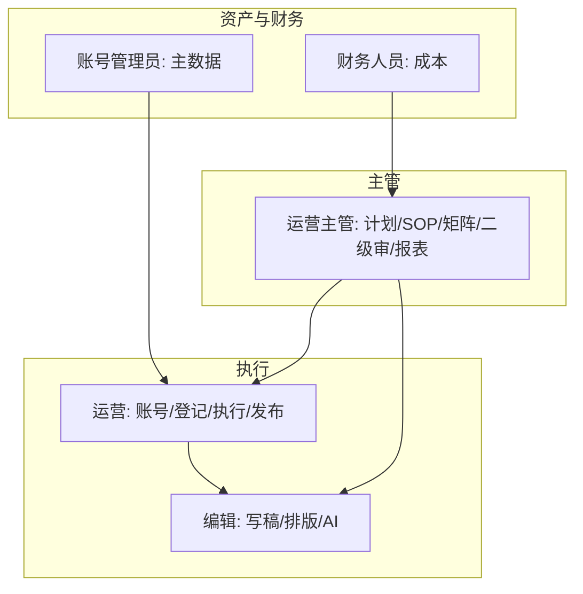

# 运营数据平台 · 汇总产品使用手册（交付版）

> **版本**：v2.1 | **日期**：2026-09-20  
> **线上环境**：[`https://saas.shenyu.com`](https://saas.shenyu.com) · Hash 路由索引 [`ROUTE-线上地址索引.md`](./ROUTE-线上地址索引.md)  
> **完整菜单正文 SSOT**：[`../产品使用操作手册.md`](../产品使用操作手册.md)（全菜单 17 章 + 附录）  
> **分角色手册（推荐一线阅读）**：五本角色手册 + 三本专题 + 本汇总页  
> **截图目录**：[`../delivery-screenshots/`](../delivery-screenshots/)（与 `manual-screenshots` 同步）  
> **Word**：`python docs/product/_build_product_delivery_docx.py` → 本目录 `*.docx`

---

## 1. 文档说明

本文件为 **交付索引**：说明新手册结构、角色分工与阅读路径，**不重复** 全菜单逐步操作正文（避免双 SSOT）。

**覆盖范围**（与总册一致）：

- Football 壳登录 → 侧栏「运营数据」Phase 1 业务菜单  
- 内容生产（计划、工作任务、任务、内容、审核、SOP/知识库/公推模板）  
- 运营管理、账号管理、监测、数据分析、绩效、财务、配置、首页  
- **数据采集** 仅边界说明（Phase 2 Out of Scope）

---

## 2. 五本角色手册（v2.0 结构）

每本均含：**篇首（定位、业务价值、主流程、角色衔接）** + **功能模块（说明、入口、步骤、截图、注意事项）**。

| 角色 | 文档 | 核心模块 |
|------|------|----------|
| **运营主管** | [`运营主管操作手册.md`](./运营主管操作手册.md) | IP 组、SOP、计划、工作任务矩阵、内容审核、数据报表、自定义查询、指标管理 |
| **运营** | [`运营操作手册.md`](./运营操作手册.md) | 平台账号、采集凭证/登录、账号分析、任务登记、任务执行 |
| **编辑** | [`编辑操作手册.md`](./编辑操作手册.md) | 任务登记（兼任）、任务执行、内容编辑、AI 排版/生成、公推模板、知识库 |
| **账号管理员** | [`账号管理员操作手册.md`](./账号管理员操作手册.md) | 平台账号、公司、实名人、手机管理、手机卡管理 |
| **财务人员** | [`财务人员操作手册.md`](./财务人员操作手册.md) | 账号成本管理（采购/过程成本） |

**专项补充**（未拆入五本）：[`../OPS业务操作手册-IP组与工作任务.md`](../OPS业务操作手册-IP组与工作任务.md) — IP 组 + 登记/矩阵/审核工作流详图。

**历史文件名（v1.1，已由上表替代）**：`运营人员使用手册.md`、`内容生产人员使用手册.md` 等 — 交付包以 **五本新命名** 为准。

### 2.1 专题手册（2026-09-20 新增）

| 文档 | 用途 |
|------|------|
| [`通用入门与权限说明.md`](./通用入门与权限说明.md) | 登录/租户、菜单、IP 组数据权限、常见错误 |
| [`端到端业务流程手册.md`](./端到端业务流程手册.md) | 计划→任务→内容→审核→报表，对齐 A/B 工作流截图 |
| [`系统配置与权限管理手册.md`](./系统配置与权限管理手册.md) | 系统参数、审核/钉钉/AI、元数据；M10/SSO Out of Scope |

---

## 3. 角色摘要与协作关系

| 问题 | 谁负责 |
|------|--------|
| 谁创建中长期多节点排期？ | 运营主管 · **计划管理** |
| 谁做日登记 confirm？ | IP 组长（常为运营/编辑兼任）· **工作任务管理** |
| 谁审内容？ | 一级 IP 组长、二级运营主管（**系统参数** 可配置） |
| 谁维护公司/实名人/手机？ | 账号管理员 |
| 谁录账号成本？ | 财务人员 |

**内容审核当前默认（Greenfield）**：一、二级均开启；一级角色 `ip_group_leader`（本组范围），二级 `ops_manager`。生产以 **系统参数 → 内容审核** 为准。

---

## 4. 推荐阅读顺序

### 4.1 全员

1. [`通用入门与权限说明.md`](./通用入门与权限说明.md) · 总册 §1–§2  
2. [`端到端业务流程手册.md`](./端到端业务流程手册.md)（可选鸟瞰）  
3. 本角色对应手册 **篇首 + 主流程图**  
4. 按需查阅总册具体章节（附录 A 路由速查 · [`ROUTE-线上地址索引.md`](./ROUTE-线上地址索引.md)）

### 4.2 按角色

| 角色 | 建议顺序 |
|------|----------|
| 运营主管 | 运营主管手册 §2→§9 → 总册 §8 系统参数 → 专项 IP 组/工作任务 |
| 运营 | 运营手册 §2→§6 → 总册 §6 审核发布 |
| 编辑 | 编辑手册 §3→§5 → UX-M2-AI 排版 |
| 账号管理员 | 账号管理员手册 §2→§6 → 总册 §11 |
| 财务 | 财务人员手册 §2 → 总册 §14 |

---

## 5. 截图清单（交付包）

### 5.1 主流程 01–15

| 文件 | 用途 |
|------|------|
| `01-login.png` … `03-ops-sidebar.png` | 登录与侧栏 |
| `04-dashboard.png` | 首页 |
| `05-plan.png` / `05b-plan-create.png` | 计划 |
| `06-task.png` | 我的任务 |
| `07-content.png` / `08-content-review.png` | 内容/审核 |
| `09-ip-group.png` | IP 组 |
| `10-internal-account.png` | 平台账号 |
| `11-monitor-hot-works.png` | 监测代表 |
| `12-system-param*.png` | 系统参数 |
| `13-perf-result.png` | 绩效 |
| `14-account-cost.png` | 账号成本 |
| `15-data-report.png` | 数据报表 |

### 5.2 增量 16–26（2026-09-20 脚本扩展）

| 文件 | 页面 |
|------|------|
| `16-sop.png` | SOP 管理 |
| `17-knowledge.png` | 内容知识库 |
| `18-layout-template.png` | 公推模板库 |
| `19-task-all.png` | 全部任务 |
| `20-metric.png` | 指标管理 |
| `21-custom-query.png` | 自定义查询 |
| `22-work-task.png` | 工作任务管理 |
| `23-company.png` | 公司管理 |
| `24-realname.png` | 实名人 |
| `25-phone.png` | 手机管理 |
| `26-simcard.png` | 手机卡 |

### 5.3 工作流 A/B 系列

`A01`–`A13`、`B01`–`B04` — IP 组、登记、矩阵、审核详情等（见 [`../delivery-screenshots/`](../delivery-screenshots/)）。

### 5.4 仍缺或待补截图

| 页面 | 说明 |
|------|------|
| SOP 编辑画布（节点属性） | 需进入模板编辑页补拍 |
| 平台账号 · 采集 Tab | 详情内 Tab |
| 账号成本 · 成本管理弹窗 | 过程成本表单 |
| 内容编辑 · AI 助手 / AI 排版预览 | 编辑页内面板 |
| 自定义查询 · 保存/双 Tab 细节 | 若与列表页不同 |
| 配置管理 · AI 模型 | 总册 §15，非五本必含 |

重新采集：`python docs/product/_capture_delivery_screenshots.py`（需 `127.0.0.1:5777` 可登录）。

---

## 6. 路由与构建

- **嵌套路由 SSOT**：[`../../delivery/OPS-MENU-ROUTE-INDEX.md`](../../delivery/OPS-MENU-ROUTE-INDEX.md)  
- **线上完整 URL**：[`ROUTE-线上地址索引.md`](./ROUTE-线上地址索引.md)（70 条）  
- **构建 Word**：`python docs/product/_build_product_delivery_docx.py`  
- **打包 Zip**：`python docs/delivery/product-handover/_pack_delivery_zip.py`

---

## 7. 修订记录

| 日期 | 说明 |
|------|------|
| 2026-09-20 | v2.0 五本角色手册重写；汇总页改为索引 + 角色摘要 |
| 2026-09-20 | v1.1 交付索引（旧分角色命名） |
