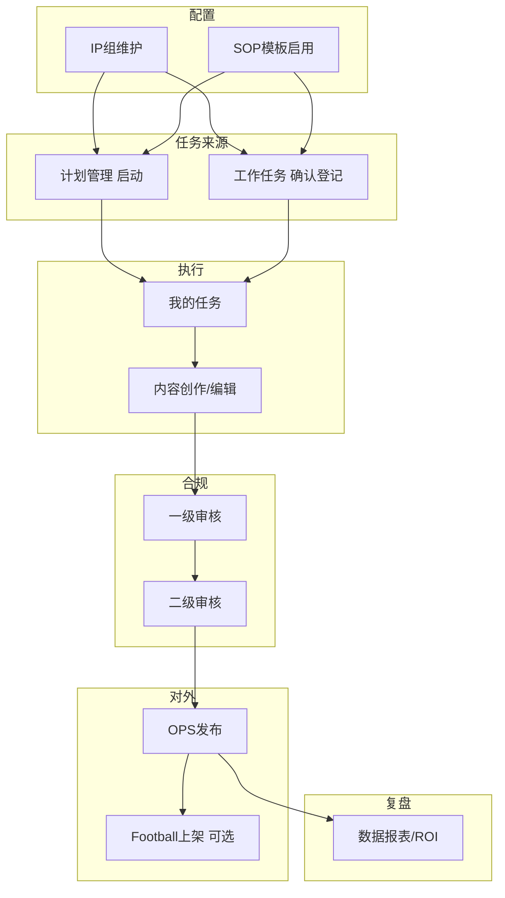
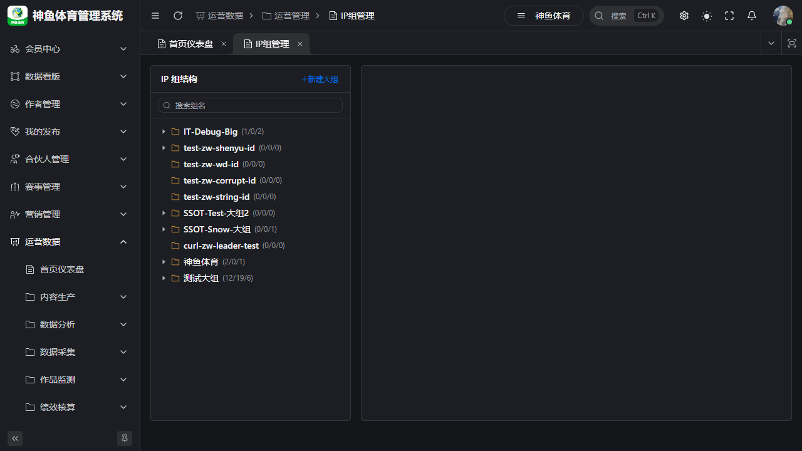
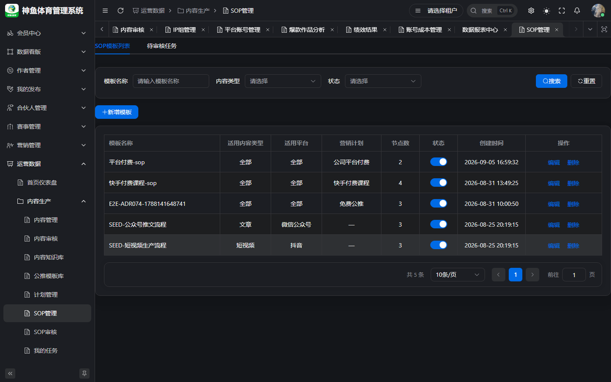
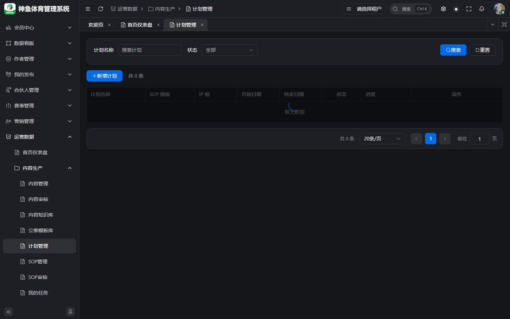
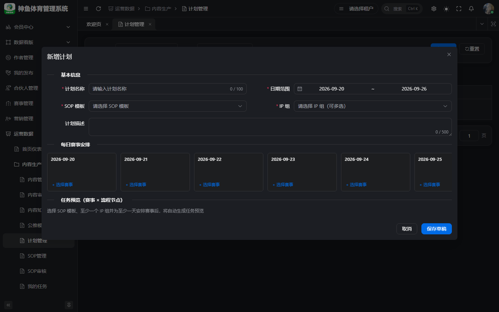
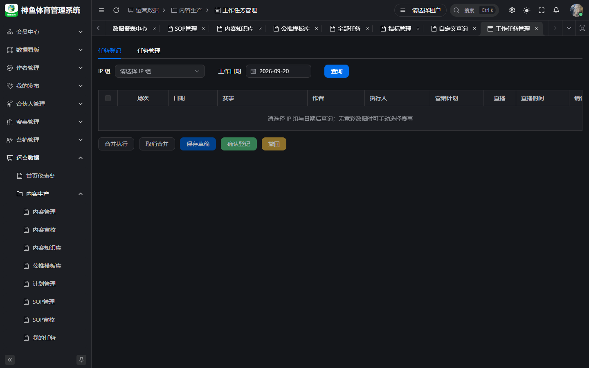
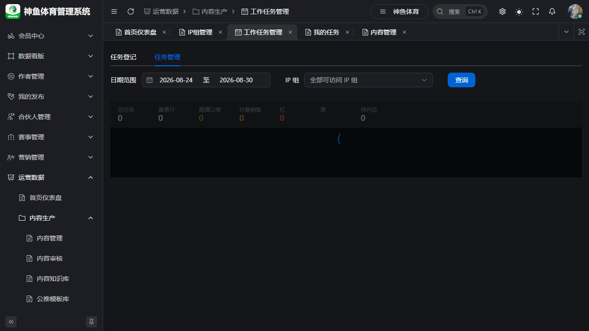
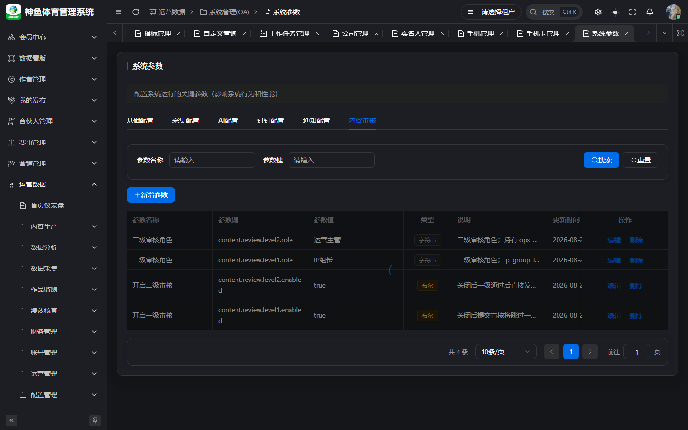
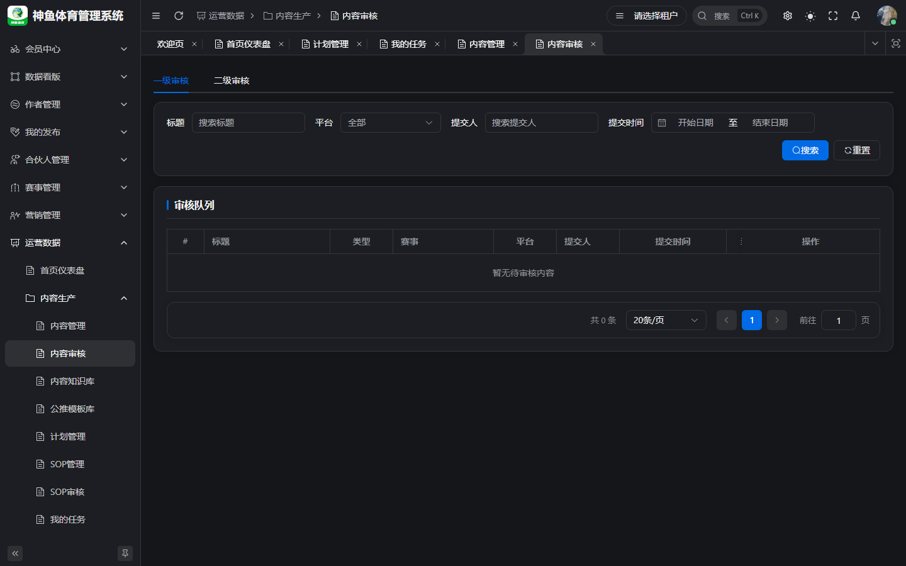
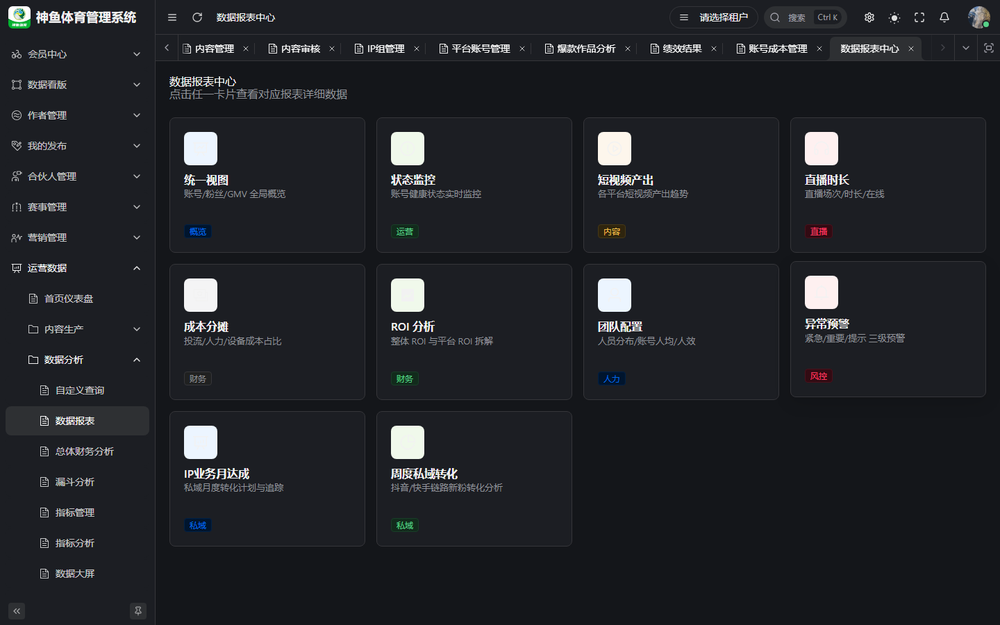

# 端到端业务流程手册

> **版本**：v1.0 | **日期**：2026-09-20  
> **线上登录**：[`https://saas.shenyu.com`](https://saas.shenyu.com)  
> **范围**：计划 → 任务 → 内容 → 审核 → 发布/报表（Phase 1 主链路）  
> **详图 SSOT**：[`../OPS业务操作手册-IP组与工作任务.md`](../OPS业务操作手册-IP组与工作任务.md)

---

## 目录

1. [篇首：链路总览](#1-篇首链路总览)
2. [阶段 A：基础配置（IP 组 + SOP）](#2-阶段-a基础配置ip-组--sop)
3. [阶段 B：驱动任务（计划 或 工作任务登记）](#3-阶段-b驱动任务计划-或-工作任务登记)
4. [阶段 C：任务执行与内容生产](#4-阶段-c任务执行与内容生产)
5. [阶段 D：内容审核与发布](#5-阶段-d内容审核与发布)
6. [阶段 E：报表与复盘](#6-阶段-e报表与复盘)
7. [附录：角色分工与 URL 速查](#7-附录角色分工与-url-速查)

---

## 1. 篇首：链路总览

### 1.1 业务价值

将 **排期、执行、合规审核、发布、数据复盘** 串成一条可审计链路，避免表格排期与口头催办脱节。

### 1.2 主流程（双入口）

### 1.3 与截图对齐（工作流系列）

| 阶段 | 代表截图 |
|------|----------|
| IP 组 | `A01-ip-group-tree.png` · `A02-ip-group-create-dialog.png` |
| 登记 | `A06-work-task-register.png` · `A07-work-task-register-loaded.png` |
| 矩阵 | `B01-manager-work-task-matrix.png` · `A09-work-task-matrix.png` |
| 任务 | `06-task.png` · `A11-task-execute.png` |
| 内容 | `A13-content-create-drawer.png` · `07-content.png` |
| 审核 | `08-content-review.png` · `B03-content-review-detail.png` |
| 报表 | `15-data-report.png` |

路径：`../delivery-screenshots/`

---

## 2. 阶段 A：基础配置（IP 组 + SOP）

### 2.1 IP 组

**入口**：运营管理 → IP 组管理  
**线上完整 URL**：`https://saas.shenyu.com/#/ops/operations/ip-group`

**操作摘要**：

1. 新建大组/小组，指定 **组长**（UserSelect）。  
2. **成员管理**：岗位（`dict_position`）。  
3. **关联作者**（登记下拉依赖）。  
4. **关联账号**（可选，分析/权限）。

**新建 IP 组字段（API `IpGroupCreateReq`，[`API-M1`](../../engineering/API-M1-运营管理.md)）**：

| 字段 | 必填 | 说明 |
|------|------|------|
| groupName | ✅ | 1–50 字；同父级唯一 |
| groupType | ✅ | BIG / SMALL |
| parentId | △ | 小组必填；大组 null |
| leaderUserId | ✅ | Football 用户 ID |
| level | ❌ | `dict_ip_group_level` |
| description / status | ❌ | 备注、启用 |

### 2.2 SOP 模板

**线上完整 URL**：`https://saas.shenyu.com/#/ops/production/sop`

1. 新建模板：`templateName`、`contentType`、`platformType`（均必填，API-M2）。  
2. 画布配置节点：`nodeType`、执行岗位；`CONTENT_GENERATION` 须 `documentType`。  
3. **启用** 模板；绑定 **营销计划**（工作任务 confirm 1:1，ADR-074）。

---

## 3. 阶段 B：驱动任务（计划 或 工作任务登记）

### 3.1 路径一：计划管理（运营主管）

**线上完整 URL**：`https://saas.shenyu.com/#/ops/production/plan`

  

**新建计划核心字段（`POST /plan/create`，API-M2-计划管理）**：

| 字段 | 必填 | 说明 |
|------|------|------|
| planName | ✅ | |
| templateId | ✅ | 保存后不可改 |
| ipGroupIds | ✅ | ≥1；保存后集合锁定 |
| startDate / endDate | ✅ | end ≥ start |
| competitions | ✅ | 赛事池 |
| steps / tasks | ✅ | 覆盖模板全部节点；执行人须在 IP 组并集内 |

**启动** 后任务 `PENDING` 进入执行人 **我的任务**；草稿对执行人默认不可见。

### 3.2 路径二：工作任务登记（IP 组长）

**线上完整 URL**：`https://saas.shenyu.com/#/ops/production/work-task`

**登记行字段（`WorkTaskAssignmentSaveReq`，API-M2-工作任务管理）**：

| 字段 | 必填 | 说明 |
|------|------|------|
| rowNo | ✅ | |
| competitionIdsJson | ✅ | ≥1 场 |
| authorId | ✅ | IP 组关联作者 |
| workDate | ✅ | |
| marketingPlan | ✅ | 字典；对应启用 SOP |
| isLive | ✅ | |
| liveTime | △ | isLive=1 |
| salesPlatform | ✅ | 字典 |
| assigneeId | ❌ | 审计用；confirm 按 SOP 岗位解析 |

**确认登记** → 全 SOP 节点生成任务 + 内容生成节点常带 DRAFT 内容（ADR-077）。

### 3.3 主管矩阵纵览

**Tab**：任务管理 / 矩阵 — 同 URL  

---

## 4. 阶段 C：任务执行与内容生产

### 4.1 我的任务

**线上完整 URL**：`https://saas.shenyu.com/#/ops/production/task`

  

**步骤**：进入执行 → 内容创作 → **提交审核** → 回任务 **完成**（内容生成节点门禁 ADR-079）。

### 4.2 内容编辑

**线上完整 URL**：`https://saas.shenyu.com/#/ops/production/content`

**新建/保存内容（`ContentCreateReq`，API-M2）**：

| 字段 | 必填 | 说明 |
|------|------|------|
| title | ✅ | |
| creatorUserId | ✅ | |
| ipGroupId | ✅ | |
| contentType | ✅ | 字典 |
| documentType | △ | `ARTICLE` 时必填 |
| accountId(s) | ❌ | 任务场景可空 |
| body / layoutJson | △ | 视频可为空；LAYOUT 时 layoutJson 必填 |

---

## 5. 阶段 D：内容审核与发布

### 5.1 审核策略

**系统参数 → 内容审核**：  
`https://saas.shenyu.com/#/ops/system-oa/system-param`

Greenfield 默认一、二级均开（详见 [`运营主管操作手册.md`](./运营主管操作手册.md) §6.3）。

### 5.2 内容审核

**线上完整 URL**：`https://saas.shenyu.com/#/ops/production/content/review`

一级（组长）→ 二级（主管，若启用）→ 状态 **待发布**。

### 5.3 发布

在 **内容管理** 执行 **OPS 发布**；C 端可见另走 **Football 上架**（两套状态，总册 §6）。

---

## 6. 阶段 E：报表与复盘

| 能力 | 线上完整 URL |
|------|----------------|
| 数据报表 | `https://saas.shenyu.com/#/ops/analysis/data-report` |
| 人效盘点 | `https://saas.shenyu.com/#/ops/operations/efficiency` |
| ROI 分析 | `https://saas.shenyu.com/#/ops/finance/roi-analysis` |
| 账号成本 | `https://saas.shenyu.com/#/ops/finance/account-cost` |

财务录入成本见 [`财务人员操作手册.md`](./财务人员操作手册.md)。

---

## 7. 附录：角色分工与 URL 速查

| 角色 | 本链路职责 | 手册 |
|------|------------|------|
| 运营主管 | 计划、SOP、矩阵、二级审、报表 | [`运营主管操作手册.md`](./运营主管操作手册.md) |
| IP 组长/运营 | 登记、一级审、发布 | [`运营操作手册.md`](./运营操作手册.md) |
| 编辑 | 写稿、排版、AI | [`编辑操作手册.md`](./编辑操作手册.md) |
| 账号管理员 | 账号主数据 | [`账号管理员操作手册.md`](./账号管理员操作手册.md) |
| 财务 | 成本 | [`财务人员操作手册.md`](./财务人员操作手册.md) |

**修订**：2026-09-20 v1.0
