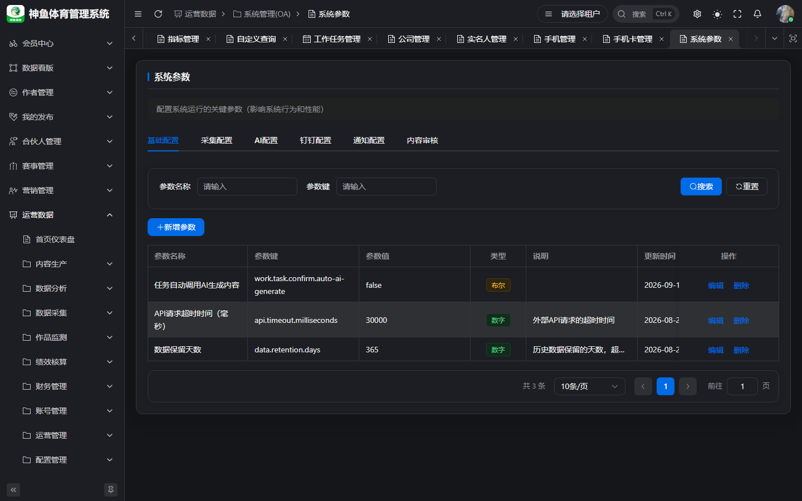
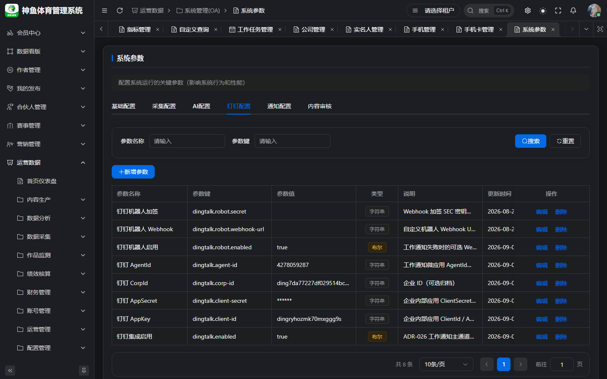

# 系统配置与权限管理手册

> **版本**：v1.0 | **日期**：2026-09-20  
> **线上登录**：[`https://saas.shenyu.com`](https://saas.shenyu.com)  
> **读者**：租户管理员、运营主管（审核/钉钉/AI 参数）、配置岗  
> **Out of Scope**：Football 全局用户/角色菜单 UI 操作步骤（Phase 2）；M10 采集任务运维全量（见第 6 章边界）

---

## 目录

1. [篇首](#1-篇首)
2. [系统参数（OA）](#2-系统参数oa)
3. [内容审核与钉钉通知](#3-内容审核与钉钉通知)
4. [AI 模型与提示词](#4-ai-模型与提示词)
5. [元数据与其他配置](#5-元数据与其他配置)
6. [角色、菜单与 Phase 2 边界](#6-角色菜单与-phase-2-边界)
7. [附录：待 Spec 确认](#7-附录待-spec-确认)

---

## 1. 篇首

### 1.1 业务价值

集中维护 **租户级行为开关**（审核级数、钉钉、AI）、**元数据**（自定义查询/指标），避免改代码发版。

### 1.2 操作入口

**菜单**：运营数据 → **系统管理(OA)** → **系统参数**  
**Hash 路由**：`/ops/system-oa/system-param`  
**线上完整 URL**：`https://saas.shenyu.com/#/ops/system-oa/system-param`

---

## 2. 系统参数（OA）

### 2.1 功能说明

键值型租户配置；修改 **立即影响后续业务**（尤其审核、通知）。

### 2.2 操作流程

1. 打开系统参数，选择 Tab（基础 / 钉钉 / 内容审核 / AI 等，以页面为准）。  
2. 修改参数 → **保存**（若分 Tab 保存则逐 Tab 保存）。  
3. 关键变更前通知审核人/运营（一级、二级角色变更会导致队列变化）。

### 2.3 注意事项

- 无 `oa:param:list` 权限不可见菜单。  
- 具体键名 SSOT：seed / ADR-017 / ADR-064；业务版 PRD 摘要见 [`../产品使用操作手册.md`](../产品使用操作手册.md) §8。

---

## 3. 内容审核与钉钉通知

### 3.1 内容审核 Tab

**线上完整 URL**：同上系统参数页 · **内容审核** Tab

| 参数键（示例） | 含义 |
|----------------|------|
| `content.review.level1.enabled` | 一级审核开关 |
| `content.review.level2.enabled` | 二级审核开关 |
| `content.review.level1.role` | 一级角色（如 `ip_group_leader`） |
| `content.review.level2.role` | 二级角色（如 `ops_manager`） |
| `ai.content.review.enabled` | AI 内容是否额外审核（若页面提供） |

**维护字段**：页面为键值表单，**无独立「新建实体」**；必填项 = 各键是否允许为空 — **待 Spec 确认**（前端校验以实际表单为准）。

### 3.2 钉钉 Tab

**用途**：`TASK_PENDING`、审核待办等跳转链接；链接拼接规则见总册 §8（基址 + hash 路由）。

**Out of Scope**：钉钉开放平台账号申请、CorpId 审批流程（客户侧运维）。

---

## 4. AI 模型与提示词

### 4.1 AI 模型

**菜单**：配置管理 → **AI模型**  
**线上完整 URL**：`https://saas.shenyu.com/#/ops/config/config-ai-model`

**操作摘要**：新增/编辑模型 endpoint、API Key（加密存储）、连通性测试 → 状态 **CONNECTED** 后内容页 AI 功能可用。

**新建字段（Spec 摘要，PRD-M15 / 配置 PRD）**：

| 字段 | 必填 | 说明 |
|------|------|------|
| 模型名称 | ✅ | 页面表单 |
| 模型类型 / 厂商 | ✅ | 字典或枚举 |
| API 地址 / Key | ✅ | Key AES |
| 状态 | ❌ | 测试通过后启用 |

> 逐字段 `@NotNull` 以 API `config-ai-model` 与前端 `formRules` 为准；本表为操作摘要。

### 4.2 AI 提示词

**线上完整 URL**：`https://saas.shenyu.com/#/ops/config/config-ai-prompt`

维护场景化 prompt 模板（内容生成、排版等）；与 SOP/内容类型映射关系见 ADR-054 与 UX-M2-AI。

---

## 5. 元数据与其他配置

| 功能 | 线上完整 URL | 说明 |
|------|----------------|------|
| 元数据维护 | `https://saas.shenyu.com/#/ops/config/config-metadata` | 自定义查询实体/字段 SSOT |
| 阈值规则 | `https://saas.shenyu.com/#/ops/config/config-threshold` | 监测/预警 |
| 外部/内部采集配置 | `.../config-external-collect` 等 | **Phase 2 / M10** 运维向 |

**元数据新建实体（API-M6 摘要）**：

| 字段 | 必填 | 说明 |
|------|------|------|
| entityCode | ✅ | 唯一 |
| entityName | ✅ | |
| tableName | ✅ | 物理表 |
| 字段映射列表 | △ | 查询依赖 |

---

## 6. 角色、菜单与 Phase 2 边界

### 6.1 Football 角色与 OPS 菜单

| 项 | Phase 1 说明 |
|----|----------------|
| 菜单树 | DB `system_menu` 6100–6999；Dev 环境 seed SQL |
| 角色分配 | Football 管理端 **非 OPS 菜单内** — **Out of Scope** 逐步截图 |
| 权限码 | 与 `oa:*` / `ops:*` 对齐，见 [`../../delivery/oa-menu-permission-map.csv`](../../delivery/oa-menu-permission-map.csv) |

操作现象排查见 [`通用入门与权限说明.md`](./通用入门与权限说明.md) §1.2。

### 6.2 数据采集（M10）

**菜单**：运营数据 → **数据采集**（日志、任务、质量等）

| 项 | 边界 |
|----|------|
| 运营日常 | 仅需保证 **平台账号 · 采集 Tab** 凭证有效 |
| 任务 cron / 私域桥接全量运维 | **Phase 2 Out of Scope** |
| 外部 SSO / 独立登录 | **Out of Scope** |

### 6.3 消息管理

**线上完整 URL**：`https://saas.shenyu.com/#/ops/system-oa/system-message`  
站内信列表；与钉钉互补。

---

## 7. 附录：待 Spec 确认

| 项 | 说明 |
|----|------|
| 系统参数全量键清单表格 | 以 seed YAML/SQL 为准，业务版 PRD 未逐键列表 |
| AI 模型 API Req 字段 | 需对照 `AiModelConfig` 后端 VO 与前端 rules 补全 |
| Football 角色菜单操作手册 | 客户环境差异大，本期不写逐步 UI |

---

**修订**：2026-09-20 v1.0
