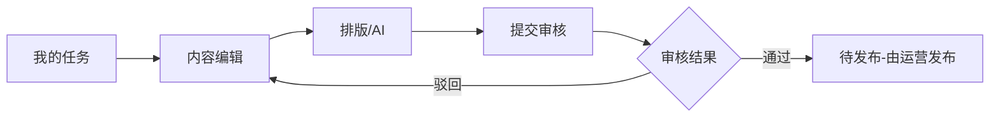
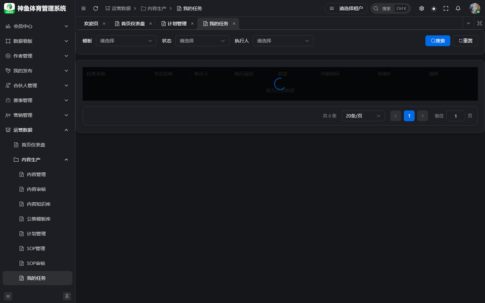
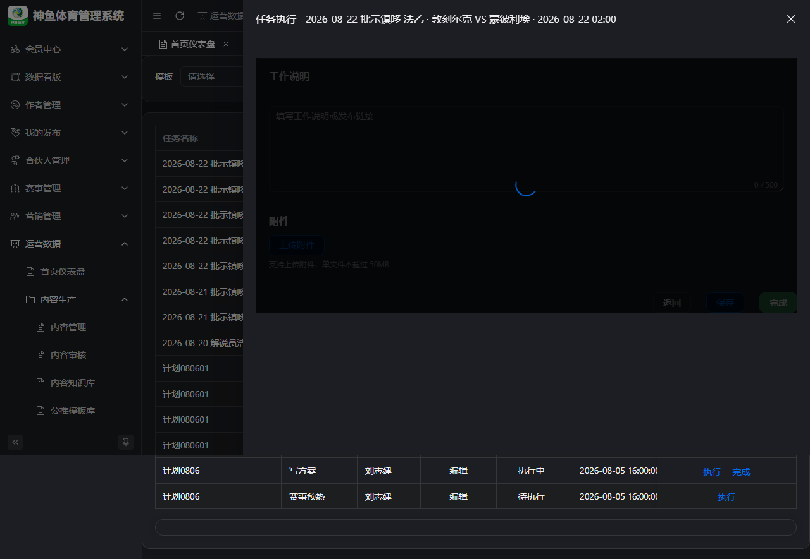
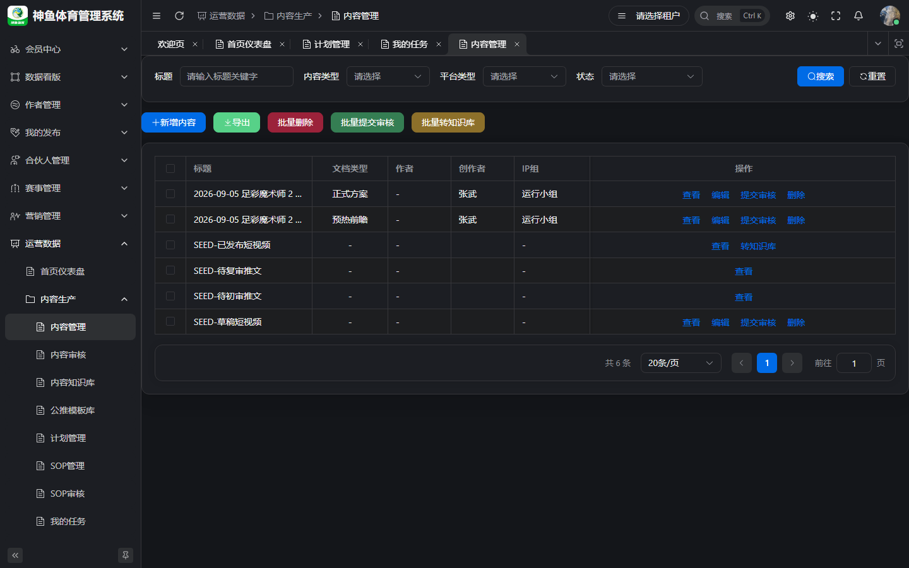
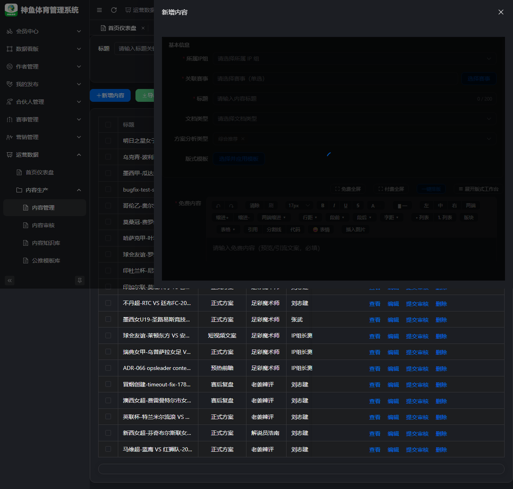
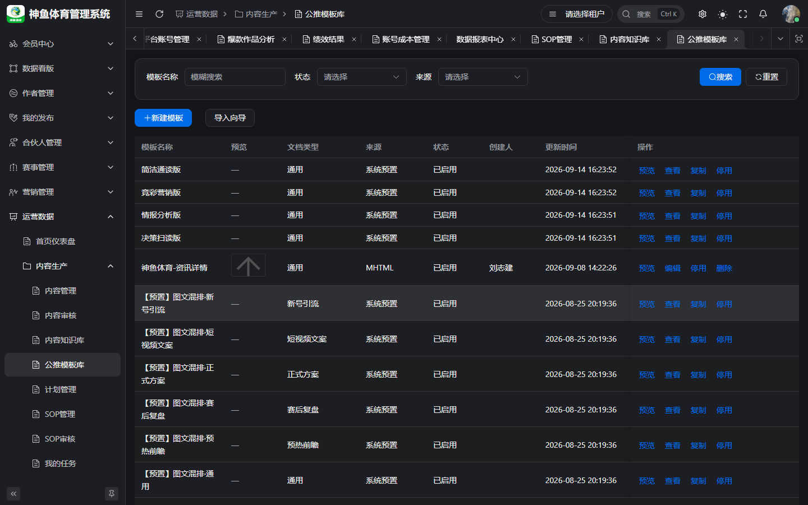
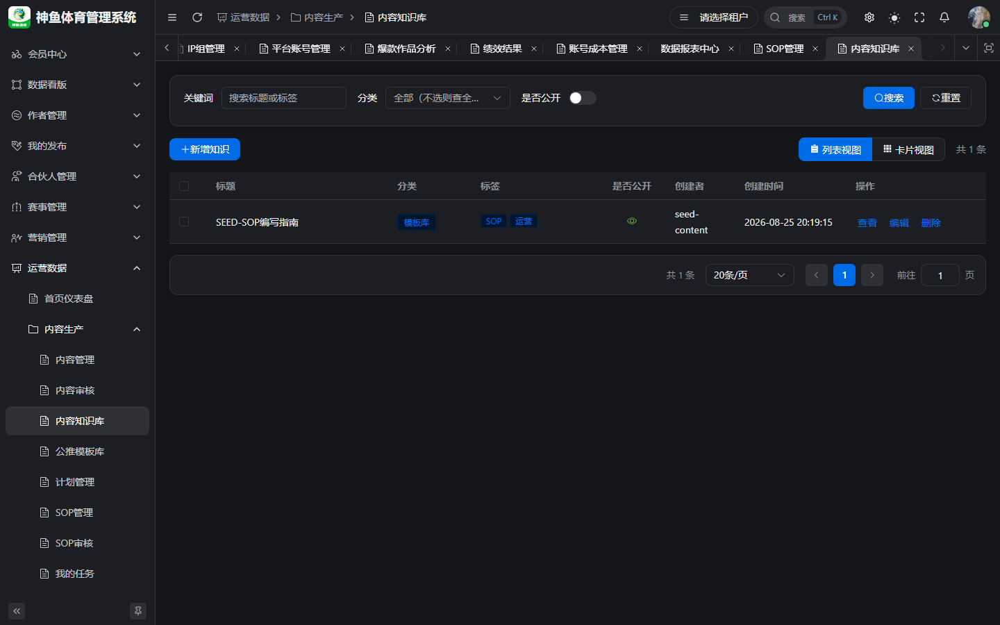

# 编辑 · 操作手册

> **版本**：v2.1 | **日期**：2026-09-20  
> **线上环境**：[`https://saas.shenyu.com`](https://saas.shenyu.com) · [`ROUTE-线上地址索引.md`](./ROUTE-线上地址索引.md)  
> **读者**：内容编辑、文案、排版岗  
> **Spec**：[`../UX-M2-内容生产.md`](../UX-M2-内容生产.md) · [`../UX-M2-AI排版增量.md`](../UX-M2-AI排版增量.md) · [`../PRD-M2-内容生产.md`](../PRD-M2-内容生产.md)

---

## 目录

1. [篇首](#1-篇首)
2. [任务登记（兼任组长时）](#2-任务登记兼任组长时)
3. [任务执行](#3-任务执行)
4. [内容编辑与排版](#4-内容编辑与排版)
5. [AI 内容生成与 AI 排版](#5-ai-内容生成与-ai-排版)
6. [公推模板与知识库](#6-公推模板与知识库)
7. [附录](#7-附录)

---

## 1. 篇首

### 1.1 角色定位与适用人员

**编辑**负责把任务要求转化为可审核、可发布的 **文章内容**，包括结构排版、版式套用、AI 辅助生成。多数编辑 **只执行不登记**；兼任 IP 组长时增加 **任务登记** 能力。

### 1.2 产品业务价值

- **任务驱动创作**：任务携带赛事、IP 组、文档类型，减少填错上下文。
- **排版三件套**：一键排版 / AI 排版 / 公推模板，**不改写正文语义**（仅套版式）。
- **审核门禁**：提交审核后进入可配置一/二级流，编辑专注改稿与重提。

### 1.3 整体操作流程

1. （可选）**工作任务登记** confirm → 生成任务。  
2. **我的任务** → 执行 → **内容创作**。  
3. 写稿 → **一键排版 / AI 排版 / 公推模板** → 保存。  
4. **提交审核** → 任务 **完成**（满足内容状态门禁）。  
5. 驳回后改稿再提交；通过后由运营 **发布/上架**。

### 1.4 与其他角色衔接

| 角色 | 衔接点 |
|------|--------|
| IP 组长 | 登记任务、一级审核 |
| 运营主管 | 二级审核、计划排期 |
| 运营 | 发布到平台账号、Football 上架 |
| 配置管理员 | AI 模型 CONNECTED 状态 |

---

## 2. 任务登记（兼任组长时）

与 [`运营操作手册.md`](./运营操作手册.md) §5 相同；编辑若 **无** IP 组长权限可跳过本章。

**Hash 路由**：`/ops/production/work-task`  
**线上完整 URL**：`https://saas.shenyu.com/#/ops/production/work-task`  
截图：[`A06-work-task-register.png`](../delivery-screenshots/A06-work-task-register.png)

**要点**：作者须在 IP 组 **关联作者** 中；confirm 生成全 SOP 节点任务。

---

## 3. 任务执行

### 3.1 操作入口

**菜单路径**：运营数据 → **内容生产** → **我的任务**  
**Hash 路由**：`/ops/production/task`
**线上完整 URL**：`https://saas.shenyu.com/#/ops/production/task`

  

### 3.2 操作流程

1. 筛选 `PENDING` / `IN_PROGRESS` 任务，进入 **执行**。
2. 阅读任务信息：节点名、IP 组、赛事；工作任务来源时看 **登记备注** 一行（ADR-080）。
3. 点击 **内容创作**（无关联内容时提示先进入创作；工作任务 confirm 后通常已有 DRAFT）。
4. 完成编辑后 **提交审核**，再回任务页 **完成**。
5. 若 `needReview=1`，等待 **SOP 任务审核** 通过后方为 `DONE`。

### 3.3 注意事项

- 内容仍在 **草稿** 时无法完成任务 — 必须先提交审核。
- 合并执行组任务备注含多场次信息，编辑需一次产出覆盖或使用 IP 组 Tab 分产。

---

## 4. 内容编辑与排版

### 4.1 操作入口

**菜单路径**：运营数据 → **内容生产** → **内容管理**（或任务内跳转创作）  
**Hash 路由**：`/ops/production/content`
**线上完整 URL**：`https://saas.shenyu.com/#/ops/production/content`

  

### 4.2 操作流程

1. 打开内容，编辑 **标题、文档类型、付费/免费正文**（文章类 `ARTICLE`）。
2. 竞彩方案：绑定 **N 场赛程 + 玩法**（与 Football 方案同构；未选玩法仍可存草稿）。
3. 选择排版方式（见 §5）：  
   - **一键排版**：选预设风格 → 预览 → **使用此排版**；  
   - **选择版式模板**：从公推模板库选已发布模板；  
   - **AI 排版**：需 AI 模型可用。
4. **保存** 保持可编辑；确认无误 **提交审核**。

### 4.3 注意事项

- **仅免费区有正文** 时，一键排版/模板/AI 排版 **只改免费栏**（Spec 约定）。
- OPS **发布** 与 Football **上架** 两套状态，编辑通常不负责上架。

### 4.4 新建/维护字段（Spec）

来源：[`API-M2-内容生产.md`](../../engineering/API-M2-内容生产.md) §3.2 `ContentCreateReq`。

| 字段 | 必填 | 说明 |
|------|------|------|
| title | ✅ | max 200 |
| creatorUserId | ✅ | |
| ipGroupId | ✅ | |
| contentType | ✅ | |
| documentType | △ | `ARTICLE` 必填 |
| accountId(s) | ❌ | 任务场景可空 |
| body / bodyFormat | △ | LAYOUT 时 layoutJson 必填 |
| layoutTemplateId | ❌ | 须匹配类型 |

---

## 5. AI 内容生成与 AI 排版

### 5.1 功能说明

- **AI 内容生成**：在内容编辑页 AI 助手面板（若菜单/权限开放）按模板生成片段，用户 **手动选择** 写入付费/免费栏（ADR-054 D8）。
- **AI 排版**：调用 LLM 理解结构，输出决策扫读版/情报分析版等；低置信度时页面提示仍可应用。

### 5.2 前置条件

**配置管理 → AI 模型**（`https://saas.shenyu.com/#/ops/config/config-ai-model`）须存在 **CONNECTED** 的 Chat 模型；提示词见 **AI 提示词**（`https://saas.shenyu.com/#/ops/config/config-ai-prompt`）。

> **待补截图**：内容编辑页 AI 助手面板、AI 排版预览对比（可参考 `docs/delivery/tmp-s21a-*.png` 走查图，未入 delivery-screenshots）

### 5.3 AI 排版步骤

1. 写好标题与正文 → 点 **AI 排版**。
2. 在 **AI 排版预览** 对比前后 → **应用排版**。
3. 检查降级/低置信提示 → 手工微调 → 保存 → 提交审核。

### 5.4 注意事项

- `documentType=OFFICIAL_PLAN` 自动首写 `paid_body` 等规则见 ADR-077，其后仍以 **用户采纳** 为准。
- AI 生成内容是否走额外审核看 `ai.content.review.enabled` 系统参数。

---

## 6. 公推模板与知识库

### 6.1 公推模板库

**入口**：运营数据 → **内容生产** → **公推模板库**  
**Hash 路由**：`/ops/production/layout-template`
**线上完整 URL**：`https://saas.shenyu.com/#/ops/production/layout-template`

**编辑常用操作**：在 **内容编辑** 中 **选择版式模板**；库内新建/导入/发布由版式管理员操作（见 [`../产品使用操作手册.md`](../产品使用操作手册.md) §10.4）。

### 6.2 内容知识库

**Hash 路由**：`/ops/production/knowledge`
**线上完整 URL**：`https://saas.shenyu.com/#/ops/production/knowledge`

**步骤**：检索案例/经验 → 只读参考；有权限时可 **新增知识** 供团队复用（与公推模板 **不是** 同一概念）。

**新增知识字段**：**待 Spec 确认**（API `/ops/knowledge/create` 未在模块 API 正文逐字段表格化）。

---

## 7. 附录

| 主题 | 文档 |
|------|------|
| 审核流 | [`../产品使用操作手册.md`](../产品使用操作手册.md) §6 |
| AI 排版 UX | [`../UX-M2-AI排版增量.md`](../UX-M2-AI排版增量.md) |

**修订**：2026-09-20 v2.0
