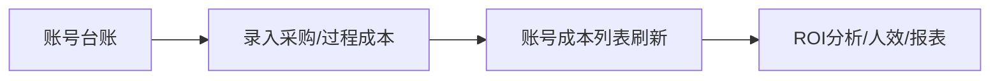
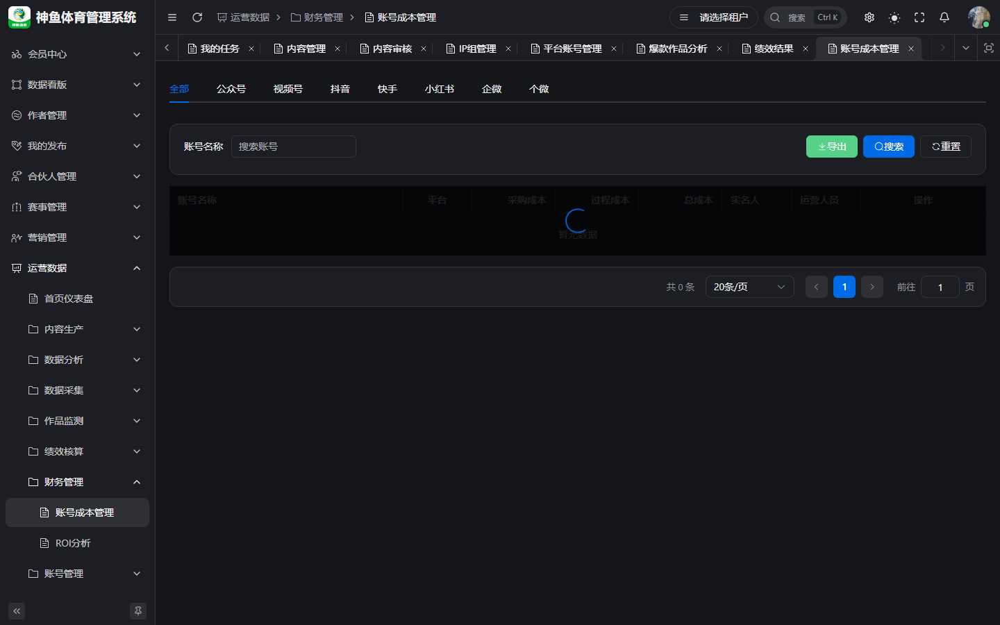

# 财务人员 · 操作手册

> **版本**：v2.1 | **日期**：2026-09-20  
> **线上环境**：[`https://saas.shenyu.com`](https://saas.shenyu.com) · [`ROUTE-线上地址索引.md`](./ROUTE-线上地址索引.md)  
> **读者**：财务、成本核算、ROI 分析岗  
> **Spec**：[`../PRD-业务版-v9.2.md`](../PRD-业务版-v9.2.md) · [`../产品使用操作手册.md`](../产品使用操作手册.md) §14

---

## 目录

1. [篇首](#1-篇首)
2. [账号成本管理维护](#2-账号成本管理维护)
3. [与 ROI / 报表的衔接](#3-与-roi--报表的衔接)
4. [附录](#4-附录)

---

## 1. 篇首

### 1.1 角色定位与适用人员

**财务人员**在 OPS 中主要负责 **账号维度成本台账**（采购成本 + 过程成本），为 ROI 分析、人效盘点、管理报表提供 **投入侧数据**。一般不参与内容审核与任务执行。

### 1.2 产品业务价值

| 价值 | 说明 |
|------|------|
| 成本归集 | 按平台账号汇总采购/过程/总成本 |
| 决策支持 | 与订单营收、ROI 分析、数据报表卡片联动 |
| 审计追溯 | 过程成本明细含类型、金额、日期、支付方式、归属周期 |

### 1.3 整体操作流程

1. 确认 **平台账号** 已由账号管理员建档（§账号管理员手册）。
2. 打开 **账号成本管理**，按平台 Tab 找到账号。
3. 在 **成本管理** 弹窗维护 **采购成本** 与 **过程成本** 明细。
4. 在 **查看** 抽屉核对 ROI/LTV/CAC 类指标与趋势。
5. 需要对比分析时打开 **ROI 分析**（财务菜单）或 **数据报表/订单归因**（与运营主管协作解读）。

### 1.4 与其他角色衔接

| 角色 | 关系 |
|------|------|
| 账号管理员 | 提供账号主数据 |
| 运营主管 | 读报表决策，不录成本 |
| 运营 | 一般不录财务成本 |
| 数据采集 | 订单/营收数据依赖订单采集配置（配置岗） |

---

## 2. 账号成本管理维护

### 2.1 功能说明与业务价值

统一维护单账号 **采购成本**（通常一次性）与 **过程成本**（租赁、投流、认证等多笔），自动汇总 **总成本**，供 ROI 与人效计算。

### 2.2 操作入口

**菜单路径**：运营数据 → **财务管理** → **账号成本管理**  
**Hash 路由**：`/ops/finance/account-cost`
**线上完整 URL**：`https://saas.shenyu.com/#/ops/finance/account-cost`

### 2.3 操作流程

**查看汇总：**

1. 选择 **平台 Tab**，按账号名称筛选。
2. 列表查看 **采购成本、过程成本、总成本** 列。
3. 点 **查看** → 抽屉内看账号信息、周期 **ROI/LTV/CAC**、成本结构与明细趋势。

**维护成本：**

1. 点 **成本管理**（或等价按钮）。
2. **采购成本**：维护/更新单条采购类记录（金额、日期等以表单为准）。
3. **过程成本**：**新增** 行 — 类型、金额、发生日期、支付方式、归属周期；可 **编辑/删除** 非采购条目。
4. **保存** 关闭弹窗，列表数字刷新。
5. 需要台账文件时 **导出**。

### 2.4 注意事项

- 成本数据按 **租户隔离**；仅能看到权限范围内账号（常与 IP 组/数据权限相关）。
- 删除过程成本不可恢复，删除前核对周期归属。
- 无订单/营收时 ROI 显示为 0 或空 — 先确认订单采集与归因数据是否入库。
- 与分析菜单 **总体财务分析** `/ops/analysis/financial-analysis` 互补，口径以页面说明为准。

> **待补截图**：账号成本「成本管理」弹窗内过程成本明细表单。

### 2.5 新建/维护字段（Spec）

来源：[`API-M5-财务管理.md`](../../engineering/API-M5-财务管理.md) §1.2 `POST /finance/cost/create`。

| 字段 | 必填 | 说明 |
|------|------|------|
| accountId | ✅ | 平台账号选择器 |
| costType | ✅ | `dict_cost_type` |
| amount | ✅ | ≥0.01 |
| payMethod | ✅ | `dict_cost_pay_method` |
| period | ✅ | `dict_cost_period` |
| payDate / remark / attachmentId | ❌ | |

**采购成本 UI 单条 vs 过程成本多行**：前端表单细分 — **待 Spec 确认**（UX-M5 未逐字段与 API 对齐表）。

---

## 3. 与 ROI / 报表的衔接

| 入口 | 线上完整 URL | 财务常用动作 |
|------|----------------|--------------|
| ROI 分析（财务） | `https://saas.shenyu.com/#/ops/finance/roi-analysis` | 选 IP 组/账号/日期 → 查 ROI 对比、成本结构 → 导出 |
| 订单归因 | `https://saas.shenyu.com/#/ops/performance/order-attribution` | 核对成交与投入、ROI Tab |
| 数据报表 | `https://saas.shenyu.com/#/ops/analysis/data-report` | 打开 ROI/成本分摊类卡片 |
| 人效盘点 | `https://saas.shenyu.com/#/ops/operations/efficiency` | 只读核对人力侧 ROI（运营菜单） |

**步骤示例（ROI 分析）：**

1. 打开 ROI 分析，选 IP 组、账号、日期、聚合维度。
2. **查询** → 看汇总卡（总成本、营收、ROI）。
3. 切换 **ROI对比 / 成本结构** Tab → **导出**。

---

## 4. 附录

- 完整财务章节：[`../产品使用操作手册.md`](../产品使用操作手册.md) §14  
- 错误码与权限：业务 1500–1504；菜单 `oa:cost:list`

**修订**：2026-09-20 v2.0
