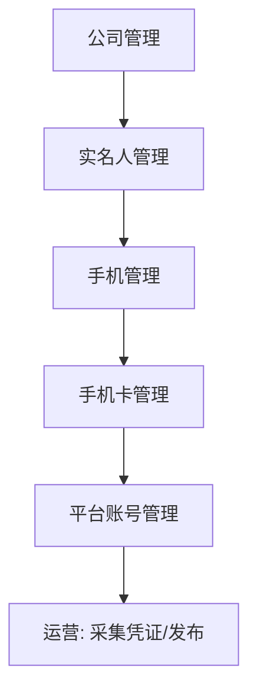
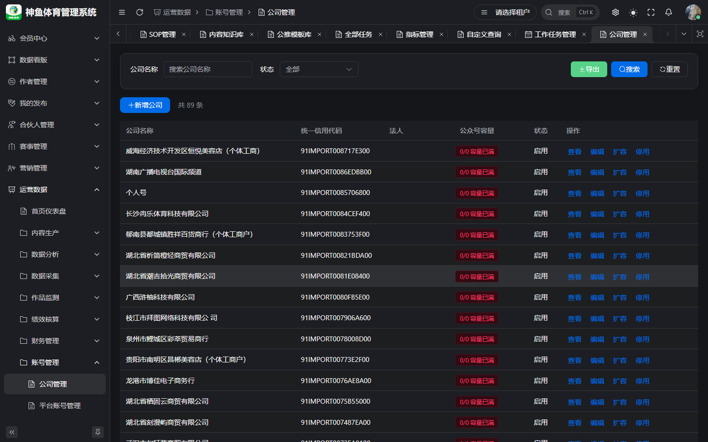
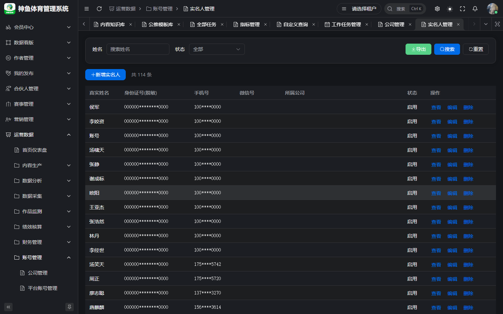
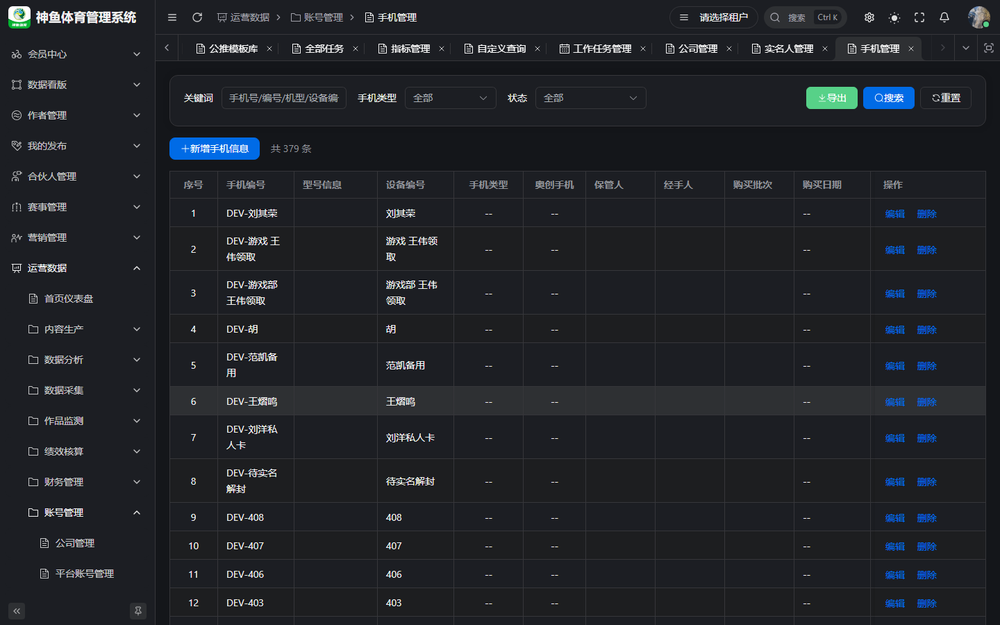
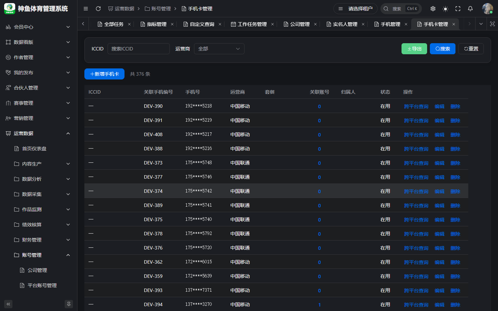

# 账号管理员 · 操作手册

> **版本**：v2.1 | **日期**：2026-09-20  
> **线上环境**：[`https://saas.shenyu.com`](https://saas.shenyu.com) · [`ROUTE-线上地址索引.md`](./ROUTE-线上地址索引.md)  
> **读者**：账号资产管理员、媒介资产、合规台账岗  
> **Spec**：[`../PRD-M4-账号管理.md`](../PRD-M4-账号管理.md)

---

## 目录

1. [篇首](#1-篇首)
2. [平台账号管理与维护](#2-平台账号管理与维护)
3. [公司管理](#3-公司管理)
4. [实名人管理](#4-实名人管理)
5. [手机管理](#5-手机管理)
6. [手机卡管理](#6-手机卡管理)
7. [附录](#7-附录)

---

## 1. 篇首

### 1.1 角色定位与适用人员

**账号管理员**维护租户内 **平台账号及强关联主数据**（公司、实名人、手机、手机卡），保证运营/财务/分析能选到正确账号。不负责内容审核与任务排期。

### 1.2 产品业务价值

- **资产台账 SSOT**：一处建档，全局选择器引用，避免重复与 ID 手输错误。
- **合规与追溯**：实名人、公司主体、手机保管人可审计；敏感字段 AES 脱敏展示。
- **支撑发布与采集**：平台账号状态、IP 组、凭证入口为下游运营能力基础。

### 1.3 整体操作流程（建档）

```text
公司（企业主体）
  → 实名人
  → 手机 → 手机卡
  → 平台账号（绑定上述 + IP 组）
  → （可选）个人账号 个微/企微
```



### 1.4 与其他角色衔接

| 角色 | 衔接 |
|------|------|
| 运营 | 更新账号业务字段、采集 Tab 凭证 |
| 运营主管 | IP 组绑账号 |
| 财务 | 账号成本挂同一 platform account |
| 编辑/任务 | 不直接依赖本角色日常操作 |

**菜单合并说明**：产品侧栏为 **手机管理**（`/ops/internal/phone`）与 **手机卡管理**（`/ops/internal/simcard`），对应 PRD 中「手机资产 + SIM 卡号码」两层，本手册分两章，不合并为一页。

---

## 2. 平台账号管理与维护

### 2.1 操作入口

**菜单路径**：运营数据 → **账号管理** → **平台账号管理**  
**Hash 路由**：`/ops/internal/internal-account`
**线上完整 URL**：`https://saas.shenyu.com/#/ops/internal/internal-account`


### 2.2 操作流程

1. 列表筛选平台、类型、IP 组、实名人、公司、状态。
2. **新增账号**：选平台、类型、账号名、**账号标识**（同平台唯一）、**IP 组**。
3. 选择器绑定 **实名人、手机、手机卡**；企业类型 **必选公司**。
4. 填写凭证字段（Cookie/Token 等，保存后脱敏）。
5. **保存**；实名人冲突时确认 **强制替换** 或取消。
6. 详情 Tab：**基本信息、公众号扩展、续费认证、采集、粉丝列表** — 按平台展示。
7. 列表 **导出** CSV 做台账备份。

### 2.3 注意事项

- 强关联必须用选择器；后端校验失败返回 1501/1502/1504。
- **采集 Tab** 日常多由运营维护凭证；管理员负责账号存在性与绑定正确。
- 停用账号前确认无在途发布/任务。

### 2.4 新建/维护字段（Spec）

同 [`运营操作手册.md`](./运营操作手册.md) §2.5 · [`API-M4-账号管理.md`](../../engineering/API-M4-账号管理.md) §5.2。

---

## 3. 公司管理

### 3.1 操作入口

**菜单路径**：运营数据 → **账号管理** → **公司管理**  
**Hash 路由**：`/ops/internal/company`
**线上完整 URL**：`https://saas.shenyu.com/#/ops/internal/company`



### 3.2 操作流程

1. 点击 **新增** / 编辑。
2. 填写公司名、统一社会信用代码、行业、地址、法人等。
3. 保存后在详情查看 **公众号容量/关联账号** Tab（若有）。
4. **导出** 备查。

### 3.3 注意事项

- 企业类型平台账号 **必须** 关联公司，先建公司再建号。

### 3.4 新建/维护字段（Spec）

| 字段 | 必填 | 说明 |
|------|------|------|
| companyName | ✅ | max 100 |
| creditCode | ✅ | 18 位统一社会信用代码 |
| industry / address / legalName | ❌ | |
| legalIdCard | ❌ | AES 加密 |
| mpCapacityStandard | ❌ | ≥0 |

来源：[`API-M4-账号管理.md`](../../engineering/API-M4-账号管理.md) §1.2。

---

## 4. 实名人管理

### 4.1 操作入口

**Hash 路由**：`/ops/internal/realname`
**线上完整 URL**：`https://saas.shenyu.com/#/ops/internal/realname`



### 4.2 操作流程

1. **新增实名人**：姓名、证件类型/号码、联系方式（敏感字段脱敏展示）。
2. 详情维护 **中介人**（选择器）及关联平台账号列表。
3. 保存后进入实名人 **选择器池**。

### 4.3 注意事项

- 同一实名人绑多账号时，后绑可能触发 **强制替换** 确认 — 操作前核对合规要求。

### 4.4 新建/维护字段（Spec）

| 字段 | 必填 | 说明 |
|------|------|------|
| realName | ✅ | |
| idType | ✅ | `dict_id_type` |
| idCard | ✅ | 正则 + AES |
| phone / wechat / gender | ❌ | gender `dict_gender` |

来源：[`API-M4-账号管理.md`](../../engineering/API-M4-账号管理.md) §2.2。

---

## 5. 手机管理

### 5.1 操作入口

**菜单路径**：运营数据 → **账号管理** → **手机管理**  
**Hash 路由**：`/ops/internal/phone`
**线上完整 URL**：`https://saas.shenyu.com/#/ops/internal/phone`



### 5.2 操作流程

1. **新增手机**：手机编码、类型、状态等。
2. **保管人** 使用 **用户选择器**（Football 用户 ID）。
3. 筛选、编辑、**导出**。

### 5.3 注意事项

- 手机页 **无实名字段**；实名人挂在 **平台账号** 侧绑定。
- 保管人变更请留痕（备注字段，若页面提供）。

### 5.4 新建/维护字段（Spec）

| 字段 | 必填 | 说明 |
|------|------|------|
| phoneNumber | ✅ | 11 位；全局唯一（创建） |
| keeperId | ✅ | UserSelect |
| phoneCode / phoneModel | ❌ | |
| phoneType / isAochuang / status | ❌ | 字典 |
| 采购/影像字段 | ❌ | ADR-024 |

来源：[`API-M4-账号管理.md`](../../engineering/API-M4-账号管理.md) §3.2 · ADR-011 无 realnameId。

---

## 6. 手机卡管理

### 6.1 操作入口

**菜单路径**：运营数据 → **账号管理** → **手机卡管理**  
**Hash 路由**：`/ops/internal/simcard`
**线上完整 URL**：`https://saas.shenyu.com/#/ops/internal/simcard`



### 6.2 操作流程

1. 新增/编辑 SIM：**号码、运营商、状态** 等。
2. 点击 **关联账号数**（或等价入口）→ 侧滑查看该号绑定的各平台账号。
3. 用于 **一号多端** 排查与台账核对。

### 6.3 注意事项

- 与 **手机管理** 区别：手机卡强调 **号码/SIM 实体** 与跨平台账号聚合；手机强调 **设备/保管** 资产。

### 6.4 新建/维护字段（Spec）

| 字段 | 必填 | 说明 |
|------|------|------|
| phoneId 或 phoneNumber | △ | 二选一；优先 phoneId |
| assignedUserId | ✅ | UserSelect |
| operator / isPrimary / status | ✅ | 字典 |
| iccid / packageName | ❌ | iccid 加密 |

来源：[`API-M4-账号管理.md`](../../engineering/API-M4-账号管理.md) §4.2。

---

## 7. 附录

| 页面 | 线上完整 URL |
|------|----------------|
| 个人账号（个微/企微） | `https://saas.shenyu.com/#/ops/internal/personal-account` |
| IP 组绑账号 | `https://saas.shenyu.com/#/ops/operations/ip-group` → 关联账号 Tab |

完整字段说明：[`../产品使用操作手册.md`](../产品使用操作手册.md) §11。

**修订**：2026-09-20 v2.0
