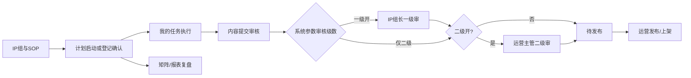
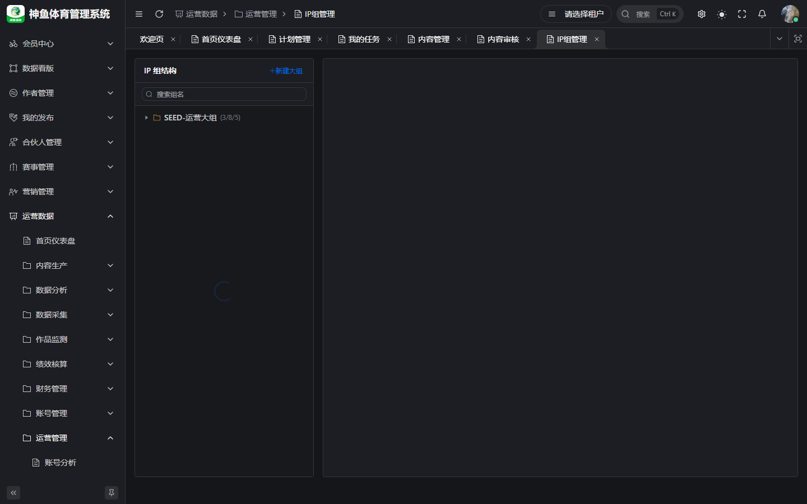
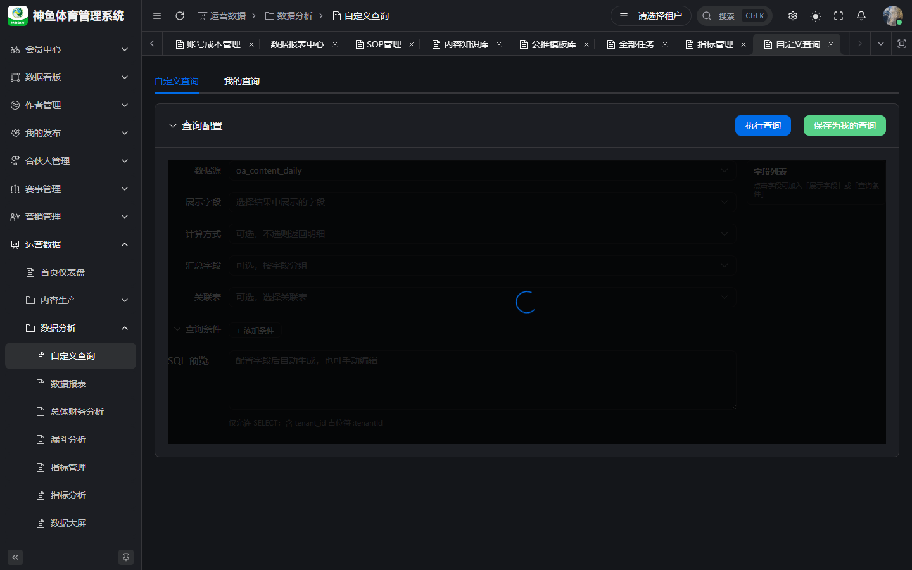
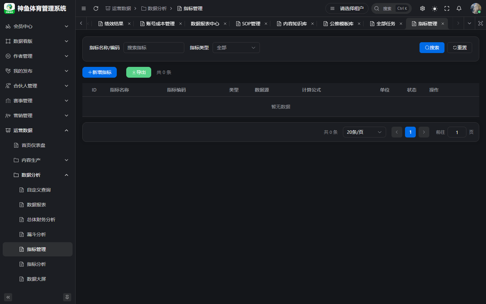

# 运营主管 · 操作手册

> **版本**：v2.1 | **日期**：2026-09-20  
> **读者**：运营主管、运营经理、具备主管权限的 IP 组长  
> **线上环境**：[`https://saas.shenyu.com`](https://saas.shenyu.com) · 完整 URL 见 [`ROUTE-线上地址索引.md`](./ROUTE-线上地址索引.md)  
> **本地联调**：`http://localhost:5777`（history 路由，无 `#`）  
> **正文 SSOT 补充**：[`../产品使用操作手册.md`](../产品使用操作手册.md) · [`../OPS业务操作手册-IP组与工作任务.md`](../OPS业务操作手册-IP组与工作任务.md)  
> **路由 SSOT**：[`../../delivery/OPS-MENU-ROUTE-INDEX.md`](../../delivery/OPS-MENU-ROUTE-INDEX.md)

---

## 目录

1. [篇首：角色定位与主流程](#1-篇首角色定位与主流程)
2. [IP 组维护](#2-ip-组维护)
3. [SOP 流程配置](#3-sop-流程配置)
4. [计划任务（计划管理）](#4-计划任务计划管理)
5. [任务登记管理（工作任务矩阵）](#5-任务登记管理工作任务矩阵)
6. [内容审核](#6-内容审核)
7. [数据报表查看](#7-数据报表查看)
8. [自定义查询](#8-自定义查询)
9. [指标管理](#9-指标管理)
10. [附录：权限与协作速查](#10-附录权限与协作速查)

---

## 1. 篇首：角色定位与主流程

### 1.1 角色定位与适用人员

**运营主管**在 OPS 中承担「排期与标准制定 + 过程纵览 + 合规把关」职责，典型适用人员包括：

- 租户内 **运营经理 / 运营主管**（`ops_manager` 等角色）
- 兼管多条业务线的 **高级 IP 组长**（若被赋予二级审核、矩阵查看权限）
- 负责 **SOP 模板、计划启停、审核策略** 的配置与监督者

本手册 **不包含** 系统管理员对 Football 用户/菜单的全局配置；也不展开 M10 采集运维（Phase 2 边界）。

### 1.2 产品业务价值

| 痛点 | OPS 如何解决 | 上下游协作 |
|------|--------------|------------|
| 多 IP 组、多赛事并行，排期靠表格易漏 | **计划管理** + **工作任务登记** 双通道，任务自动进「我的任务」 | 主管建计划/看矩阵；组长登记；运营/编辑执行 |
| 流程不统一、节点漏审 | **SOP 模板** 固化节点类型、审核门禁 | 主管维护 SOP；执行人按节点交付 |
| 内容合规风险 | **可配置一/二级内容审核** + IP 组长组内范围 | 组长一级审；主管二级审（按系统参数） |
| 决策缺数据 | **数据报表、指标、自定义查询** | 与财务成本、监测数据互补 |

### 1.3 整体操作流程说明

**日常主流程（推荐顺序）：**

1. 维护 **IP 组** 树、组长、成员岗位与关联作者/账号（数据权限基础）。
2. 在 **SOP 管理** 配置/启用模板（节点类型、needReview、执行岗位）。
3. **二选一或并行** 驱动任务：  
   - **计划管理**：多 IP 组 × 赛事 × SOP 节点 → **启动计划**；  
   - **工作任务管理**：IP 组长 **确认登记** → 按营销计划绑定 SOP 生成全节点任务（见专项手册）。
4. 在 **全部任务 / 工作任务矩阵** 纵览进度，处理异常与终止审批。
5. 在 **内容审核** 完成二级（若启用）或协助一级；通过后内容进入 **待发布**。
6. 通过 **数据报表、指标管理、自定义查询** 复盘产出与异常。

### 1.4 与其他角色的衔接

| 环节 | 主导角色 | 运营主管做什么 |
|------|----------|----------------|
| IP 组建档 | 运营主管 / 管理员 | 建组、指定组长、绑作者 |
| 日登记 | IP 组长 | 看 **任务管理矩阵**，催办、撤回协调 |
| SOP/计划 | 运营主管 | 建计划、启动/终止审批 |
| 内容执行 | 运营、编辑 | 审内容、催审核 |
| 账号资产 | 账号管理员 | 只读核对账号是否齐 |
| 成本 ROI | 财务人员 | 读报表与 ROI，不录成本 |

---

## 2. IP 组维护

### 2.1 功能说明与业务价值

IP 组是 **计划多选范围、工作任务登记范围、一级内容审核范围、数据权限** 的核心单元。组结构不正确会导致：登记选不到作者、一级审核列表为空、报表筛选偏差。

### 2.2 操作入口

**菜单路径**：运营数据 → **运营管理** → **IP组管理**  
**Hash 路由**：`/ops/operations/ip-group`
**线上完整 URL**：`https://saas.shenyu.com/#/ops/operations/ip-group`

  
*图 2-1 IP 组列表/树（联调环境可能暂无数据）*

工作流详图见：[`../delivery-screenshots/A01-ip-group-tree.png`](../delivery-screenshots/A01-ip-group-tree.png)

### 2.3 操作流程

**前置条件**：登录账号具备 `oa:ip-group:list` 及新建/编辑权限；用户选择器中的用户已在 Football 租户内启用。

**新建大组 / 小组：**

1. 打开 IP 组管理，点击 **新建大组**（或选中大组后 **新建小组**）。
2. 填写组名、等级（字典 `dict_ip_group_level`）、**组长**（用户选择器，存 Football `system_users.id`）。
3. 保存后在 **成员管理** Tab：**添加成员** 并设置 **岗位**（`dict_position`）。
4. 在 **关联作者** Tab 绑定内容作者；在 **关联账号** Tab 绑定平台账号（可选，便于分析）。
5. **结果**：该组出现在计划多选、工作任务 IP 组筛选、一级审核组范围计算中。

**维护已有组：**

1. 左侧树选中目标 **小组**（工作任务与一级审核多以小组为范围）。
2. 在 **基本信息** 更换组长或备注；在成员 Tab 调整岗位。
3. 若登记页作者下拉为空 → 回到 **关联作者** 补绑。

### 2.4 注意事项

- **数据权限**：非全局角色通常只能看到本人相关的 IP 组；看不到组请先确认成员/组长关系。
- **Football 用户 SSOT**：写入组长/成员 ID 必须为 Football 系统用户 ID（ADR-056）。
- **与计划**：草稿计划 **不可改 IP 组集合**；需换组请删草稿重建（ADR-070）。

### 2.5 新建/维护字段（Spec）

来源：[`API-M1-运营管理.md`](../../engineering/API-M1-运营管理.md) §2.3 `IpGroupCreateReq` / 成员 Tab。

| 字段 | 必填 | 说明 |
|------|------|------|
| groupName | ✅ | 1–50 字；同父级唯一 |
| groupType | ✅ | BIG / SMALL |
| parentId | △ | 小组必填 |
| leaderUserId | ✅ | UserSelect · Football 用户 ID |
| level | ❌ | `dict_ip_group_level` |
| description / status | ❌ | 备注、启用 |
| 成员 userId + position | △ | 成员 Tab；岗位 `dict_position` |

---

## 3. SOP 流程配置

### 3.1 功能说明与业务价值

SOP 模板定义内容生产 **节点类型**（内容生成 / 发布 / 普通）、**执行岗位**、**任务级 needReview**。计划管理与工作任务 confirm 均依赖 **已启用** 且绑定 **营销计划** 的模板（工作任务见 ADR-074）。

### 3.2 操作入口

**菜单路径**：运营数据 → **内容生产** → **SOP管理**  
**Hash 路由**：`/ops/production/sop`
**线上完整 URL**：`https://saas.shenyu.com/#/ops/production/sop`

  
*图 3-1 SOP 模板列表（若 16-sop 未采集则见下方说明）*

> **待补截图**：SOP 编辑画布（节点属性面板）— 需在 `/ops/production/sop` 进入模板编辑页补拍。

### 3.3 操作流程

1. 打开 SOP 管理，停留在 **SOP模板列表** Tab。
2. **新增模板**：填写名称、内容类型、描述 → 进入 **编辑画布**。
3. 从节点库拖入节点，在右侧配置：  
   - 节点类型、执行岗位（必填）；  
   - **是否需要审核** → 若开启须选 **审核人岗位**；  
   - 依赖连线、SLA、执行说明（可选）。
4. **校验 DAG** → **保存**（Ctrl+S）；启用模板开关。
5. 切到 **待审核任务** Tab 处理 **任务级** SOP 审核（needReview 完成后门禁，非模板审批）。

**任务级 SOP 审核步骤：**

1. 在 **待审核任务** Tab 筛选 `PENDING`。
2. 打开记录核对计划名、节点、提交人 → **通过**（任务 `DONE`）或 **驳回**（回 `IN_PROGRESS`）。

独立菜单 **SOP审核**（`/ops/production/sop/review`）若仍带演示数据，**以 SOP 管理 Tab 为准**。

### 3.4 注意事项

- 停用模板后 **新计划不可选**，已有计划不受影响。
- needReview 与 **内容三级审核** 是两套机制：前者管 **任务状态**，后者管 **内容状态**。
- 删除模板若被计划引用，系统会阻止并提示。

### 3.5 新建/维护字段（Spec）

来源：[`API-M2-内容生产.md`](../../engineering/API-M2-内容生产.md) §1.2–§1.6。

| 字段 | 必填 | 说明 |
|------|------|------|
| templateName | ✅ | max 100 |
| contentType | ✅ | `dict_content_type` |
| platformType | ✅ | `dict_platform_type` |
| description | ❌ | max 500 |
| status | ❌ | 启用开关 |
| 节点 nodeName / nodeType / executorRole | ✅ | 画布；`CONTENT_GENERATION` 须 `documentType` |
| needReview / reviewerRole | △ | needReview=1 时须审核岗位 |

---

## 4. 计划任务（计划管理）

### 4.1 功能说明与业务价值

面向 **多 IP 组、多赛事、完整 SOP 多节点** 的中长周期排期。主管创建并 **启动** 计划后，任务进入执行人「我的任务」。

### 4.2 操作入口

**菜单路径**：运营数据 → **内容生产** → **计划管理**  
**Hash 路由**：`/ops/production/plan`
**线上完整 URL**：`https://saas.shenyu.com/#/ops/production/plan`

  

### 4.3 操作流程

1. 点击 **新建**，填写计划名称、日期范围，选择 **已启用 SOP 模板**（保存后不可换模板）。
2. **多选 IP 组**（至少一个；保存后 IP 组集合锁定）。
3. 勾选赛事池，为每个 SOP 节点指定执行人（须在 IP 组并集成员/组长内）。
4. 可选 **预览任务** 核对 `|IP组|×|赛事|×|节点|` 行数。
5. **保存** → 计划 `DRAFT`；点 **启动** → `IN_PROGRESS`，任务 `PENDING`。
6. 进行中如需停止：**申请终止** → 具备审批权限者 **通过/驳回**。

### 4.4 注意事项

- 草稿任务状态 `PLAN_DRAFT`，执行人 **默认不可见**，必须启动。
- 任务名规则：`{赛事名称}-{节点名称}`，便于检索。
- 钉钉 `TASK_PENDING` 依赖系统参数钉钉配置（见 [`../产品使用操作手册.md`](../产品使用操作手册.md) §8）。

### 4.5 新建/维护字段（Spec）

来源：[`API-M2-计划管理.md`](../../engineering/API-M2-计划管理.md) §3。

| 字段 | 必填 | 说明 |
|------|------|------|
| planName | ✅ | |
| templateId | ✅ | 保存后不可改 |
| ipGroupIds | ✅ | ≥1；保存后锁定 |
| startDate / endDate | ✅ | |
| competitions | ✅ | 赛事池 |
| steps 或 tasks | ✅ | 覆盖模板全部节点；执行人 ∈ IP 组并集 |
| description | ❌ | |

---

## 5. 任务登记管理（工作任务矩阵）

### 5.1 功能说明与业务价值

IP 组长在 **任务登记** Tab 按日登记「赛事 × 作者 × 营销计划」；主管在 **任务管理** Tab 用 **矩阵视图** 纵览各作者、各组登记与任务分布，便于催办与复盘。

### 5.2 操作入口

**菜单路径**：运营数据 → **内容生产** → **工作任务管理**  
**Hash 路由**：`/ops/production/work-task`
**线上完整 URL**：`https://saas.shenyu.com/#/ops/production/work-task`

  

### 5.3 操作流程（主管侧）

1. 打开工作任务管理，切换到 **任务管理**（或矩阵）视图。
2. 选择 **IP 组、日期区间** → **查询**。
3. 查看矩阵：行为作者/登记批次，列为节点或状态（以页面为准）；识别未登记、未 confirm、执行中、已完成。
4. 点进明细行查看登记备注（格式：`赛事-营销计划-是否直播（时间）-销售平台；`）。
5. 协调组长 **撤回** 错误登记（若业务允许）或催执行人在 **我的任务** 完成。
6. **合并执行**：同作者、同营销计划多场次可由组长勾选 **合并执行**（ADR-075），主管在矩阵上识别「合并 N」标签。

**登记侧（供主管督导，执行多为组长）：**

1. 组长在 **任务登记** Tab 选 IP 组、日期，新增行并选作者、赛事、营销计划。
2. **确认登记** → 按 SOP **全节点** 生成 `oa_task`，执行人收到待办（ADR-074、078）。

### 5.4 注意事项

- 营销计划与启用 SOP **1:1**（同租户唯一绑定）；登记前确认营销计划已配置。
- confirm 后内容生成节点通常已有 **DRAFT 内容**（ADR-077）；执行人须 **提交内容审核** 才能完成任务门禁（ADR-079）。
- 详细步骤见 [`../OPS业务操作手册-IP组与工作任务.md`](../OPS业务操作手册-IP组与工作任务.md)。

### 5.5 登记行字段（Spec，组长操作）

来源：[`API-M2-工作任务管理.md`](../../engineering/API-M2-工作任务管理.md) `WorkTaskAssignmentSaveReq`。

| 字段 | 必填 | 说明 |
|------|------|------|
| competitionIdsJson | ✅ | ≥1 场 |
| authorId | ✅ | IP 组关联作者 |
| workDate | ✅ | |
| marketingPlan | ✅ | 绑定启用 SOP |
| isLive / liveTime | ✅ / △ | 直播时必填时间 |
| salesPlatform | ✅ | 字典 |
| assigneeId | ❌ | confirm 按 SOP 岗位解析 |

---

## 6. 内容审核

### 6.1 功能说明与业务价值

保证内容在 **OPS 发布** 前经过配置的一/二级人工审核；与 Football **上架** 独立（审核通过 ≠ APP 可见）。

### 6.2 操作入口

**菜单路径**：运营数据 → **内容生产** → **内容审核**  
**URL**：`/ops/production/content/review`（可带 `?stage=FIRST` / `SECOND`）

  

**审核策略配置**：运营数据 → **系统管理(OA)** → **系统参数** → **内容审核** Tab  

### 6.3 当前系统配置说明（Greenfield / 联调默认）

以租户 **系统参数 → 内容审核** Tab **实际值**为准；Greenfield seed 与 ADR-017/064 约定 **默认** 如下（生产环境可能已改）：

| 参数 | 默认值 | 含义 |
|------|--------|------|
| `content.review.level1.enabled` | `true` | 启用一级审核 |
| `content.review.level2.enabled` | `true` | 启用二级审核 |
| `content.review.level1.role` | `ip_group_leader`（兼容 `OPS_LEADER`） | 一级审核角色；IP 组长 **仅本组** 内容 |
| `content.review.level2.role` | `ops_manager`（兼容 `DEPT_HEAD`） | 二级审核角色；常为运营主管 |

**落态逻辑（摘要）**：一、二级均开 → 提交后 **待一级** → 一级通过 **待二级** → 二级通过 **待发布**；关闭某级则按 [`../产品使用操作手册.md`](../产品使用操作手册.md) §6.2 表跳转。

### 6.4 操作流程（主管 · 二级）

1. 打开内容审核，切换到 **二级审核** Tab（若参数关闭则不显示）。
2. 打开待审内容，核对正文、流程 steps（角色与可审人）。
3. **通过** → 内容 `PENDING_PUBLISH`；**驳回** → `REJECTED`，执行人改稿后重新提交。
4. 通知运营在 **内容管理** 执行 **OPS 发布**；需要 C 端可见时再 **Football 上架**。

**一级（组长）协作**：组长审本组内容；主管不越组代审除非具备全量权限。

### 6.5 注意事项

- 一级列表为空：确认是否 **跨组内容** 或当前用户非该组组长。
- 修改审核参数 **立即影响后续提交**，改前请同步审核人。
- AI 生成内容是否额外审核看 `ai.content.review.enabled`（系统参数 AI 相关项）。

---

## 7. 数据报表查看

### 7.1 功能说明与业务价值

统一查看运营产出、成本分摊、ROI、团队配置、异常预警等 **卡片化报表**，支撑主管周会/月会复盘。

### 7.2 操作入口

**菜单路径**：运营数据 → **数据分析** → **数据报表**  
**Hash 路由**：`/ops/analysis/data-report`
**线上完整 URL**：`https://saas.shenyu.com/#/ops/analysis/data-report`

### 7.3 操作流程

1. 打开报表中心，浏览卡片列表（统一视图、状态监控、短视频产出、直播时长、成本分摊、ROI 等）。
2. 点击卡片进入子报表。
3. 设置 **IP 组、平台、日期、时间维度** → **查询**。
4. 阅读汇总卡、图表、明细；需要时 **导出**。
5. 与 **运营管理 → 人效盘点**（§7.5 总册）交叉验证人力投入。

### 7.4 注意事项

- 空表常见于 seed 未灌或筛选过窄；先放宽日期与 IP 组。
- 外部竞品数据在 **作品监测** 菜单，与内部报表数据源不同，勿混读。

---

## 8. 自定义查询

### 8.1 功能说明与业务价值

面向临时分析需求，在权限与元数据约束下 **自助查表**（构建器或 SQL 能力以页面为准），补报表卡片未覆盖的明细。

### 8.2 操作入口

**菜单路径**：运营数据 → **数据分析** → **自定义查询**  
**Hash 路由**：`/ops/analysis/custom-query`
**线上完整 URL**：`https://saas.shenyu.com/#/ops/analysis/custom-query`

### 8.3 操作流程

1. 打开自定义查询页，选择 **数据源 / 实体**（依赖 **配置管理 → 元数据维护**）。
2. 在可视化构建器添加字段、过滤条件、排序；或使用页面提供的 SQL 模式（若开放）。
3. 点击 **执行/查询**，预览结果集。
4. 确认行数合理后 **导出**（若有）；保存常用查询（若页面支持）。

### 8.4 注意事项

- **租户隔离**：结果集必须带 `tenant_id` 约束；禁止导出超权限范围数据。
- 复杂 SQL 错误多源于元数据未维护字段映射 — 先找管理员补元数据。
- **待补截图**：自定义查询「双 Tab / 保存查询」细节页（若与列表差异大）。

---

## 9. 指标管理

### 9.1 功能说明与业务价值

定义 **指标编码、公式、维度**，供 **指标分析**、绩效模板、大屏引用；主管维护口径，避免各部门各算一套。

### 9.2 操作入口

**菜单路径**：运营数据 → **数据分析** → **指标管理**  
**Hash 路由**：`/ops/analysis/metric`
**线上完整 URL**：`https://saas.shenyu.com/#/ops/analysis/metric`

关联：**指标分析** `/ops/analysis/metric-analysis`

### 9.3 操作流程

1. 打开指标管理，点击 **新建指标**。
2. 填写名称、编码、类型（原子/复合等，以表单为准）。
3. 使用 **公式构建器** 或引用已有指标 → **预览** 试算。
4. **保存** → 在指标分析页选择该指标 + 时间/维度查询趋势。
5. 停用或修订指标前，确认 **绩效模板** 是否引用（见总册 §13）。

### 9.4 注意事项

- 指标编码建议租户内唯一；变更公式会影响历史可比性，需版本沟通。
- 元数据字段变更后需回归预览，防止 SQL 生成失败。

### 9.5 新建指标字段（Spec）

来源：[`API-M6-数据分析.md`](../../engineering/API-M6-数据分析.md) §1.2。

| 字段 | 必填 | 说明 |
|------|------|------|
| metricName | ✅ | |
| metricCode | ✅ | 英文+下划线；租户内唯一 |
| metricType | ✅ | `dict_perf_metric_type` |
| metricFormula / dataSource | ❌ | 复合指标依赖 |
| unit / description | ❌ | |

**自定义查询** 保存实体字段：**待 Spec 确认**（见 [`通用入门与权限说明.md`](./通用入门与权限说明.md) §5）。

---

## 10. 附录：权限与协作速查

| Hash 路由 | 线上完整 URL | 页面 | 权限码（参考） |
|-----------|--------------|------|----------------|
| `/ops/operations/ip-group` | `https://saas.shenyu.com/#/ops/operations/ip-group` | IP 组 | `oa:ip-group:list` |
| `/ops/production/sop` | `https://saas.shenyu.com/#/ops/production/sop` | SOP | `oa:sop:list` |
| `/ops/production/plan` | `https://saas.shenyu.com/#/ops/production/plan` | 计划 | `oa:plan:list` |
| `/ops/production/work-task` | `https://saas.shenyu.com/#/ops/production/work-task` | 工作任务 | `ops:work-task:list` |
| `/ops/production/task/all` | `https://saas.shenyu.com/#/ops/production/task/all` | 全部任务 | `oa:task:list` |
| `/ops/production/content/review` | `https://saas.shenyu.com/#/ops/production/content/review` | 内容审核 | `oa:content:list` |
| `/ops/analysis/data-report` | `https://saas.shenyu.com/#/ops/analysis/data-report` | 数据报表 | `oa:report:list` |
| `/ops/analysis/custom-query` | `https://saas.shenyu.com/#/ops/analysis/custom-query` | 自定义查询 | `oa:custom-query:list` |
| `/ops/analysis/metric` | `https://saas.shenyu.com/#/ops/analysis/metric` | 指标管理 | `oa:metric:list` |
| `/ops/system-oa/system-param` | `https://saas.shenyu.com/#/ops/system-oa/system-param` | 系统参数 | `oa:param:list` |

**登录与环境**：[`通用入门与权限说明.md`](./通用入门与权限说明.md) · 总册 §2。

---

## 修订记录

| 日期 | 说明 |
|------|------|
| 2026-09-20 | v2.0 按角色 SSOT 重写：篇首 + 九模块完整步骤 |
