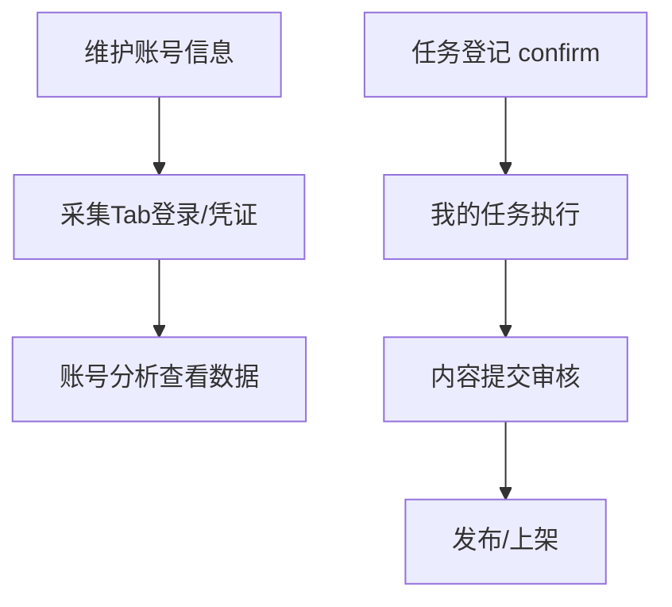
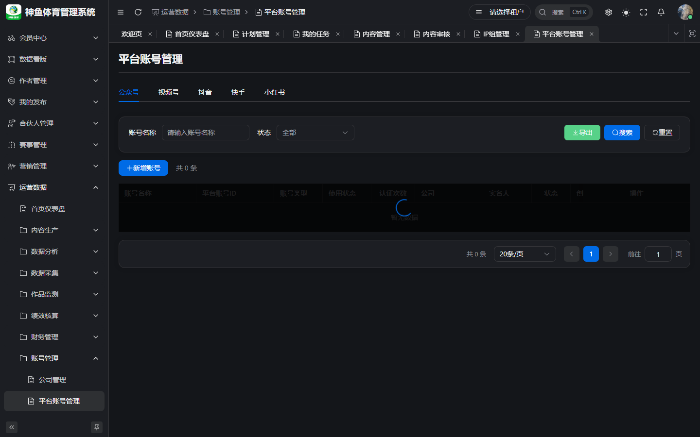
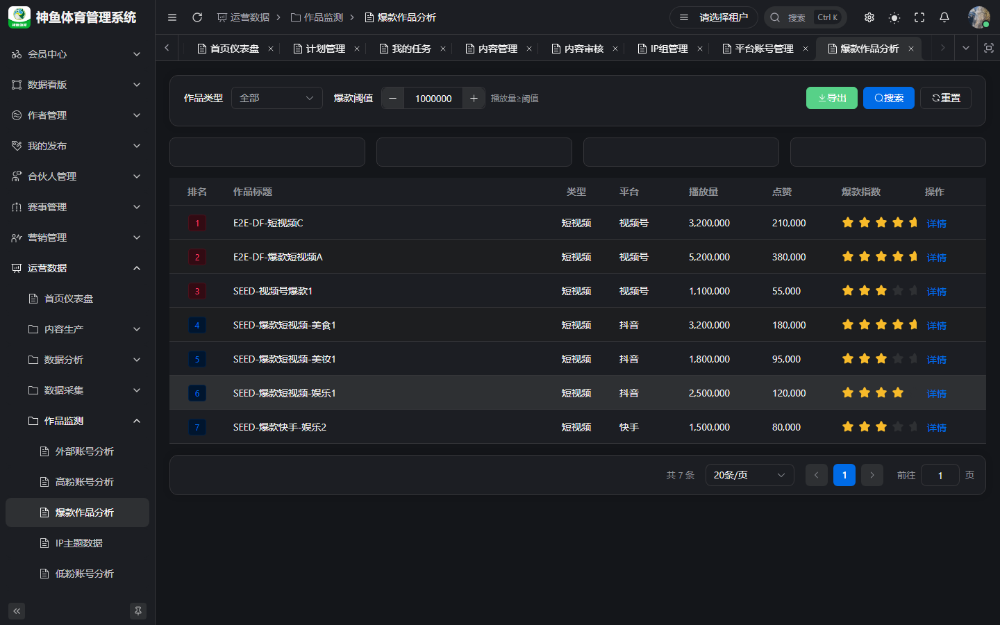

# 运营 · 操作手册

> **版本**：v2.1 | **日期**：2026-09-20  
> **线上环境**：[`https://saas.shenyu.com`](https://saas.shenyu.com) · [`ROUTE-线上地址索引.md`](./ROUTE-线上地址索引.md)  
> **读者**：日常运营、平台运营、账号运营（非专职编辑/非财务）  
> **SSOT 补充**：[`../产品使用操作手册.md`](../产品使用操作手册.md) §4、§5、§6、§11、§7.2

---

## 目录

1. [篇首](#1-篇首)
2. [账号信息维护](#2-账号信息维护)
3. [账号登录设置（采集凭证）](#3-账号登录设置采集凭证)
4. [账号数据查看](#4-账号数据查看)
5. [任务登记（IP 组长）](#5-任务登记ip-组长)
6. [任务执行](#6-任务执行)
7. [附录](#7-附录)

---

## 1. 篇首

### 1.1 角色定位与适用人员

**运营**人员负责 **平台账号台账、登录凭证、账号表现数据**，并作为 IP 组长时完成 **工作任务登记**，作为执行人时完成 **我的任务**（含发布类节点）。适用：一线运营、账号运营、兼任组长的运营。

### 1.2 产品业务价值

- **账号信息集中**：公司/实名人/手机/手机卡/平台账号强关联，避免「凭记忆找号」。
- **登录与采集凭证 SSOT**（ADR-047）：在账号详情 **采集 Tab** 维护 Cookie/Token，支撑粉丝与作品数据刷新。
- **任务闭环**：登记 → 执行 → 内容审核 → **OPS 发布** / Football 上架。

### 1.3 整体操作流程

1. 在 **平台账号管理** 维护账号基础信息与资产绑定（或由账号管理员建档，运营补全业务字段）。
2. 在账号详情 **采集 Tab** 配置凭证、测试连接、必要时扫码登录。
3. 在 **账号分析** 等页查看粉丝/表现；空数据先查凭证与采集是否成功。
4. （若任 IP 组长）**工作任务管理 → 任务登记 → 确认登记**。
5. **我的任务** 执行节点 → 内容创作 → 提交审核 → 完成；发布节点配合 **内容管理**。

### 1.4 与其他角色衔接

| 角色 | 分工 |
|------|------|
| 账号管理员 | 公司/实名人/手机/手机卡主数据 |
| 运营主管 | 计划、矩阵督导、二级审核 |
| 编辑 | 深度内容排版、AI 生成 |
| 财务 | 账号成本录入 |

---

## 2. 账号信息维护

### 2.1 功能说明与业务价值

运营侧常需 **更新账号展示名、IP 组、状态、中介人**，以及核对实名人/手机绑定是否正确。强关联 ID **禁止手输**，一律用选择器（业务错误码 1501/1502）。

### 2.2 操作入口

**菜单路径**：运营数据 → **账号管理** → **平台账号管理**  
**Hash 路由**：`/ops/internal/internal-account`
**线上完整 URL**：`https://saas.shenyu.com/#/ops/internal/internal-account`

### 2.3 操作流程

1. 按 **平台、账号类型、IP 组、实名人、公司、状态** 筛选目标账号。
2. 点击 **编辑**（或 **新增账号**，若权限允许）。
3. 填写/修改：平台、类型、账号名、账号标识（同平台唯一）、**IP 组**。
4. 用选择器绑定 **实名人、手机、手机卡**；企业类型必选 **公司**。
5. 凭证类字段按需更新（界面脱敏展示）。
6. **保存**；若实名人已被其他账号占用，按提示确认 **强制替换** 或改绑。

**推荐建档顺序**（与账号管理员协作）：公司 → 实名人 → 手机 → 手机卡 → 平台账号。

### 2.4 注意事项

- 停用账号后发布与采集可能失败，改状态前确认无在途任务。
- 个人账号（个微/企微）在 **个人账号管理** `https://saas.shenyu.com/#/ops/internal/personal-account`，与本章平台账号分开。

### 2.5 新建/维护字段（Spec）

来源：[`API-M4-账号管理.md`](../../engineering/API-M4-账号管理.md) §5.2 `AccountCreateReq`。

| 字段 | 必填 | 说明 |
|------|------|------|
| platformType | ✅ | `dict_platform_type` |
| accountName | ✅ | |
| accountId | ✅ | 同平台唯一 |
| accountType | ✅ | `dict_account_type` |
| ipGroupId | ✅ | 选择器 |
| companyId | △ | 企业类型必选 |
| realnameId / phoneId / simCardId | ✅ | 强关联选择器 |
| intermediaryId | ❌ | 实名人中介 |
| cookie / status 等 | ❌ | 凭证与状态 |

---

## 3. 账号登录设置（采集凭证）

### 3.1 功能说明与业务价值

Channel-A 平台（公众号、视频号、抖音、快手、小红书、B 站等）的内部采集凭证统一在 **平台账号详情 · 采集 Tab** 维护（PRD-M4 §4.5.5），替代历史分散配置。

### 3.2 操作入口

**菜单路径**：平台账号管理 → 打开某账号 **详情** → **采集** Tab  
**URL**：`/ops/internal/internal-account`（详情抽屉/页内 Tab）

> **待补截图**：平台账号详情 · 采集 Tab（含测试连接/扫码登录按钮）

### 3.3 操作流程

1. 在列表打开目标 **平台账号** 详情。
2. 切换到 **采集** Tab（仅支持的平台类型显示）。
3. 编辑 **Cookie、mp_token（公众号）、auth_token** 等字段（以平台表单为准）。
4. 点击 **绑定采集服务** / **测试连接**（页面按钮文案为准），确认返回成功。
5. 若提供 **扫码登录**：按弹窗指引完成扫码，成功后保存凭证。
6. 在 **粉丝列表** 或 **账号分析** 稍后验证数据是否更新（依赖 M10 采集任务，非本 Tab 建 cron）。

### 3.4 注意事项

- AppId/AppSecret 等多为 **档案字段**，MVP **不参与** 采集鉴权（Spec 写明部分）。
- 完整 **采集任务频率** 在 **数据采集 → 采集任务**（Phase 2 运维边界）；运营只需保证 **凭证有效**。
- 勿将 Cookie/Token 写入文档或截图外泄。

---

## 4. 账号数据查看

### 4.1 功能说明与业务价值

查看 **内部账号** 粉丝、作品、ROI 相关表现，支撑日常运营决策；与 **作品监测**（外部竞品）数据源不同。

### 4.2 操作入口

| 页面 | 菜单路径 | 线上完整 URL |
|------|----------|----------------|
| 账号分析 | 运营管理 → 账号分析 | `https://saas.shenyu.com/#/ops/operations/account-analysis` |
| 粉丝分析 | 运营管理 → 粉丝分析 | `https://saas.shenyu.com/#/ops/operations/fans-analysis` |
| 内部作品分析 | 运营管理 → 内部作品分析 | `https://saas.shenyu.com/#/ops/operations/internal-content` |
| 账号详情粉丝 | 平台账号详情 → 粉丝列表 | `https://saas.shenyu.com/#/ops/internal/internal-account` |

  
*外部竞品见作品监测；内部账号请用运营管理下分析页。*

### 4.3 操作流程

**账号分析：**

1. 打开账号分析，选择 **平台 Tab**。
2. 设置 IP 组、时间范围 → **查询**。
3. 查看汇总与表格，点行看详情 → 需要时 **导出**。

**粉丝分析：**

1. 选 IP 组、平台、时间维度与日期 → **查询** → 看趋势/明细 → **导出**。

**内部作品分析：**

1. 筛选平台/IP/日期 → **查询** → 点行进作品详情（若有）。

### 4.4 注意事项

- 空表优先检查：**采集凭证**、采集任务是否运行、筛选日期是否过窄。
- 数据权限按 IP 组过滤；看不到其他组账号属正常。

---

## 5. 任务登记（IP 组长）

### 5.1 功能说明与业务价值

IP 组长按日登记 **赛事 × 作者 × 营销计划**，**确认登记** 后生成 SOP 全节点任务，是短周期内容产出的主入口（相对「计划管理」）。

### 5.2 操作入口

**菜单路径**：运营数据 → **内容生产** → **工作任务管理** → **任务登记**  
**Hash 路由**：`/ops/production/work-task`
**线上完整 URL**：`https://saas.shenyu.com/#/ops/production/work-task`

  

### 5.3 操作流程

1. 选择 **IP 组、日期** → 查询/进入登记视图。
2. **新增行**：选 **作者**（须已在 IP 组关联作者）、赛事、营销计划、是否直播、销售平台等。
3. 指定执行人或使用 **岗位匹配** 默认执行人（无匹配则 **IP 组长**，见 ADR-074）。
4. 多场次同计划可选 **合并执行**（ADR-075）→ 场次列显示「合并 N」。
5. 核对无误 → **确认登记** → 系统生成任务，执行人「我的任务」出现待办，可能钉钉 `TASK_PENDING`。
6. 错误登记在允许规则下 **撤回** 后修改再 confirm（以页面按钮为准）。

### 5.4 注意事项

- 作者下拉为空 → 回 IP 组 **关联作者** Tab 维护。
- confirm 后内容节点常有自动 DRAFT（ADR-077）；仍须 **提交内容审核** 才能过任务完成门禁。

### 5.5 登记行字段（Spec）

同 [`运营主管操作手册.md`](./运营主管操作手册.md) §5.5 · [`API-M2-工作任务管理.md`](../../engineering/API-M2-工作任务管理.md)。

---

## 6. 任务执行

### 6.1 功能说明与业务价值

在 **我的任务** 完成 SOP 节点：内容生成、普通交付、内容发布等。

### 6.2 操作入口

**菜单路径**：运营数据 → **内容生产** → **我的任务**  
**Hash 路由**：`/ops/production/task`
**线上完整 URL**：`https://saas.shenyu.com/#/ops/production/task`

  

### 6.3 操作流程（内容生成节点）

1. 列表点 **执行** 进入执行页（`PENDING` 自动变 `IN_PROGRESS`）。
2. 进入 **内容创作**，编辑标题/正文/付费免费栏 → **保存**。
3. 在内容侧 **提交审核**（进入内容审核流）。
4. 回到任务页点 **完成**：  
   - 内容须非 `DRAFT`/`REJECTED`；  
   - 若节点 `needReview=1` → 任务 `PENDING_REVIEW`（SOP 任务审核）；否则 `DONE`。

**发布类节点：**

1. 确认内容已 **待发布/已发布**（视节点要求）。
2. 在 **内容管理** 执行 **发布** 选平台账号；需要 C 端可见再 **上架**。

### 6.4 注意事项

- 多 IP 组并行任务在执行页用 **IP 组 Tab** 切换兄弟任务。
- 任务名自动生成，勿依赖手填标题检索任务。

---

## 7. 附录

| 需求 | 参考文档 |
|------|----------|
| 内容审核、发布 | [`../产品使用操作手册.md`](../产品使用操作手册.md) §5–§6 |
| IP 组与矩阵 | [`../OPS业务操作手册-IP组与工作任务.md`](../OPS业务操作手册-IP组与工作任务.md) |
| 登录环境 | [`../产品使用操作手册.md`](../产品使用操作手册.md) §2 |

**修订**：2026-09-20 v2.0 角色手册重写。
