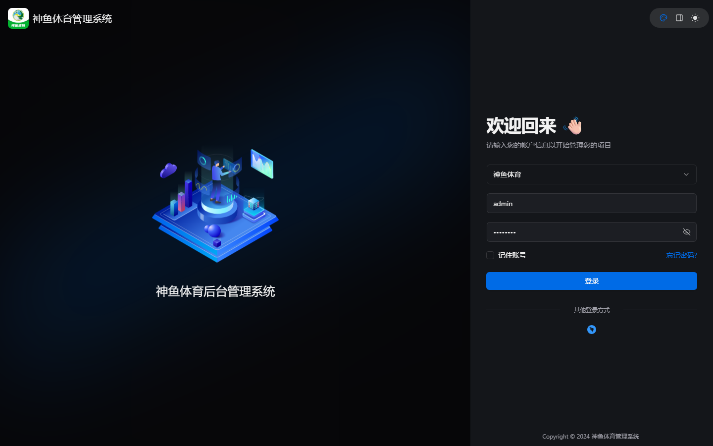
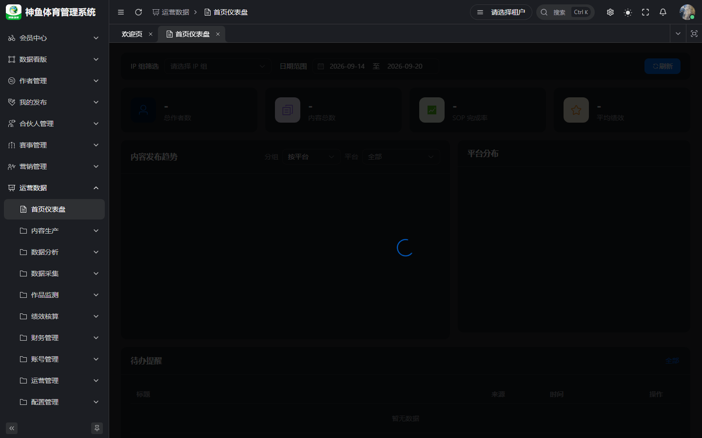

# 通用入门与权限说明

> **版本**：v1.0 | **日期**：2026-09-20  
> **线上登录**：[`https://saas.shenyu.com`](https://saas.shenyu.com)（Football 管理端；登录后侧栏 **运营数据**）  
> **Hash 路由基址**：`https://saas.shenyu.com/#` + 下文各功能路径（见 [`ROUTE-线上地址索引.md`](./ROUTE-线上地址索引.md)）  
> **本地联调**：`http://localhost:5777` + 同路径（history，**无** `#`）— 见 [`../../delivery/OPS-DEV-DEPLOY-GUIDE.md`](../../delivery/OPS-DEV-DEPLOY-GUIDE.md)

---

## 目录

1. [登录与租户](#1-登录与租户)
2. [菜单与路由](#2-菜单与路由)
3. [IP 组与数据权限](#3-ip-组与数据权限)
4. [常见错误与排查](#4-常见错误与排查)
5. [附录：待 Spec 确认项](#5-附录待-spec-确认项)

---

## 1. 登录与租户

### 1.1 线上入口

| 项 | 说明 |
|----|------|
| 地址 | `https://saas.shenyu.com` |
| 登录方式 | Football 统一账号（**非** OPS 独立登录页；Phase 2 Out of Scope） |
| 租户 | 多租户 SaaS；请求头/会话携带 `tenant_id`，数据 **全表隔离** |
| 登录后 | 侧栏一级 **运营数据**（menu_id 6100）→ 展开业务菜单 |

  

### 1.2 看不到「运营数据」？

1. 账号未分配 OPS 菜单块（6100–6999）— 联系租户管理员在 Football **角色/菜单** 中授权。  
2. 使用了错误环境（仅前端空壳、未接 Gateway/ops-server）。  
3. 浏览器缓存旧菜单 — 重新登录或清缓存。

### 1.3 Dev Token（仅开发）

本地联调可用 Dev Token 替代登录来源；**权限仍从 DB 读取**（ADR-003），不得硬编码 userId/tenantId。

---

## 2. 菜单与路由

### 2.1 路由规则

- **线上**：`https://saas.shenyu.com/#/ops/{分组}/{页面}`，例如手机管理：  
  `https://saas.shenyu.com/#/ops/internal/phone`  
- **SSOT**：seed 菜单嵌套拼接 — [`../../delivery/OPS-MENU-ROUTE-INDEX.md`](../../delivery/OPS-MENU-ROUTE-INDEX.md)  
- **交付速查**：[`ROUTE-线上地址索引.md`](./ROUTE-线上地址索引.md)（**70** 条可导航页）

### 2.2 权限与按钮

| 层级 | 行为 |
|------|------|
| 菜单 type=2 | 无 `permission` 则侧栏不显示 |
| 按钮 type=3 | 无权限则按钮隐藏/禁用 |
| `@PreAuthorize` | 后端 API 二次校验 |

角色手册中的权限码（如 `oa:ip-group:list`）为 **参考**；以登录账号实际菜单为准。

### 2.3 首页

**菜单**：运营数据 → **首页仪表盘**  
**Hash 路由**：`/ops/dashboard`  
**线上完整 URL**：`https://saas.shenyu.com/#/ops/dashboard`

---

## 3. IP 组与数据权限

### 3.1 IP 组是什么

IP 组（大组/小组）是 **计划多选、工作任务登记、一级内容审核、部分报表/成本** 的数据范围单元。  
维护入口：**运营管理 → IP 组管理**  
`https://saas.shenyu.com/#/ops/operations/ip-group`

### 3.2 常见数据范围规则（摘要）

| 场景 | 规则摘要 |
|------|----------|
| 非全局角色 | 列表常限「本人为组长/成员的 IP 组」 |
| 一级内容审核 | IP 组长 **仅本组** 内容（系统参数角色 `ip_group_leader`） |
| 账号/成本 | 经 `account_id` 与 IP 组关联过滤（见数据权限实现计划） |
| Football 用户 ID | 写入组长/成员/执行人须为 shenyu `system_users.id`（ADR-056） |

### 3.3 用户选择器

表单中 **组长、保管人、执行人** 等须用 **UserSelect**，禁止手输 ID；保存前后端校验租户内有效用户（1501）。

---

## 4. 常见错误与排查

| 现象 | 可能原因 | 建议 |
|------|----------|------|
| 403 / 无权限 | 角色未配菜单或按钮权限 | 管理员核对 Football 角色菜单 |
| 1501 关联不存在 | 选择器 ID 无效或跨租户 | 重新选择；确认 Football 用户已启用 |
| 1502 业务冲突 | 唯一约束、实名人占用、任务已有关联内容 | 按提示改绑或撤回 |
| 1504 租户隔离 | 跨租户 ID | 仅选本租户数据 |
| 一级审核列表空 | 非本组组长 / 内容属他组 | 确认 IP 组与 `content.review.level1` 参数 |
| 登记页作者为空 | IP 组未 **关联作者** | IP 组 → 关联作者 Tab 补绑 |
| 计划草稿任务不可见 | 未 **启动** 计划 | 计划管理 → 启动 |
| 钉钉通知未达 | 系统参数钉钉未配或未测通 | 系统参数 → 钉钉 Tab |
| 采集数据空 | 凭证失效或 M10 任务未跑 | 平台账号采集 Tab；采集菜单 Phase 2 边界 |

业务错误码 **1500–1504** 为全局关联类；模块 200x 见各 API 文档。

---

## 5. 附录：待 Spec 确认项

| 模块 | 项 | 说明 |
|------|-----|------|
| 自定义查询 | 保存查询 / SQL 模式字段 | 前端表单 rules 与 API 未在 M6 正文逐字段列出 |
| 系统参数 | 部分 AI 子项默认值 | 以页面与 seed 为准，业务版 PRD 未全量表格化 |
| 个人账号 API 配置 | appSecret 等必填 | 见 API-M4 §6.3，操作手册未展开 |
| Football 角色菜单配置 | 操作步骤 | Phase 2 / 系统管理员 Out of Scope（本手册仅说明现象） |

---

**关联文档**：[`汇总产品使用手册.md`](./汇总产品使用手册.md) · [`端到端业务流程手册.md`](./端到端业务流程手册.md) · [`系统配置与权限管理手册.md`](./系统配置与权限管理手册.md)

**修订**：2026-09-20 v1.0
