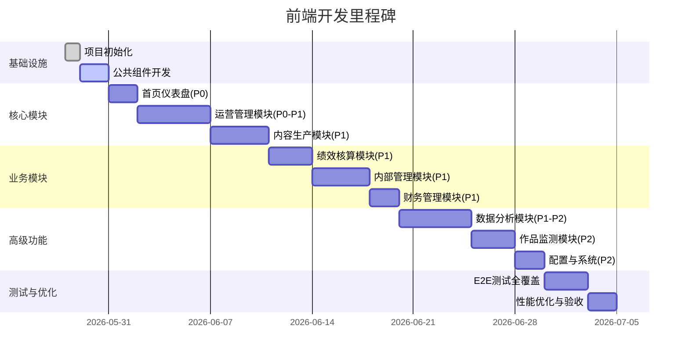
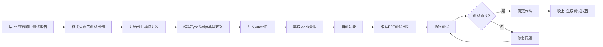
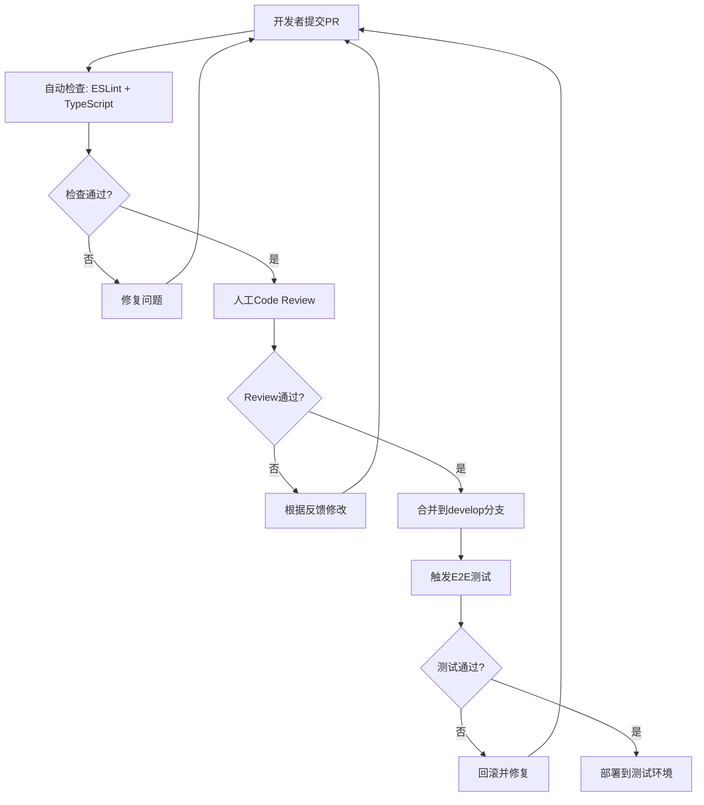

# 运营数据平台 - Vue3前端开发计划与E2E测试方案

**版本**: v1.0  
**日期**: 2026-05-28  
**技术栈**: Vue 3.4 + Element Plus 2.7 + TypeScript 5.x + Pinia 2.x + ECharts 5.5 + Vite 5.x

---

## 📋 目录

1. [项目概述](#1-项目概述)
2. [开发阶段规划](#2-开发阶段规划)
3. [模块开发详细计划](#3-模块开发详细计划)
4. [E2E测试用例设计](#4-e2e测试用例设计)
5. [开发执行流程](#5-开发执行流程)
6. [质量保障机制](#6-质量保障机制)

---

## 1. 项目概述

### 1.1 项目目标

基于PRD v9.0和AI开发规范，构建完整的运营数据分析平台前端应用，实现：
- ✅ 42个功能模块的完整UI实现
- ✅ 符合Element Plus设计规范的用户界面
- ✅ 严格的TypeScript类型安全
- ✅ 完善的E2E自动化测试覆盖
- ✅ Mock数据驱动的独立前端开发

### 1.2 技术约束

| 约束项 | 要求 |
|--------|------|
| 前端框架 | Vue 3.4+ Composition API + `<script setup>` |
| UI组件库 | Element Plus 2.7+（禁止使用其他UI库） |
| 状态管理 | Pinia 2.x（禁止Vuex） |
| HTTP客户端 | Axios 1.x |
| 图表库 | ECharts 5.5+ + vue-echarts |
| 构建工具 | Vite 5.x |
| 代码规范 | ESLint + Prettier + TypeScript严格模式 |
| 分页参数 | 统一使用 `pageNo`/`pageSize`（禁止 `page`/`size`） |
| 字段命名 | TypeScript接口使用camelCase（禁止snake_case） |
| API前缀 | 所有API路径必须包含 `/admin-api/oa` |

### 1.3 交付物清单

- ✅ 42个Vue页面组件（`.vue`文件）
- ✅ 公共组件库（TableSearch、Pagination、DictSelect等）
- ✅ API接口层（TypeScript封装）
- ✅ TypeScript类型定义（interfaces/types）
- ✅ Pinia Store（状态管理）
- ✅ E2E测试用例（Playwright/Cypress）
- ✅ Mock数据服务（JSON Server/Mock.js）

---

## 2. 开发阶段规划

### 2.1 阶段划分（共6个阶段）



### 2.2 优先级定义

| 优先级 | 说明 | 模块数量 | 预计工期 |
|--------|------|---------|---------|
| **P0** | 核心基础功能，必须首先完成 | 5个模块 | 7天 |
| **P1** | 重要业务功能，第二批次完成 | 25个模块 | 18天 |
| **P2** | 辅助功能，最后完成 | 12个模块 | 10天 |

---

## 3. 模块开发详细计划

### 3.1 阶段一：基础设施搭建（2天）

#### Day 1: 项目初始化

**任务清单**：
- [x] ✅ 创建Vue 3 + Vite项目（已完成）
- [ ] 配置TypeScript严格模式
- [ ] 安装Element Plus及图标库
- [ ] 配置Vite别名（`@/` → `src/`）
- [ ] 配置ESLint + Prettier
- [ ] 创建目录结构
- [ ] 配置路由（Vue Router）
- [ ] 配置Pinia Store
- [ ] 配置Axios拦截器
- [ ] 创建全局样式（SCSS）

**输出文件**：
```
ops-platform-ui-vue/
├── src/
│   ├── api/              # API接口层
│   │   ├── index.ts      # Axios实例配置
│   │   ├── dashboard.ts  # 首页API
│   │   └── ...
│   ├── components/       # 公共组件
│   │   ├── ContentWrap.vue
│   │   ├── Pagination.vue
│   │   ├── DictSelect.vue
│   │   └── TableSearch.vue
│   ├── router/           # 路由配置
│   │   └── index.ts
│   ├── stores/           # Pinia状态
│   │   ├── user.ts
│   │   └── app.ts
│   ├── types/            # TypeScript类型
│   │   ├── dashboard.ts
│   │   └── common.ts
│   ├── utils/            # 工具函数
│   │   ├── request.ts
│   │   └── format.ts
│   ├── views/            # 页面组件
│   │   ├── Layout.vue
│   │   ├── Dashboard.vue
│   │   └── ...
│   ├── styles/           # 全局样式
│   │   └── index.scss
│   ├── App.vue
│   └── main.ts
├── vite.config.ts
├── tsconfig.json
└── package.json
```

#### Day 2: 公共组件开发

**任务清单**：
- [ ] 开发 `ContentWrap` 组件（页面容器）
- [ ] 开发 `Pagination` 组件（标准分页器）
- [ ] 开发 `DictSelect` 组件（字典下拉选择）
- [ ] 开发 `TableSearch` 组件（搜索区容器）
- [ ] 开发 `Icon` 组件（SVG图标）
- [ ] 创建Mock数据服务
- [ ] 配置路由守卫（权限控制）
- [ ] 创建Layout布局组件

**公共组件规格**：

##### ContentWrap.vue
```typescript
// Props
interface Props {
  title?: string        // 可选标题
  extra?: string        // 右上角额外内容
}

// 样式要求
- 白色背景 (#fff)
- 圆角 (8px)
- 阴影 (0 2px 12px rgba(0,0,0,0.1))
- 内边距 (20px)
```

##### Pagination.vue
```typescript
// Props
interface Props {
  total: number         // 总记录数
  currentPage: number   // 当前页码
  pageSize: number      // 每页条数
}

// Emits
emit('update:currentPage', page: number)
emit('update:pageSize', size: number)
emit('change', page: number, size: number)

// 默认值
- 每页显示: 10/20/50/100
- 显示总数
- 支持跳转
```

##### DictSelect.vue
```typescript
// Props
interface Props {
  dictType: string      // 字典类型（如 oa_ip_group_type）
  modelValue?: string | number
  placeholder?: string
}

// Emits
emit('update:modelValue', value: string | number)

// API调用
GET /admin-api/system/dict-data/list?type={dictType}
```

---

### 3.2 阶段二：P0核心模块（7天）

#### Day 3-4: 首页仪表盘（DASHBOARD-001）

**参考文档**：
- PRD章节：5.0 首页仪表盘
- 页面规格：`AI开发规范/00-首页仪表盘-页面规格.md`
- API契约：待补充

**开发任务**：
- [ ] 创建 `Dashboard.vue` 页面组件
- [ ] 实现欢迎区（"欢迎回来，Donny！今日运营概况"）
- [ ] 实现5个KPI卡片（平台账号数、粉丝总量、今日内容、待审核、预警数）
- [ ] 实现6个快捷入口（IP组管理、作者管理、账号分析、内容管理、ROI分析、数据报表）
- [ ] 实现账号数据概览饼图（ECharts）
- [ ] 实现近7天内容发布趋势折线图（ECharts）
- [ ] 实现待办事项区域
- [ ] 实现预警通知区域
- [ ] 集成Mock数据
- [ ] 添加加载状态和错误处理

**TypeScript类型定义**：
```typescript
// src/types/dashboard.ts

interface DashboardHomeKpiVO {
  totalAccounts: number
  accountChangeRate: number
  totalFollowers: number
  followerChangeRate: number
  todayContentCount: number
  contentChangeRate: number
  pendingReviewCount: number
  alertCount: number
}

interface DashboardAccountOverviewVO {
  platformType: PlatformType
  accountCount: number
  followerCount: number
}

interface DashboardContentOverviewVO {
  date: string
  wechatCount: number
  douyinCount: number
  kuaishouCount: number
  xiaohongshuCount: number
  videoAccountCount: number
}

interface DashboardAlertItemVO {
  alertId: number
  alertLevel: 'CRITICAL' | 'WARNING' | 'INFO'
  alertContent: string
  triggerTime: string
}

interface DashboardTodoItemVO {
  type: 'REVIEW' | 'TASK' | 'EXPIRE'
  title: string
  count: number
  route: string
}
```

**API接口**：
```typescript
// src/api/dashboard.ts

/**
 * 获取首页KPI数据
 */
export function getDashboardKpi(): Promise<DashboardHomeKpiVO> {
  return request.get({ url: '/admin-api/oa/dashboard/home/kpi' })
}

/**
 * 获取账号数据概览
 */
export function getAccountOverview(): Promise<DashboardAccountOverviewVO[]> {
  return request.get({ url: '/admin-api/oa/dashboard/home/account-overview' })
}

/**
 * 获取内容数据概览
 */
export function getContentOverview(): Promise<DashboardContentOverviewVO[]> {
  return request.get({ url: '/admin-api/oa/dashboard/home/content-overview' })
}

/**
 * 获取预警列表
 */
export function getAlertList(): Promise<DashboardAlertItemVO[]> {
  return request.get({ url: '/admin-api/oa/dashboard/home/alert-list' })
}

/**
 * 获取待办事项
 */
export function getTodoList(): Promise<DashboardTodoItemVO[]> {
  return request.get({ url: '/admin-api/oa/dashboard/home/todo-list' })
}
```

**Mock数据示例**：
```typescript
// src/mock/dashboard.ts

export const mockDashboardKpi: DashboardHomeKpiVO = {
  totalAccounts: 256,
  accountChangeRate: 2.1,
  totalFollowers: 12345000,
  followerChangeRate: 0.8,
  todayContentCount: 12,
  contentChangeRate: -1,
  pendingReviewCount: 5,
  alertCount: 3,
}

export const mockAccountOverview: DashboardAccountOverviewVO[] = [
  { platformType: 'WECHAT_MP', accountCount: 45, followerCount: 3200000 },
  { platformType: 'DOUYIN', accountCount: 38, followerCount: 5600000 },
  { platformType: 'KUAISHOU', accountCount: 32, followerCount: 2100000 },
  { platformType: 'XIAOHONGSHU', accountCount: 28, followerCount: 1800000 },
  { platformType: 'VIDEO_ACCOUNT', accountCount: 25, followerCount: 950000 },
  { platformType: 'SERVICE_ACCOUNT', accountCount: 18, followerCount: 680000 },
]
```

#### Day 5-6: IP组管理（OA-001）

**参考文档**：
- PRD章节：5.1 IP组管理
- 页面规格：`AI开发规范/01-IP组管理-页面规格.md`
- API契约：`AI开发规范/01-IP组管理-API接口契约.md`

**开发任务**：
- [ ] 创建 `IpGroup.vue` 页面组件
- [ ] 实现树形表格展示（大组/小组两级层级）
- [ ] 实现搜索区（IP组名称、类型、状态）
- [ ] 实现新增/编辑弹窗（表单校验）
- [ ] 实现删除功能（二次确认）
- [ ] 实现展开/折叠子节点
- [ ] 集成Mock数据

**关键交互**：
- 大组不可直接管理账号，必须通过小组
- 删除时需检查是否有子组或关联账号
- 支持拖拽排序（可选）

#### Day 7: 作者管理（OA-002）

**参考文档**：
- PRD章节：5.2 作者管理
- 页面规格：`AI开发规范/02-作者管理-页面规格.md`
- API契约：`AI开发规范/02-作者管理-API接口契约.md`

**开发任务**：
- [ ] 创建 `Author.vue` 页面组件
- [ ] 实现作者列表表格
- [ ] 实现主推号关联功能
- [ ] 实现运营→主播关联
- [ ] 实现作者数据看板（Tab切换）

---

### 3.3 阶段三：P1重要模块（18天）

#### Day 8-12: 运营管理模块（5天）

| 模块 | 天数 | 关键功能 |
|------|------|---------|
| 账号分析 | 1天 | Tab按平台→列表→粉丝/作品详情 |
| 粉丝分析 | 1天 | 粉丝增长趋势、粉丝画像 |
| 作品分析 | 1天 | 作品列表、数据对比 |
| 内部内容分析 | 1天 | Tab按平台→作品列表 |
| 人效盘点 | 1天 | 经办人展开详情 |

#### Day 13-16: 内容生产模块（4天）

| 模块 | 天数 | 关键功能 |
|------|------|---------|
| SOP管理 | 1.5天 | DAG流程编排、审核状态机、预置模板 |
| 计划管理 | 0.5天 | 计划列表、创建计划 |
| 任务管理 | 1天 | 任务分配、任务状态跟踪 |
| 内容管理 | 1天 | AI生成、三级审核、发布 |

#### Day 17-19: 绩效核算模块（3天）

| 模块 | 天数 | 关键功能 |
|------|------|---------|
| 考核模板 | 1天 | 岗位模板、指标关联配置 |
| 考核执行 | 1天 | 自动算分、人工调整 |
| 绩效结果 | 0.5天 | 结果查询、导出 |
| 订单归因分析 | 0.5天 | 订单关联、归因统计 |

#### Day 20-23: 内部管理模块（4天）

| 模块 | 天数 | 关键功能 |
|------|------|---------|
| 公司管理 | 0.5天 | 企业基本信息、公众号容量管理 |
| 实名人管理 | 0.5天 | 实名人列表、关联查询 |
| 手机管理 | 0.5天 | 手机设备列表、状态管理 |
| 手机卡管理 | 0.5天 | SIM卡列表、绑定关系 |
| 内部平台账号 | 1天 | 多平台账号统一管理 |
| 个人账号管理 | 0.5天 | 企微/个微私域账号 |
| 三方关联统计 | 0.5天 | 微信+视频号+企微三方映射 |

#### Day 24-25: 财务管理模块（2天）

| 模块 | 天数 | 关键功能 |
|------|------|---------|
| 账号成本管理 | 1天 | 购买成本、过程成本记录 |
| ROI分析 | 1天 | 公司/IP组/账号维度ROI |

#### Day 26-30: 数据分析模块（5天）

| 模块 | 天数 | 关键功能 |
|------|------|---------|
| 指标管理 | 1天 | 指标定义、计算公式 |
| 数据报表 | 1.5天 | 8张报表（全平台账号视图、状态监控等） |
| 总体财务分析 | 0.5天 | 财务数据汇总 |
| 漏斗分析 | 1天 | 预置漏斗、自定义漏斗 |
| 自定义查询 | 1天 | 查询构建器、发布机制 |

---

### 3.4 阶段四：P2辅助模块（10天）

#### Day 31-33: 作品监测模块（3天）

| 模块 | 天数 | 关键功能 |
|------|------|---------|
| 外部账号分析 | 0.5天 | 竞品账号监控 |
| 爆款作品分析 | 0.5天 | 爆款判定、趋势分析 |
| 低分作品分析 | 0.5天 | 低分判定、优化建议 |
| 高粉/低粉账号 | 0.5天 | 粉丝异常检测 |
| IP主题数据 | 0.5天 | 主题热度分析 |
| 行业数据 | 0.5天 | 行业对标数据 |

#### Day 34-35: 配置管理与系统管理（2天）

| 模块 | 天数 | 关键功能 |
|------|------|---------|
| 配置管理 | 1天 | 采集配置、阈值规则、AI模型 |
| 系统管理 | 1天 | 用户、角色、权限、日志 |

#### Day 36-37: 数据采集模块（2天）

| 模块 | 天数 | 关键功能 |
|------|------|---------|
| 采集任务管理 | 1天 | 任务调度、执行日志 |
| 数据质量 | 1天 | 质量监控、异常告警 |

---

### 3.5 阶段五：E2E测试全覆盖（3天）

#### Day 38-40: 编写并执行E2E测试

**测试框架**：Playwright（推荐）或 Cypress

**测试覆盖目标**：
- ✅ 所有P0模块：100%覆盖
- ✅ 所有P1模块：80%覆盖
- ✅ 所有P2模块：50%覆盖

**测试场景分类**：
1. **登录与权限测试**（5个用例）
2. **首页仪表盘测试**（10个用例）
3. **CRUD操作测试**（每个模块至少5个用例）
4. **表单校验测试**（每个表单至少3个用例）
5. **数据可视化测试**（图表渲染验证）
6. **异常处理测试**（网络错误、超时、空数据）

---

### 3.6 阶段六：性能优化与验收（2天）

#### Day 41-42: 最终优化

**优化项**：
- [ ] 首屏加载时间 ≤ 2s
- [ ] 打包体积优化（Code Splitting）
- [ ] 图片懒加载
- [ ] 虚拟滚动（大数据表格）
- [ ] 路由懒加载
- [ ] 组件按需引入
- [ ] Lighthouse评分 ≥ 90

**验收标准**：
- [ ] 所有P0/P1模块功能完整
- [ ] E2E测试通过率 ≥ 95%
- [ ] 无TypeScript编译错误
- [ ] 无ESLint警告
- [ ] 符合Element Plus设计规范
- [ ] 响应式布局适配（1920px/1440px/1366px）

---

## 4. E2E测试用例设计

### 4.1 测试框架选型

**推荐**：Playwright
- 优势：支持多浏览器、自动等待、强大的调试工具
- 语言：TypeScript
- 报告：HTML报告 + 截图/视频录制

**备选**：Cypress
- 优势：开发者友好、实时重载
- 劣势：仅支持Chrome系浏览器

### 4.2 测试用例清单

#### 4.2.1 登录与权限测试（5个用例）

| 用例ID | 测试场景 | 预期结果 | 优先级 |
|--------|---------|---------|--------|
| AUTH-001 | 正常登录 | 跳转到首页，显示用户信息 | P0 |
| AUTH-002 | 密码错误 | 显示"用户名或密码错误" | P0 |
| AUTH-003 | 无权限访问 | 按钮不渲染（v-hasPermi） | P0 |
| AUTH-004 | Token过期 | 自动跳转登录页 | P0 |
| AUTH-005 | 退出登录 | 清除Token，跳转登录页 | P1 |

**测试代码示例**：
```typescript
// tests/auth.spec.ts

import { test, expect } from '@playwright/test'

test.describe('登录与权限测试', () => {
  test('AUTH-001: 正常登录', async ({ page }) => {
    await page.goto('/login')
    await page.fill('input[name="username"]', 'admin')
    await page.fill('input[name="password"]', '123456')
    await page.click('button[type="submit"]')
    
    // 等待跳转到首页
    await page.waitForURL('/')
    
    // 验证用户信息显示
    await expect(page.locator('.user-info')).toBeVisible()
    await expect(page.locator('.username')).toContainText('管理员')
  })

  test('AUTH-002: 密码错误', async ({ page }) => {
    await page.goto('/login')
    await page.fill('input[name="username"]', 'admin')
    await page.fill('input[name="password"]', 'wrong')
    await page.click('button[type="submit"]')
    
    // 验证错误提示
    await expect(page.locator('.el-message--error')).toBeVisible()
    await expect(page.locator('.el-message--error')).toContainText('用户名或密码错误')
  })
})
```

#### 4.2.2 首页仪表盘测试（10个用例）

| 用例ID | 测试场景 | 预期结果 | 优先级 |
|--------|---------|---------|--------|
| DASH-001 | KPI卡片数据加载 | 5个KPI卡片正确显示数值 | P0 |
| DASH-002 | KPI环比变化显示 | 正数绿色↑，负数红色↓ | P0 |
| DASH-003 | 快捷入口跳转 | 点击后跳转到对应页面 | P0 |
| DASH-004 | 账号数据饼图渲染 | ECharts饼图正确显示 | P0 |
| DASH-005 | 内容趋势折线图渲染 | ECharts折线图正确显示 | P0 |
| DASH-006 | 待办事项列表 | 显示待办数量和标题 | P0 |
| DASH-007 | 预警通知列表 | 按严重程度排序显示 | P0 |
| DASH-008 | 手动刷新功能 | 点击刷新按钮重新加载数据 | P1 |
| DASH-009 | 空数据状态 | 无待办时显示"暂无待办" | P1 |
| DASH-010 | 加载失败重试 | 显示重试按钮，点击后重试 | P1 |

**测试代码示例**：
```typescript
// tests/dashboard.spec.ts

import { test, expect } from '@playwright/test'

test.describe('首页仪表盘测试', () => {
  test.beforeEach(async ({ page }) => {
    // 登录并导航到首页
    await page.goto('/')
  })

  test('DASH-001: KPI卡片数据加载', async ({ page }) => {
    // 验证5个KPI卡片存在
    const kpiCards = page.locator('.kpi-card')
    await expect(kpiCards).toHaveCount(5)
    
    // 验证具体数值
    await expect(page.locator('.kpi-value').nth(0)).toContainText('256')
    await expect(page.locator('.kpi-label').nth(0)).toContainText('平台账号数')
  })

  test('DASH-003: 快捷入口跳转', async ({ page }) => {
    // 点击IP组管理快捷入口
    await page.locator('.quick-item').filter({ hasText: 'IP组管理' }).click()
    
    // 验证跳转到IP组管理页面
    await page.waitForURL('/ip-group')
    await expect(page.locator('.el-breadcrumb__item').last()).toContainText('IP组管理')
  })

  test('DASH-004: 账号数据饼图渲染', async ({ page }) => {
    // 验证ECharts容器存在
    const chartContainer = page.locator('[ref="accountChartRef"]')
    await expect(chartContainer).toBeVisible()
    
    // 验证canvas元素已渲染
    await expect(chartContainer.locator('canvas')).toBeVisible()
  })
})
```

#### 4.2.3 IP组管理CRUD测试（5个用例）

| 用例ID | 测试场景 | 预期结果 | 优先级 |
|--------|---------|---------|--------|
| IPG-001 | 列表数据加载 | 树形表格正确显示大组/小组 | P0 |
| IPG-002 | 新增IP组 | 弹窗提交后列表刷新 | P0 |
| IPG-003 | 编辑IP组 | 修改后数据更新成功 | P0 |
| IPG-004 | 删除IP组 | 二次确认后删除成功 | P0 |
| IPG-005 | 表单校验 | 必填项为空时阻止提交 | P0 |

**测试代码示例**：
```typescript
// tests/ip-group.spec.ts

import { test, expect } from '@playwright/test'

test.describe('IP组管理CRUD测试', () => {
  test.beforeEach(async ({ page }) => {
    await page.goto('/ip-group')
  })

  test('IPG-002: 新增IP组', async ({ page }) => {
    // 点击新增按钮
    await page.click('button:has-text("新增")')
    
    // 填写表单
    await page.fill('input[placeholder="请输入IP组名称"]', '测试大组')
    await page.selectOption('select[name="type"]', '1') // 大组
    await page.selectOption('select[name="status"]', '1') // 启用
    
    // 提交表单
    await page.click('button:has-text("确认")')
    
    // 验证成功提示
    await expect(page.locator('.el-message--success')).toBeVisible()
    await expect(page.locator('.el-message--success')).toContainText('操作成功')
    
    // 验证列表刷新
    await expect(page.locator('.el-table__row').first()).toContainText('测试大组')
  })

  test('IPG-005: 表单校验', async ({ page }) => {
    // 点击新增按钮
    await page.click('button:has-text("新增")')
    
    // 不填写任何字段，直接提交
    await page.click('button:has-text("确认")')
    
    // 验证错误提示
    await expect(page.locator('.el-form-item__error')).toHaveCount(3)
    await expect(page.locator('.el-form-item__error').first()).toContainText('请输入IP组名称')
  })
})
```

#### 4.2.4 表单校验测试（通用，每个表单3个用例）

| 用例ID | 测试场景 | 预期结果 | 优先级 |
|--------|---------|---------|--------|
| FORM-001 | 必填项为空 | 显示红色错误提示，阻止提交 | P0 |
| FORM-002 | 长度超限 | 显示"长度超出限制"提示 | P1 |
| FORM-003 | 格式错误 | 显示"格式不正确"提示（邮箱/手机号等） | P1 |

#### 4.2.5 数据可视化测试（每个图表2个用例）

| 用例ID | 测试场景 | 预期结果 | 优先级 |
|--------|---------|---------|--------|
| CHART-001 | 图表渲染 | canvas元素可见，无控制台错误 | P0 |
| CHART-002 | 图表交互 | 悬停显示tooltip，点击触发事件 | P1 |

#### 4.2.6 异常处理测试（5个用例）

| 用例ID | 测试场景 | 预期结果 | 优先级 |
|--------|---------|---------|--------|
| ERR-001 | 网络断开 | 显示"网络连接失败"提示 | P0 |
| ERR-002 | 请求超时 | 显示"请求超时"提示 + 重试按钮 | P0 |
| ERR-003 | 401未授权 | 自动跳转登录页 | P0 |
| ERR-004 | 403无权限 | 显示"无权限操作"警告 | P0 |
| ERR-005 | 500服务器错误 | 显示"系统异常"提示 | P0 |

**测试代码示例**：
```typescript
// tests/error-handling.spec.ts

import { test, expect } from '@playwright/test'

test.describe('异常处理测试', () => {
  test('ERR-002: 请求超时', async ({ page }) => {
    // Mock超时请求
    await page.route('**/admin-api/oa/dashboard/home/kpi', async route => {
      await new Promise(resolve => setTimeout(resolve, 10000)) // 模拟10秒超时
      await route.abort('timedout')
    })
    
    await page.goto('/')
    
    // 验证超时提示
    await expect(page.locator('.el-message--error')).toBeVisible()
    await expect(page.locator('.el-message--error')).toContainText('请求超时')
  })

  test('ERR-003: 401未授权', async ({ page }) => {
    // Mock 401响应
    await page.route('**/admin-api/oa/dashboard/home/kpi', route => {
      route.fulfill({
        status: 401,
        contentType: 'application/json',
        body: JSON.stringify({ code: 401, msg: '未授权' })
      })
    })
    
    await page.goto('/')
    
    // 验证跳转到登录页
    await page.waitForURL('/login')
  })
})
```

### 4.3 测试执行策略

#### 4.3.1 测试分组

```typescript
// playwright.config.ts

export default defineConfig({
  testDir: './tests',
  
  // 测试分组
  projects: [
    {
      name: 'smoke',        // 冒烟测试（P0用例）
      grep: /@smoke/,
    },
    {
      name: 'regression',   // 回归测试（P0+P1用例）
      grep: /@(smoke|regression)/,
    },
    {
      name: 'full',         // 全量测试（所有用例）
      grep: /@.*/,
    },
  ],
  
  // 并行执行
  fullyParallel: true,
  
  // 重试次数
  retries: process.env.CI ? 2 : 0,
  
  // 超时时间
  timeout: 30000,
})
```

#### 4.3.2 测试命令

```bash
# 运行冒烟测试（快速验证核心功能）
npm run test:smoke

# 运行回归测试（P0+P1模块）
npm run test:regression

# 运行全量测试（所有模块）
npm run test:full

# 生成HTML报告
npm run test:report
```

#### 4.3.3 CI/CD集成

```yaml
# .github/workflows/e2e-test.yml

name: E2E Tests

on:
  push:
    branches: [main, develop]
  pull_request:
    branches: [main]

jobs:
  e2e:
    runs-on: ubuntu-latest
    
    steps:
      - uses: actions/checkout@v3
      
      - name: Setup Node.js
        uses: actions/setup-node@v3
        with:
          node-version: 18
      
      - name: Install dependencies
        run: npm ci
      
      - name: Install Playwright
        run: npx playwright install --with-deps
      
      - name: Run smoke tests
        run: npm run test:smoke
      
      - name: Upload test report
        if: always()
        uses: actions/upload-artifact@v3
        with:
          name: playwright-report
          path: playwright-report/
```

---

## 5. 开发执行流程

### 5.1 每日开发流程



### 5.2 模块开发 checklist

每个模块开发完成后，必须完成以下检查：

- [ ] TypeScript类型定义完整（无`any`）
- [ ] 组件Props/Emits声明类型
- [ ] 表单校验规则完整
- [ ] 错误处理完善（loading、empty、error状态）
- [ ] Mock数据集成
- [ ] 至少5个E2E测试用例
- [ ] 符合Element Plus设计规范
- [ ] 响应式布局测试（1920/1440/1366）
- [ ] 无ESLint警告
- [ ] 无控制台错误

### 5.3 代码审查流程



---

## 6. 质量保障机制

### 6.1 代码质量标准

| 指标 | 要求 | 检查工具 |
|------|------|---------|
| TypeScript覆盖率 | 100%（无`any`） | tsc --noEmit |
| ESLint通过率 | 100%（无警告） | eslint |
| 单元测试覆盖率 | ≥ 70% | vitest + coverage |
| E2E测试通过率 | ≥ 95% | playwright |
| Lighthouse评分 | ≥ 90 | lighthouse CI |

### 6.2 性能指标

| 指标 | 目标值 | 测量工具 |
|------|--------|---------|
| 首屏加载时间 | ≤ 2s | Lighthouse |
| FCP（首次内容绘制） | ≤ 1.5s | Web Vitals |
| LCP（最大内容绘制） | ≤ 2.5s | Web Vitals |
| TTI（可交互时间） | ≤ 3s | Web Vitals |
| 打包体积（gzip） | ≤ 300KB | webpack-bundle-analyzer |

### 6.3 兼容性要求

| 浏览器 | 最低版本 | 测试频率 |
|--------|---------|---------|
| Chrome | 90+ | 每次发布 |
| Firefox | 88+ | 每周 |
| Safari | 14+ | 每周 |
| Edge | 90+ | 每次发布 |

### 6.4 持续集成流水线

```yaml
stages:
  - lint
  - build
  - test
  - deploy

lint:
  script:
    - npm run lint
    - npm run type-check

build:
  script:
    - npm run build
  artifacts:
    paths:
      - dist/

test:
  script:
    - npm run test:unit
    - npm run test:e2e:smoke

deploy:
  script:
    - npm run deploy:test
  only:
    - develop
```

---

## 附录

### A. 模块开发优先级汇总表

| 模块编号 | 模块名称 | 优先级 | 预计天数 | 开始日期 | 完成日期 |
|---------|---------|--------|---------|---------|---------|
| DASHBOARD-001 | 首页仪表盘 | P0 | 2 | 2026-05-29 | 2026-05-30 |
| OA-001 | IP组管理 | P0 | 2 | 2026-05-31 | 2026-06-01 |
| OA-002 | 作者管理 | P0 | 1 | 2026-06-02 | 2026-06-02 |
| OA-003 | 账号分析 | P0 | 1 | 2026-06-03 | 2026-06-03 |
| OA-004 | 粉丝分析 | P1 | 1 | 2026-06-04 | 2026-06-04 |
| ... | ... | ... | ... | ... | ... |

### B. 常见问题FAQ

**Q1: Mock数据如何管理？**
A: 使用JSON Server或Mock.js，在`src/mock/`目录下按模块组织，每个模块一个文件。

**Q2: 如何处理API未就绪的情况？**
A: 优先使用Mock数据开发，API就绪后替换为真实接口，保持接口签名一致。

**Q3: E2E测试失败如何调试？**
A: Playwright提供截图、视频录制、Trace Viewer三种调试方式，推荐使用Trace Viewer。

**Q4: 如何保证TypeScript类型安全？**
A: 严格模式（`strict: true`），禁止`any`，所有Props/Emits/API返回值必须声明类型。

**Q5: 组件复用如何管理？**
A: 公共组件放在`src/components/`，业务组件放在`src/views/{module}/components/`。

---

**文档维护者**: AI Assistant  
**最后更新**: 2026-05-28  
**下次 review**: 2026-06-04（阶段一完成后）
