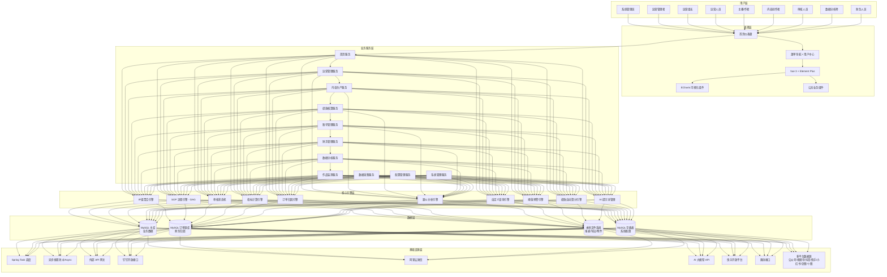
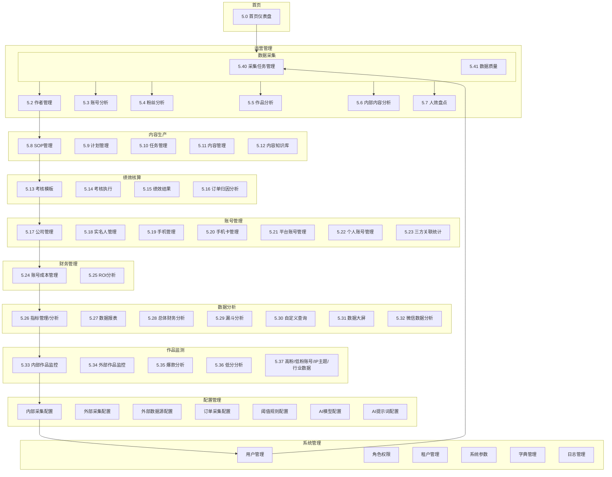
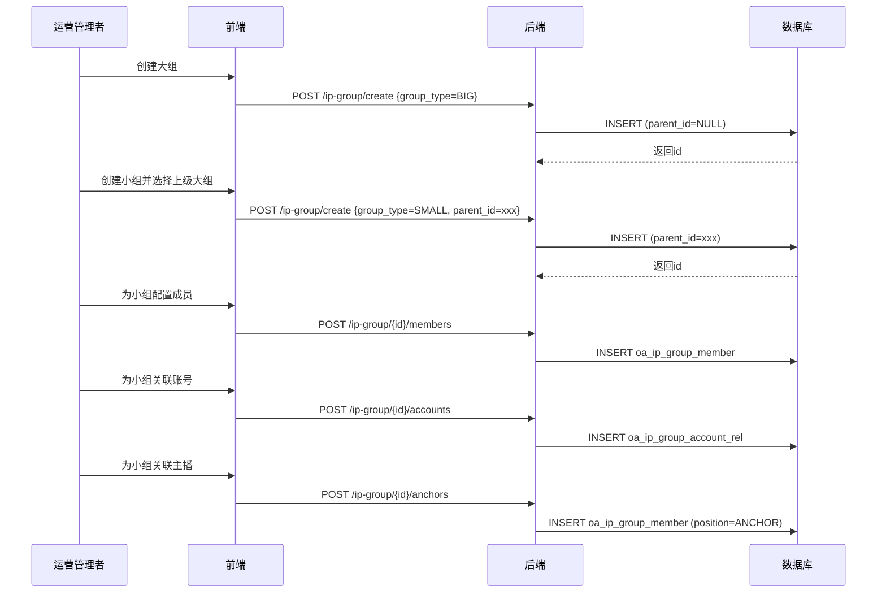
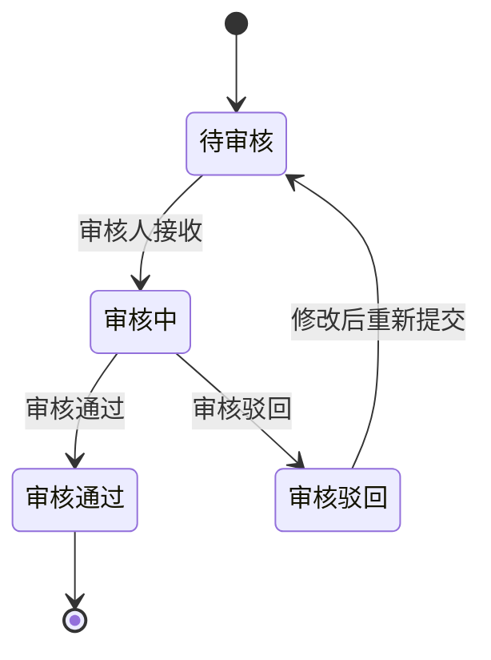
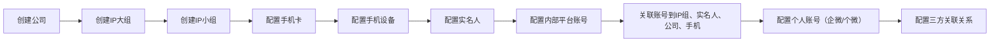
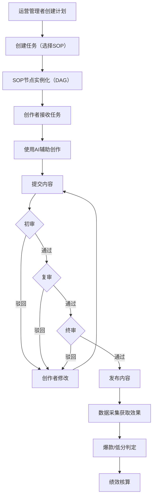
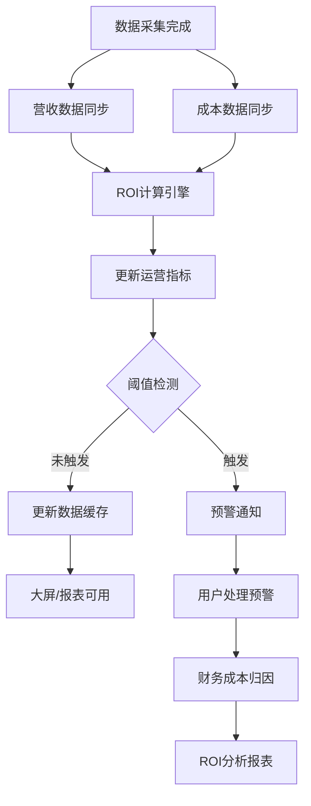
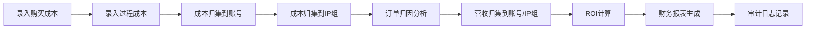

# 运营数据分析平台 - 完整PRD v9.1（开发版）

**版本**：v9.1
**作者**：齐活林（主理人）+ 许清楚（产品经理）
**日期**：2026-05-31
**状态**：开发就绪
**基于文档**：PRD-正式版.md + PRD-需求变更-v2.md + 0525沟通记录.md + 0525需求变更分析报告-v2.md（所有来源已合并为本完整自包含文档）

---

## 版本历史

| 版本 | 日期 | 更新内容 | 更新人 |
|------|------|---------|--------|
| v9.1-整理版 | 2026-06-07 | 重写 ## 2. 产品逻辑架构（六层架构+中间件简化）；重写 ## 3. 功能架构（11 模块+41 子模块与 5.0~5.41 对齐）；新增 ## 3A. 产品功能点列表（53 个功能点+8 张报表，按 11 业务域组织） | 齐活林+许清楚 |
| v9.1 | 2026-05-31 | 0530需求变更：内部管理改名为账号管理、实名人新增中介人关联、手机号展示全平台账号、内部平台账号管理改名、内部内容分析新增补录功能 | 齐活林+许清楚 |
| v9.0 | 2026-05-28 | 完整自包含PRD：消除所有"保持vX.X设计不变"占位，补全SOP引擎增强(DAG/并行/审核状态机)、绩效考核系统(4新表/模板/指标关联/自动算分)、预置SOP生产流程(14节点/4路并行)、SOP审核记录表，全部50+模块内容完整内嵌无需关联其他文档 | 齐活林+许清楚 |
| v7.0 | 2026-05-27 | 0525需求变更全面落地：IP组管理重构、内部管理独立模块、财务管理独立、运营→主播关联、企业公众号容量管理、三方关联、自定义查询发布、首页IP组筛选、账号关联关系总览 | 齐活林+许清楚 |
| v5.0 | 2026-05-20 | 大规模需求变更v2：快手平台、奥创接口展示、账号财务增强(4新表)、作者主推号、人效详情展开、SOP引擎增强(DAG/并行/审核)、绩效考核系统(4新表)、预置SOP流程 | 许清楚 |
| v4.0 | 2026-05-20 | 开发级完整PRD，整合PRD+详细设计，包含完整输入/输出/流程/权限/数据流 | 齐活林+许清楚 |

---

---

## 文档体系导航（v1.0，2026-06-07 起）

> 本文档是 **L1 PRD 单一事实源**。AI 开发需配套使用以下文档（位于 `docs/` 目录）：

| 层级 | 文档 | 路径 | 用途 |
|------|------|------|------|
| L1 | 本 PRD | `完整PRD-v9.1-开发版.md` | 产品需求规格 |
| L1+ | 子模块 PRD | `docs/product/PRD-M{1-10}-{模块}.md` | 每个模块的 FR/AC/Out-of-Scope |
| L2 | UX 规格 | `docs/product/UX-M{1-10}-{模块}.md` | 页面矩阵、状态矩阵、按钮级规格 |
| L3 | 技术约束 | `docs/engineering/TECH-CONSTRAINTS.md` | 技术栈、目录、命名、禁止事项 |
| L3 | API 规格 | `docs/engineering/API-M{1-10}-{模块}.md` | 接口 DTO、错误码、鉴权 |
| L3 | 状态机 | `docs/engineering/STATE-M{1-10}-{模块}.md` | 状态定义、转移矩阵、副作用 |
| L4 | 切片计划 | `docs/delivery/SLICES-M{1-10}-{模块}.md` | 分片实现、依赖图、五段式 Prompt |
| L5 | 自检清单 | `docs/delivery/CHECKLIST-M{1-10}-{模块}.md` | 开发完成自检 |
| L5 | 测试用例 | `docs/delivery/TESTCASES-M{1-10}-{模块}.md` | 功能/权限/异常/状态机/性能 |
| - | AI 规则 | `AGENTS.md`（根目录） | AI 编码代理硬性规则 |
| - | 决策记录 | `docs/adr/ADR-NNN-{描述}.md` | 架构/产品决策 |
| - | 文档索引 | `docs/README.md` | 文档体系总览 |

**当前完成度**：
- ✅ M1 运营管理全套 8 个文档（试点）
- ✅ 项目级文档：TECH-CONSTRAINTS、AGENTS.md、README.md
- ✅ ADR-001、ADR-M1-001/002（已签字）
- 📋 M0/M2~M10 子模块文档待生成

详见 [docs/README.md](./docs/README.md)

---

## 目录

1. [产品概述](#1-产品概述)
2. [产品逻辑架构](#2-产品逻辑架构)
3. [功能架构](#3-功能架构)
3A. [产品功能点列表（完整）](#3a-产品功能点列表完整)
4. [目标用户与权限矩阵](#4-目标用户与权限矩阵)
5. [功能详细设计](#5-功能详细设计)
   - 5.0 首页仪表盘（含IP组筛选）
   - 5.1 运营管理 - IP组管理
   - 5.2 运营管理 - 作者管理（含主推号关联、运营→主播关联）
   - 5.3 运营管理 - 账号分析（Tab按平台→列表→粉丝/作品详情）
   - 5.4 运营管理 - 粉丝分析
   - 5.5 运营管理 - 作品分析
   - 5.6 运营管理 - 内部内容分析（Tab按平台→作品列表）
   - 5.7 运营管理 - 人效盘点（含经办人展开详情）
   - 5.8 内容生产 - SOP管理（DAG+审核+并行+预置模板）
   - 5.9 内容生产 - 计划管理
   - 5.10 内容生产 - 任务管理
   - 5.11 内容生产 - 内容管理（AI生成+审核+发布）
   - 5.12 内容生产 - 内容知识库
   - 5.13 绩效核算 - 考核模板
   - 5.14 绩效核算 - 考核执行
   - 5.15 绩效核算 - 绩效结果
   - 5.16 绩效核算 - 订单归因分析
   - 5.17 账号管理 - 公司管理
   - 5.18 账号管理 - 实名人管理
   - 5.19 账号管理 - 手机管理
   - 5.20 账号管理 - 手机卡管理
   - 5.21 账号管理 - 平台账号管理
   - 5.22 账号管理 - 个人账号管理
   - 5.23 账号管理 - 三方关联统计
   - 5.24 财务管理 - 账号成本管理（购买+过程成本）
   - 5.25 财务管理 - ROI分析
   - 5.26 数据分析 - 指标管理 / 指标分析
   - 5.27 数据分析 - 数据报表（8张报表含字段+样式）
   - 5.28 数据分析 - 总体财务分析
   - 5.29 数据分析 - 漏斗分析（预置+自定义）
   - 5.30 数据分析 - 自定义查询（含发布机制）
   - 5.31 数据分析 - 数据大屏 / 大屏配置
   - 5.32 数据分析 - 微信数据分析（企微/个微）
   - 5.33 作品监测 - 内部作品监控
   - 5.34 作品监测 - 外部作品监控
   - 5.35 作品监测 - 爆款分析
   - 5.36 作品监测 - 低分分析
   - 5.37 作品监测 - 高粉/低粉账号 / IP主题数据 / 行业数据
   - 5.38 配置管理
   - 5.39 系统管理
   - 5.40 数据采集 - 采集任务管理
   - 5.41 数据采集 - 数据质量
6. [业务流程总览](#6-业务流程总览)
7. [数据库设计概要](#7-数据库设计概要)
   - 7.1 表分类
   - 7.2 核心表结构
   - 7.3 账号关联关系总览（12类关联+完整链路+约束）
   - 7.4 多租户设计
   - 7.5 审计字段规范
8. [API路径规范](#8-API路径规范)
9. [非功能性需求](#9-非功能性需求)
10. [附录](#10-附录)

---

## 1. 产品概述

### 1.1 产品背景

公司目前运营着多个新媒体平台（公众号、视频号、抖音、快手、小红书、服务号、企业微信、个人微信）的内容账号矩阵，运营团队以**IP组**为基本管理单位，每个IP组包含运营人员、主播、手机设备、手机卡等资产。当前管理存在以下核心问题：

1. **数据割裂**：各平台数据无法统一对比分析，IP组维度数据无法聚合
2. **效率低下**：运营人员每天花费大量时间在重复的数据收集工作上
3. **决策滞后**：爆款和问题作品无法及时发现
4. **资产管理混乱**：手机设备、手机卡、实名人、公司与账号的关联关系缺乏系统化管理
5. **财务核算不准确**：账号成本（购买成本+过程成本）无法精确归因到IP组和运营人员

**内容生产环节同样缺乏标准化流程和智能辅助工具**：
- 内容创作依赖个人经验，没有统一的SOP流程管理
- 审核流程不规范，合规风险难以把控
- 内容价值与人员绩效没有直接关联
- 优秀内容的创作经验无法沉淀和复用

不做此平台的后果：运营效率持续低下，财务核算不准确，爆款内容无法被快速复制，低质内容无法被及时发现和优化，竞品动态无法系统监控，内容生产无法标准化和规模化，资产（手机/卡/实名人）管理混乱导致账号风险失控。

### 1.2 产品定位

**聚合多平台数据的智能化运营分析平台**，以**IP组**为管理核心，实现账号管理、资产管理和财务管理（含公司/实名人/运营人员/手机/手机卡管理）、数据采集、指标分析、财务评估、AI智能诊断和竞品监控的完整运营数据闭环。**同时建设内部标准化生产运营模块，实现SOP流程管理（DAG并行+审核状态机）、任务自动推送、AI辅助创作、三级审核机制、绩效考核体系（模板+自动算分）和作者主推号管理，实现内容生产的标准化、自动化和价值最大化。**

### 1.3 核心业务规则

| 规则编号 | 规则名称 | 规则描述 | 计算公式/逻辑 |
|---------|---------|---------|--------------|
| BR-001 | ROI计算 | ROI = 总营收/总成本 | SUM(oa_order_attribution.pay_amount) / SUM(oa_author_cost.in_cost) |
| BR-002 | 粉丝LTV | 平均粉丝生命周期 | AVG(取消关注时间 - 关注时间) |
| BR-003 | 爆款判定 | AND关系所有维度条件均满足 | 阅读量≥阈值 AND 点赞≥阈值 AND 评论≥阈值 AND 转发≥阈值 |
| BR-004 | 低分判定 | AND关系所有维度条件均满足 | 阅读量≤阈值 AND 点赞≤阈值 AND 评论≤阈值 AND 转发≤阈值 |
| BR-005 | 三级审核 | 初审→复审→终审 | 任一环节驳回则流程结束 |
| BR-006 | 数据权限 | 按角色+部门+IP组+人员四级 | 全部数据/本部门/本IP组/仅本人 |
| BR-007 | 大屏数据 | 进入页面读取数据，不轮询 | 支持手动刷新 |
| BR-008 | SOP并行执行 | DAG有向无环图调度 | 同parallel_group节点并行，汇聚节点等待所有前置完成 |
| BR-009 | 审核状态机 | pending→reviewing→approved/rejected | 驳回回到active重新执行 |
| BR-010 | 绩效考核自动算分 | 指标引擎→模板规则→算分 | 总分=SUM(最终得分×weight/100)，支持人工微调 |
| BR-011 | 财务审计日志 | 每次修改自动记录更新人/时间 | 通过Spring AOP+MetaObjectHandler自动填充 |
| BR-012 | 全平台账号统一视图 | 整合微信/抖音/快手/小红书/公众号/企微等平台账号 | 按平台/IP组/账号状态筛选，支持Excel/PDF导出 |
| BR-013 | 短视频产出统计 | 统计各主播/IP组短视频产出数量和时间趋势 | 支持日/周/月维度，导出Excel+图表 |
| BR-014 | 直播时长统计 | 统计各主播/IP组直播时长和开播情况 | 支持日/周/月维度，导出Excel+图表 |
| BR-015 | 账号成本分摊 | 按IP组/账号类型/成本类型进行成本分摊统计 | 支持Excel/PDF导出，成本类型包括采购/租赁/注册认证/充值投流等 |
| BR-016 | ROI分析报表 | 分析各IP组/账号的投资回报率 | ROI = 营收/成本，支持趋势对比和图表导出 |
| BR-017 | IP团队人员配置 | 展示各IP组的团队组织架构和人员配置 | 支持Excel导出组织架构图 |
| BR-018 | 账号异常预警 | 监控账号认证到期/封禁提醒/状态异常等预警信息 | 支持预警规则配置和预警通知 |
| BR-019 | **IP组层级管理（v7.0新增）** | IP组支持大组/小组两级层级，大组管理多个小组，小组直接管理账号和主播 | 树形结构，大组不可直接管理账号，必须通过小组 |
| BR-020 | **运营→主播关联（v7.0新增）** | 一个运营人员可负责多个主播，系统自动统计运营负责的主播情况 | oa_ops_anchor_rel表维护关联关系 |
| BR-021 | **财务成本明细（v7.0新增）** | 账号成本包含购买成本（一次性）和过程成本（多条记录） | 过程成本包含：成本类型、时间、费用、经办人 |
| BR-022 | **企业公众号容量管理（v7.0新增）** | 每个公司记录公众号容量标准、已注册数量、剩余可注册、扩容情况 | 剩余可注册 = 容量标准 - 已注册数量，低于阈值预警 |
| BR-023 | **三方关联统计（v7.0新增）** | 微信+视频号+企业微信三者关联需要单独统计 | oa_account_wechat_video_wework_rel表维护三方映射 |
| BR-024 | **自定义查询发布（v7.0新增）** | 系统管理员可发布自定义查询，其他用户直接使用已发布的查询 | oa_published_query表存储发布状态 |

---

## 2. 产品逻辑架构

本平台采用**经典六层架构**设计，自上而下分别为：用户层、表现层、业务服务层、核心引擎层、数据层、基础设施层。各层职责清晰、松耦合，便于扩展和维护。

### 2.1 架构总览



### 2.2 各层职责

| 层级 | 职责 | 关键能力 |
|------|------|----------|
| **用户层** | 平台全部使用人员，覆盖 9 类核心角色 | 角色 → 权限 → 数据范围 → 菜单四级绑定 |
| **表现层** | Web 前端交互 | Vue 3 + Element Plus + ECharts，支持首页看板、菜单导航、可视化组件复用 |
| **业务服务层** | 11 个业务领域服务，对应功能架构 11 大模块 | 提供 RESTful API，承接前端调用、聚合引擎计算结果 |
| **核心引擎层** | 10 个独立计算/调度引擎，被业务服务复用 | DAG 流程编排、状态机、指标计算、订单归因、漏斗分析、自定义查询、阈值预警、绩效算分、AI 提示词 |
| **数据层** | MySQL 主库 + 订单源库 + 本地文件 + 字典表 | 不依赖 Redis 缓存、不依赖 MinIO 对象存储；导出文件落本地、附件走 MySQL 大字段或本地路径 |
| **基础设施层** | 调度、异步、外部对接 | 用 Spring Task 替代 XXL-JOB，用 @Async 替代 RabbitMQ 消息队列，对外走统一 API 网关 |

### 2.3 中间件简化原则

| 旧方案 | 新方案 | 简化原因 |
|--------|--------|----------|
| Redis 缓存 | MySQL + 本地 ConcurrentHashMap | 业务并发量适中，MySQL 索引已能支撑 |
| RabbitMQ 消息队列 | Spring @Async 异步线程池 + 本地任务表 | 异步场景集中在数据采集、报表导出 |
| MinIO 对象存储 | 本地文件存储 + Nginx 静态代理 | 导出文件、附件大小可控（< 50MB/文件） |
| XXL-JOB 分布式调度 | Spring Task + 数据库任务表 | 单体部署足够，调度逻辑可观测可重试 |
| ELK 日志 | MySQL 日志表 + 本地文件 | 审计追溯够用，不引入额外组件 |

---

## 3. 功能架构

本平台功能架构与**功能详细设计**（## 5.）完全对齐，共 **11 个一级业务模块 + 41 个二级子模块**。

### 3.1 架构总览



### 3.2 模块清单

| 模块编号 | 模块名 | 详细设计子章节 | 功能点数 | 说明 |
|----------|--------|----------------|----------|------|
| **M0** | 首页 | 5.0 | 1 | 首页仪表盘（IP组筛选 + 核心指标卡 + 数据趋势） |
| **M1** | 运营管理 | 5.1 ~ 5.7 | 7 | IP组、作者、账号分析、粉丝/作品/内部内容分析、人效盘点 |
| **M2** | 内容生产 | 5.8 ~ 5.12 | 5 | SOP管理（DAG+审核）、计划、任务、内容管理（AI+三级审核）、知识库 |
| **M3** | 绩效核算 | 5.13 ~ 5.16 | 4 | 考核模板、自动算分、结果、订单归因分析 |
| **M4** | 账号管理 | 5.17 ~ 5.23 | 7 | 公司/实名人/手机/手机卡/平台账号/个人账号/三方关联 |
| **M5** | 财务管理 | 5.24 ~ 5.25 | 2 | 账号成本管理（购买+过程）、ROI 分析 |
| **M6** | 数据分析 | 5.26 ~ 5.32 | 7 | 指标、8 张报表、总体财务、漏斗、自定义查询、数据大屏、微信 |
| **M7** | 作品监测 | 5.33 ~ 5.37 | 5 | 内部/外部作品、爆款/低分分析、高低粉账号/IP主题/行业 |
| **M8** | 配置管理 | （内嵌） | 7 | 内部/外部采集、订单采集、阈值、AI 模型/提示词 |
| **M9** | 系统管理 | （内嵌） | 6 | 用户/角色/租户/系统参数/字典/日志 |
| **M10** | 数据采集 | 5.40 ~ 5.41 | 2 | 采集任务管理、数据质量监控 |
| **合计** | 11 大模块 | 5.0 ~ 5.41 | **55+** | 详见 ## 3A. 产品功能点列表 |

### 3.3 关键流程贯穿

| 流程 | 涉及模块 |
|------|----------|
| **数据采集 → 指标分析 → 报表/大屏** | M10 → M6 → M6 |
| **内容创作 → SOP 审核 → 发布** | M2（5.8 SOP） → M2（5.10 任务） → M2（5.11 内容） |
| **账号成本 → ROI → 绩效** | M5 → M5 → M3 |
| **爆款/低分发现 → 作者归因 → 绩效** | M7 → M1（5.2 作者） → M3 |
| **账号/手机/实名人 → 平台账号 → 三方关联** | M4（5.17/5.18/5.19/5.20） → M4（5.21） → M4（5.23） |

---

## 3A. 产品功能点列表（完整）

本节汇总产品全部 **55+ 个功能点**，按 11 个业务域组织。每个功能点提供：**功能编号、名称、所属详细设计章节（## 5.X）、优先级、对应 API 路径前缀**，便于开发、测试、产品追溯。

### 3A.1 功能编号体系

| 编号前缀 | 业务域 | 范围 |
|----------|--------|------|
| `HOME-` | 首页 | 5.0 |
| `OPS-` | 运营管理 | 5.1 ~ 5.7 |
| `PROD-` | 内容生产 | 5.8 ~ 5.12 |
| `PERF-` | 绩效核算 | 5.13 ~ 5.16 |
| `INTERNAL-` | 账号管理 | 5.17 ~ 5.23 |
| `FINANCE-` | 财务管理 | 5.24 ~ 5.25 |
| `ANALYSIS-` | 数据分析 | 5.26 ~ 5.32 |
| `MONITOR-` | 作品监测 | 5.33 ~ 5.37 |
| `CONFIG-` | 配置管理 | （内嵌） |
| `SYSTEM-` | 系统管理 | （内嵌） |
| `COLLECT-` | 数据采集 | 5.40 ~ 5.41 |

### 3A.2 各业务域功能点明细

#### 3A.2.1 首页（1 个功能点）

| 编号 | 功能名称 | 章节 | 优先级 | 对应 API |
|------|----------|------|--------|----------|
| `HOME-001` | 首页仪表盘（含 IP 组筛选） | 5.0 | P0 | `/admin-api/oa/home/*` |

#### 3A.2.2 运营管理（7 个功能点）

| 编号 | 功能名称 | 章节 | 优先级 | 对应 API |
|------|----------|------|--------|----------|
| `OPS-001` | IP 组管理（大组/小组） | 5.1 | P0 | `/admin-api/oa/ip-group/*` |
| `OPS-002` | 作者管理（含主推号、运营→主播关联） | 5.2 | P0 | `/admin-api/oa/author/*` |
| `OPS-003` | 账号分析（平台→列表→粉丝/作品） | 5.3 | P0 | `/admin-api/oa/account-analysis/*` |
| `OPS-004` | 粉丝分析 | 5.4 | P0 | `/admin-api/oa/follower-analysis/*` |
| `OPS-005` | 作品分析 | 5.5 | P0 | `/admin-api/oa/content-analysis/*` |
| `OPS-006` | 内部内容分析（平台→作品列表+补录） | 5.6 | P0 | `/admin-api/oa/internal-content/*` |
| `OPS-007` | 人效盘点（含经办人展开详情） | 5.7 | P1 | `/admin-api/oa/efficiency/*` |

#### 3A.2.3 内容生产（5 个功能点）

| 编号 | 功能名称 | 章节 | 优先级 | 对应 API |
|------|----------|------|--------|----------|
| `PROD-001` | SOP 管理（DAG+审核+并行+预置模板） | 5.8 | P0 | `/admin-api/oa/sop/*` |
| `PROD-002` | 计划管理 | 5.9 | P1 | `/admin-api/oa/plan/*` |
| `PROD-003` | 任务管理 | 5.10 | P0 | `/admin-api/oa/task/*` |
| `PROD-004` | 内容管理（AI 生成+三级审核+发布） | 5.11 | P0 | `/admin-api/oa/content/*` |
| `PROD-005` | 内容知识库 | 5.12 | P1 | `/admin-api/oa/content-kb/*` |

#### 3A.2.4 绩效核算（4 个功能点）

| 编号 | 功能名称 | 章节 | 优先级 | 对应 API |
|------|----------|------|--------|----------|
| `PERF-001` | 考核模板（岗位模型+指标关联） | 5.13 | P0 | `/admin-api/oa/perf-template/*` |
| `PERF-002` | 考核执行（自动算分+人工调整） | 5.14 | P0 | `/admin-api/oa/perf-execute/*` |
| `PERF-003` | 绩效结果 | 5.15 | P0 | `/admin-api/oa/perf-result/*` |
| `PERF-004` | 订单归因分析 | 5.16 | P1 | `/admin-api/oa/order-attribution/*` |

#### 3A.2.5 账号管理（7 个功能点）

| 编号 | 功能名称 | 章节 | 优先级 | 对应 API |
|------|----------|------|--------|----------|
| `INTERNAL-001` | 公司管理（含公众号容量） | 5.17 | P0 | `/admin-api/oa/company/*` |
| `INTERNAL-002` | 实名人管理（含中介人关联） | 5.18 | P0 | `/admin-api/oa/real-person/*` |
| `INTERNAL-003` | 手机管理 | 5.19 | P0 | `/admin-api/oa/phone/*` |
| `INTERNAL-004` | 手机卡管理 | 5.20 | P0 | `/admin-api/oa/phone-card/*` |
| `INTERNAL-005` | 平台账号管理（公众号/视频号/抖音/快手/小红书） | 5.21 | P0 | `/admin-api/oa/platform-account/*` |
| `INTERNAL-006` | 个人账号管理（企微/个微） | 5.22 | P0 | `/admin-api/oa/personal-account/*` |
| `INTERNAL-007` | 三方关联统计 | 5.23 | P1 | `/admin-api/oa/tripartite-link/*` |

#### 3A.2.6 财务管理（2 个功能点）

| 编号 | 功能名称 | 章节 | 优先级 | 对应 API |
|------|----------|------|--------|----------|
| `FINANCE-001` | 账号成本管理（购买+过程成本） | 5.24 | P0 | `/admin-api/oa/account-cost/*` |
| `FINANCE-002` | ROI 分析（公司/IP组/账号三级） | 5.25 | P0 | `/admin-api/oa/roi/*` |

#### 3A.2.7 数据分析（7 个功能点 + 8 张报表）

| 编号 | 功能名称 | 章节 | 优先级 | 对应 API |
|------|----------|------|--------|----------|
| `ANALYSIS-001` | 指标管理 / 指标分析 | 5.26 | P0 | `/admin-api/oa/metric/*` |
| `ANALYSIS-002` | 数据报表（8 张报表：字段+样式） | 5.27 | P0 | `/admin-api/oa/report/*` |
| `ANALYSIS-003` | 总体财务分析 | 5.28 | P1 | `/admin-api/oa/finance-overview/*` |
| `ANALYSIS-004` | 漏斗分析（预置+自定义） | 5.29 | P1 | `/admin-api/oa/funnel/*` |
| `ANALYSIS-005` | 自定义查询（含发布机制） | 5.30 | P0 | `/admin-api/oa/custom-query/*` |
| `ANALYSIS-006` | 数据大屏 / 大屏配置 | 5.31 | P0 | `/admin-api/oa/dashboard/*` |
| `ANALYSIS-007` | 微信数据分析（企微/个微） | 5.32 | P1 | `/admin-api/oa/wx-data/*` |

**配套 8 张数据报表**（`ANALYSIS-002` 子项）：

| 报表编号 | 报表名称 | 章节 |
|----------|----------|------|
| RPT-001 | 全平台账号视图报表 | 5.27 |
| RPT-002 | 账号状态监控报表 | 5.27 |
| RPT-003 | 短视频产出统计报表 | 5.27 |
| RPT-004 | 直播时长统计报表 | 5.27 |
| RPT-005 | 账号成本分摊报表 | 5.27 |
| RPT-006 | ROI 分析报表 | 5.27 |
| RPT-007 | IP 团队人员配置报表 | 5.27 |
| RPT-008 | 账号异常预警报表 | 5.27 |

#### 3A.2.8 作品监测（5 个功能点）

| 编号 | 功能名称 | 章节 | 优先级 | 对应 API |
|------|----------|------|--------|----------|
| `MONITOR-001` | 内部作品监控 | 5.33 | P1 | `/admin-api/oa/monitor/internal/*` |
| `MONITOR-002` | 外部作品监控（外部平台采集） | 5.34 | P1 | `/admin-api/oa/monitor/external/*` |
| `MONITOR-003` | 爆款分析（BR-003 阈值规则） | 5.35 | P0 | `/admin-api/oa/monitor/hit/*` |
| `MONITOR-004` | 低分分析（BR-004 阈值规则） | 5.36 | P0 | `/admin-api/oa/monitor/low-score/*` |
| `MONITOR-005` | 高粉/低粉账号 / IP 主题数据 / 行业数据 | 5.37 | P1 | `/admin-api/oa/monitor/{high-follower,low-follower,ip-theme,industry}/*` |

#### 3A.2.9 配置管理（7 个功能点）

| 编号 | 功能名称 | 章节 | 优先级 | 对应 API |
|------|----------|------|--------|----------|
| `CONFIG-001` | 内部采集配置（快手账号、奥创接口展示） | （内嵌） | P0 | `/admin-api/oa/config/internal-collect/*` |
| `CONFIG-002` | 外部采集配置 | （内嵌） | P0 | `/admin-api/oa/config/external-collect/*` |
| `CONFIG-003` | 外部数据源配置 | （内嵌） | P0 | `/admin-api/oa/config/external-source/*` |
| `CONFIG-004` | 订单采集配置 | （内嵌） | P0 | `/admin-api/oa/config/order-collect/*` |
| `CONFIG-005` | 阈值规则配置 | （内嵌） | P0 | `/admin-api/oa/config/threshold/*` |
| `CONFIG-006` | AI 模型配置 | （内嵌） | P1 | `/admin-api/oa/config/ai-model/*` |
| `CONFIG-007` | AI 提示词配置 | （内嵌） | P1 | `/admin-api/oa/config/ai-prompt/*` |

#### 3A.2.10 系统管理（6 个功能点）

| 编号 | 功能名称 | 章节 | 优先级 | 对应 API |
|------|----------|------|--------|----------|
| `SYSTEM-001` | 用户管理 | （内嵌） | P0 | `/admin-api/oa/system/user/*` |
| `SYSTEM-002` | 角色权限 | （内嵌） | P0 | `/admin-api/oa/system/role/*` |
| `SYSTEM-003` | 租户管理 | （内嵌） | P0 | `/admin-api/oa/system/tenant/*` |
| `SYSTEM-004` | 系统参数 | （内嵌） | P0 | `/admin-api/oa/system/param/*` |
| `SYSTEM-005` | 字典管理 | （内嵌） | P0 | `/admin-api/oa/dict/*`（ADR-006） |
| `SYSTEM-006` | 日志管理 / 消息管理 | （内嵌） | P1 | `/admin-api/oa/system/{log,message}/*` |

#### 3A.2.11 数据采集（2 个功能点）

| 编号 | 功能名称 | 章节 | 优先级 | 对应 API |
|------|----------|------|--------|----------|
| `COLLECT-001` | 采集任务管理 | 5.40 | P0 | `/admin-api/oa/collect/task/*` |
| `COLLECT-002` | 数据质量 | 5.41 | P0 | `/admin-api/oa/collect/quality/*` |

### 3A.3 功能点统计

| 业务域 | 功能点数 | P0 优先 | P1 优先 |
|--------|----------|---------|---------|
| 首页 | 1 | 1 | 0 |
| 运营管理 | 7 | 6 | 1 |
| 内容生产 | 5 | 3 | 2 |
| 绩效核算 | 4 | 3 | 1 |
| 账号管理 | 7 | 6 | 1 |
| 财务管理 | 2 | 2 | 0 |
| 数据分析 | 7（+8 张报表） | 4 | 3 |
| 作品监测 | 5 | 2 | 3 |
| 配置管理 | 7 | 5 | 2 |
| 系统管理 | 6 | 5 | 1 |
| 数据采集 | 2 | 2 | 0 |
| **合计** | **53 + 8 张报表** | **39** | **14** |

### 3A.4 与 ## 5. 功能详细设计的对应关系

- **章节级对应**：每个功能点都明确标注所属的 ## 5.X 子章节，开发可按章节定位需求
- **字段/API 对应**：每个功能点给出对应 API 路径前缀，可与 ## 8. API 路径规范交叉核对
- **优先级对应**：P0 = 必须一期上线；P1 = 二期或迭代上线
- **跨域引用**：例如 `OPS-005 作品分析` 在 `MONITOR-003 爆款分析` 中复用 BR-003 阈值规则

---

## 4. 目标用户与权限矩阵

| 角色 | 首页仪表盘 | IP组管理 | 作者管理 | 账号分析 | 粉丝分析 | 作品分析 | 内部内容分析 | 人效盘点 | SOP管理 | 计划管理 | 任务管理 | 内容管理 | 绩效核算 | 公司管理 | 账号管理 | 财务管理 | 数据报表 | 漏斗分析 | 自定义查询 | 数据大屏 | 作品监测 | 配置管理 | 系统管理 |
|------|-----------|---------|---------|---------|---------|---------|------------|---------|---------|---------|---------|---------|---------|---------|---------|---------|---------|---------|----------|---------|---------|---------|---------|
| 系统管理员 | RW | RWD | RWD | RWD | RWD | RWD | RWD | RWD | RWD | RWD | RWD | RWD | RWD | RWD | RWD | RWD | RWD | RWD | RWD | RWD | RWD | RWD | RWD |
| 运营管理者 | R | RW | R | R | R | R | R | R | RW | R | R | RW | R | R | R | R | RWD | R | R | R | R | RW | R |
| 运营组长 | R | R (本组) | R (本组) | R (本组) | R (本组) | R (本组) | R (本组) | R (本组) | R | R (本组) | RW (本组) | R (本组) | RW | R | R (本组) | R | R (本组) | - | R (本组) | R (本组) | R (本组) | R (本组) | - |
| 运营人员 | R | - | R (本人) | R (本人) | R (本人) | R (本人) | R (本人) | R (本人) | R (本人任务) | R (本人) | RW (本人) | R (本人) | R (本人) | R | R (本人) | R (本人) | R (本人) | - | R (本人) | R | R (本人) | R (本人) | - |
| 主播/作者 | R | - | R (本人) | R (本人) | R (本人) | R (本人) | R (本人) | R (本人) | R (本人任务) | R (本人) | R (本人) | R (本人) | R (本人) | - | R (本人) | - | R (本人) | - | R (本人) | R | R (本人) | - | - |
| 内容创作者 | R | - | - | R (本组) | R (本组) | R (本组) | R (本组) | - | R | R | RW (本人) | RW (本人) | - | - | R (本组) | - | R (本组) | - | R (本组) | R | R (本组) | - | - |
| 审核人员 | R | - | - | R | R | R | R | - | R | R | R | R | - | - | - | - | - | - | R | R | R | - | - |
| 数据分析师 | R | R | R | RWD | RWD | RWD | RWD | RWD | R | R | R | R | R | R | R | R | RWD | RWD | RWD | R | RWD | RWD | R |
| 财务人员 | R | - | R | R | R | R | R | RWD | R | R | R | R | RWD | R | R | RWD | RWD | - | RWD | R | R | R | R |
| 快手运营 | R | R (本组) | R (本组) | R (本组) | R (本组) | R (本组) | R (本组) | R (本组) | R | R (本组) | R (本组) | R (本组) | R | - | R (本组) | R | R (本组) | - | R (本组) | R | R (本组) | R (本组) | - |

**权限说明**：R=只读，W=可写（新增/编辑），D=可删除，-=无权限。括号内为数据权限范围限定。

## 5. 功能详细设计（开发功能点级别）

---

### 5.0 首页 - 首页仪表盘（含IP组筛选）

**功能编号**：HOME-001  
**优先级**：P0  
**对应表**：复用各业务数据表 + `oa_dashboard_data_cache`  
**对应API**：`/admin-api/oa/dashboard/home/*`

#### 5.0.1 页面结构

| 区域 | 内容 | 数据来源 |
|------|------|---------|
| 顶部操作栏 | IP组筛选器（默认"全部"）+ 日期范围选择器 | 用户数据权限过滤后的IP组列表 |
| 统计卡片区（4个） | 总作者数、内容总数、SOP完成率、平均绩效等级 | oa_author / oa_content / oa_task / oa_perf_record |
| 图表区域（2个） | 内容发布趋势（折线图）、平台分布（饼图） | oa_content_daily + GROUP BY platform_type |
| 待办提醒表格 | 提醒事项列表（提醒内容、来源、时间、操作按钮） | oa_task + oa_alert_log + oa_sop_review |
| 底部快捷入口 | IP组管理、账号管理、任务管理、数据报表、内容审核 | 菜单跳转 |

#### 5.0.2 输入

| 参数名 | 类型 | 必填 | 说明 | 校验规则 |
|-------|------|-----|------|---------|
| ip_group_id | Long | 否 | IP组ID筛选条件 | 默认null=全部；传值则按该IP组及下属小组聚合 |
| start_date | Date | 否 | 开始日期 | 默认当天 |
| end_date | Date | 否 | 结束日期 | 默认当天 |

#### 5.0.3 输出

| 字段 | 类型 | 说明 |
|------|------|------|
| total_authors | Integer | 总作者数（按IP组筛选） |
| total_content | Integer | 内容总数（按IP组+日期筛选） |
| sop_completion_rate | Decimal | SOP完成率（%） |
| avg_perf_grade | String | 平均绩效等级（S/A/B/C/D） |
| content_trend | Array | 内容发布趋势数据（日期, count, platform） |
| platform_distribution | Array | 平台分布数据（platform, count, percentage） |
| todo_list | Array | 待办提醒列表 |

**content_trend 结构**：

| 字段 | 类型 | 说明 |
|------|------|------|
| date | Date | 日期 |
| count | Integer | 内容数量 |
| platform | String | 平台类型 |

**platform_distribution 结构**：

| 字段 | 类型 | 说明 |
|------|------|------|
| platform | String | 平台类型 |
| count | Integer | 内容数量 |
| percentage | Decimal | 占比（%） |

**todo_list 结构**：

| 字段 | 类型 | 说明 |
|------|------|------|
| title | String | 提醒内容 |
| source | String | 来源（SOP/发布/绩效/集成） |
| time | DateTime | 触发时间 |
| action_url | String | 操作跳转URL |

#### 5.0.4 业务规则

1. **IP组筛选**：页面加载时默认显示"全部"IP组的数据，用户可通过下拉选择器选择特定IP组进行筛选
2. IP组筛选对所有指标区域（统计卡片、图表、待办）统一生效
3. 首页数据一次性加载，不轮询
4. 数据权限基于用户角色+IP组自动过滤（用户仅看自己有权限的IP组）
5. 支持手动刷新
6. 待办提醒点击后跳转到对应业务页面
7. 快捷入口基于用户权限动态显示（无权限的入口不显示）

#### 5.0.5 权限说明

- **查看**：所有登录用户（R-按数据权限+IP组筛选）

#### 5.0.6 API设计

| 方法 | 路径 | 说明 | 请求体 | 响应体 |
|------|------|------|-------|-------|
| GET | `/admin-api/oa/dashboard/home/metrics` | 获取核心指标 | ip_group_id, dateRange | HomeMetricsVO |
| GET | `/admin-api/oa/dashboard/home/trend` | 获取趋势数据 | ip_group_id, dateRange, type | HomeTrendVO |
| GET | `/admin-api/oa/dashboard/home/platform-dist` | 获取平台分布 | ip_group_id, dateRange | List<PlatformDistVO> |
| GET | `/admin-api/oa/dashboard/home/todos` | 获取待办提醒 | ip_group_id, limit | List<TodoVO> |
| GET | `/admin-api/oa/dashboard/home/quick-actions` | 获取快捷入口 | - | List<QuickActionVO> |

---

### 5.1 运营管理 - IP组管理

**功能编号**：OPS-001  
**优先级**：P0  
**对应表**：`oa_ip_group`, `oa_ip_group_member`, `oa_ip_group_account_rel`  
**对应API**：`/admin-api/oa/ip-group/*`

#### 5.1.1 功能描述

管理IP运营组的层级结构（大组/小组）、成员配置、关联账号和主播。IP组是运营管理的核心组织单位。

**层级关系**：
- 大组（BIG）：管理多个小组，不直接管理账号和主播
- 小组（SMALL）：隶属于一个大组，直接管理账号和主播

#### 5.1.2 输入

| 参数名 | 类型 | 必填 | 说明 | 校验规则 |
|-------|------|-----|------|---------|
| group_name | String | 是 | IP组名称 | 1-50字符，同上级组下唯一 |
| group_type | String | 是 | 组类型 | BIG（大组）/ SMALL（小组） |
| parent_id | Long | 条件 | 上级组ID | 小组必填，大组为空 |
| description | String | 否 | 描述 | 0-200字符 |
| leader_user_id | Long | 否 | 组长用户ID | 用户必须存在 |
| status | Integer | 是 | 状态 | 0=停用，1=启用 |

**成员配置**（小组专用）：

| 参数名 | 类型 | 必填 | 说明 |
|-------|------|-----|------|
| user_id | Long | 是 | 成员用户ID |
| position | String | 是 | 岗位 | OPS_LEADER/OPERATOR/ANCHOR/EDITOR/LIVE_OPERATOR/SALES |
| is_leader | Boolean | 否 | 是否组长 |

**关联账号**（小组专用）：

| 参数名 | 类型 | 必填 | 说明 |
|-------|------|-----|------|
| account_id | Long | 是 | 账号ID |
| account_role | String | 否 | 账号在组内角色 | PRIMARY（主号）/ SECONDARY（辅号）/ BACKUP（备用号） |

**关联主播**（小组专用）：

| 参数名 | 类型 | 必填 | 说明 |
|-------|------|-----|------|
| anchor_user_id | Long | 是 | 主播用户ID |
| anchor_type | String | 否 | 主播类型 | LIVE（直播主播）/ SHORT_VIDEO（短视频主播）/ BOTH |

#### 5.1.3 输出

| 字段 | 类型 | 说明 |
|------|------|------|
| id | Long | 主键ID |
| group_name | String | 组名称 |
| group_type | String | 组类型 |
| parent_id | Long | 上级组ID |
| parent_name | String | 上级组名称 |
| leader_user_name | String | 组长姓名 |
| member_count | Integer | 成员数量 |
| account_count | Integer | 关联账号数 |
| anchor_count | Integer | 关联主播数 |
| children | Array | 子组列表（大组查看时返回） |
| status | Integer | 状态 |
| create_time | DateTime | 创建时间 |

#### 5.1.4 业务规则

1. **层级规则**：仅支持两级（大组→小组），不支持更深层级
2. **大组限制**：大组不可直接关联账号和主播，必须通过小组
3. **小组限制**：小组必须有一个上级大组
4. **成员规则**：小组成员可配置多个岗位角色
5. **账号归属**：一个账号只能属于一个小组
6. **主播归属**：一个主播可以同时属于多个小组（但通常只属于一个）
7. **统计规则**：大组的统计数据 = 所有子小组的统计之和

#### 5.1.5 操作流程



#### 5.1.6 权限说明

- **查看**：系统管理员（全部）、运营管理者（全部）、运营组长（本组）
- **新增/编辑/删除**：系统管理员、运营管理者
- **配置成员/账号/主播**：系统管理员、运营管理者、运营组长（本组）

#### 5.1.7 API设计

| 方法 | 路径 | 说明 | 请求体 | 响应体 |
|------|------|------|-------|-------|
| GET | `/admin-api/oa/ip-group/tree` | IP组树形结构 | - | List<IpGroupTreeVO> |
| GET | `/admin-api/oa/ip-group/list` | IP组列表 | page, size, groupType | PageResult<IpGroupVO> |
| POST | `/admin-api/oa/ip-group/create` | 新增IP组 | IpGroupCreateReq | Long (id) |
| PUT | `/admin-api/oa/ip-group/update` | 修改IP组 | IpGroupUpdateReq | Boolean |
| DELETE | `/admin-api/oa/ip-group/delete` | 删除IP组 | id | Boolean |
| GET | `/admin-api/oa/ip-group/{id}/members` | 成员列表 | id | List<IpGroupMemberVO> |
| POST | `/admin-api/oa/ip-group/{id}/members` | 添加成员 | id, MemberReq | Boolean |
| PUT | `/admin-api/oa/ip-group/{id}/members/{memberId}` | 修改成员 | memberId, MemberReq | Boolean |
| DELETE | `/admin-api/oa/ip-group/{id}/members/{memberId}` | 删除成员 | id, memberId | Boolean |
| GET | `/admin-api/oa/ip-group/{id}/accounts` | 关联账号列表 | id | List<AccountVO> |
| POST | `/admin-api/oa/ip-group/{id}/accounts` | 关联账号 | id, accountIds | Boolean |
| POST | `/admin-api/oa/ip-group/{id}/anchors` | 关联主播 | id, anchorUserIds | Boolean |
| GET | `/admin-api/oa/ip-group/{id}/stats` | IP组统计 | id | IpGroupStatsVO |

---

### 5.2 运营管理 - 作者管理（含主推号关联、运营→主播关联）

**功能编号**：OPS-002  
**优先级**：P0  
**对应表**：`oa_author`, `oa_author_account_rel`, `oa_ops_anchor_rel`  
**对应API**：`/admin-api/oa/author/*`

#### 5.2.1 功能描述

管理作者/主播信息，关联主推号，统计作者数据，建立运营人员与主播的关联关系。

#### 5.2.2 输入

| 参数名 | 类型 | 必填 | 说明 | 校验规则 |
|-------|------|-----|------|---------|
| author_name | String | 是 | 作者名称 | 1-50字符 |
| ip_group_id | Long | 是 | 所属IP组ID | 必须存在且为小组 |
| author_type | String | 是 | 作者类型 | LIVE（直播）/ SHORT_VIDEO（短视频）/ BOTH |
| primary_account_id | Long | 否 | 主推号ID | 关联oa_collect_internal_account，类型=OFFICIAL_ACCOUNT |
| user_id | Long | 否 | 关联系统用户ID | 用户必须存在 |
| status | Integer | 是 | 状态 | 0=停用，1=启用 |

**运营→主播关联**：

| 参数名 | 类型 | 必填 | 说明 |
|-------|------|-----|------|
| ops_user_id | Long | 是 | 运营人员用户ID |
| anchor_user_id | Long | 是 | 主播用户ID |
| ip_group_id | Long | 是 | 所属IP组ID |
| start_date | Date | 是 | 关联开始日期 |
| end_date | Date | 否 | 关联结束日期（为空表示持续有效） |

#### 5.2.3 输出

| 字段 | 类型 | 说明 |
|------|------|------|
| id | Long | 主键ID |
| author_name | String | 作者名称 |
| author_type | String | 作者类型 |
| ip_group_name | String | 所属IP组 |
| primary_account_name | String | 主推号名称 |
| ops_user_names | Array | 负责运营人员列表 |
| follower_count | Integer | 粉丝数（最新） |
| content_count | Integer | 内容产出数 |
| live_hours | Decimal | 直播时长（小时） |
| video_count | Integer | 短视频产出数 |
| status | Integer | 状态 |

#### 5.2.4 业务规则

1. 作者可关联一个主推号（公众号类型）
2. 一个运营人员可负责多个主播（1对多）
3. 一个主播可被多个运营人员负责（多对多）
4. 作者数据看板自动拉取该作者的内容/粉丝/直播数据

#### 5.2.5 权限说明

- **查看**：所有登录用户（R-按数据权限）
- **新增/编辑/删除**：系统管理员、运营管理者、运营组长

#### 5.2.6 API设计

| 方法 | 路径 | 说明 | 请求体 | 响应体 |
|------|------|------|-------|-------|
| GET | `/admin-api/oa/author/list` | 作者列表 | page, size, 查询条件 | PageResult<AuthorVO> |
| POST | `/admin-api/oa/author/create` | 新增作者 | AuthorCreateReq | Long (id) |
| PUT | `/admin-api/oa/author/update` | 修改作者 | AuthorUpdateReq | Boolean |
| DELETE | `/admin-api/oa/author/delete` | 删除作者 | id | Boolean |
| GET | `/admin-api/oa/author/{id}/dashboard` | 作者数据看板 | id | AuthorDashboardVO |
| GET | `/admin-api/oa/ops-anchor/list` | 运营→主播关联列表 | opsUserId, anchorUserId | List<OpsAnchorRelVO> |
| POST | `/admin-api/oa/ops-anchor/create` | 建立运营→主播关联 | OpsAnchorCreateReq | Boolean |
| PUT | `/admin-api/oa/ops-anchor/update` | 修改关联 | OpsAnchorUpdateReq | Boolean |
| DELETE | `/admin-api/oa/ops-anchor/delete` | 删除关联 | opsUserId, anchorUserId | Boolean |
| GET | `/admin-api/oa/author/{id}/ops-list` | 查看作者负责运营人员 | authorUserId | List<OpsUserVO> |
| GET | `/admin-api/oa/ops/{userId}/anchor-stats` | 运营负责的主播情况统计 | opsUserId | OpsAnchorStatsVO |

---

### 5.3 运营管理 - 账号分析（Tab按平台→列表→粉丝/作品详情）

**功能编号**：OPS-003
**优先级**：P0
**对应表**：`oa_account`, `oa_follower_daily`, `oa_content`, 各平台特有表
**对应API**：`/admin-api/oa/account-analysis/*`

#### 5.3.1 页面结构

页面提供**各平台Tab标签页**：公众号、视频号、抖音、快手、小红书、服务号、企业微信、全部。切换到某个Tab后展示该平台账号列表。

#### 5.3.2 搜索条件（Tab页顶部）

| 参数名 | 类型 | 必填 | 说明 |
|-------|------|-----|------|
| ip_group_id | Long | 否 | IP组筛选 |
| keyword | String | 否 | 账号名称/ID模糊搜索 |
| account_status | String | 否 | 账号状态筛选 |
| realname_id | Long | 否 | 实名人筛选 |
| operator_user_id | Long | 否 | 运营人员筛选 |

#### 5.3.3 账号列表输出

| 字段 | 类型 | 说明 |
|------|------|------|
| account_id | Long | 账号系统ID |
| platform_account_id | String | 平台内账号标识 |
| account_name | String | 账号名称 |
| ip_group_name | String | 所属IP组 |
| follower_count | Integer | 粉丝数 |
| content_count | Integer | 内容数 |
| account_status | String | 状态 |
| real_name | String | 实名人（脱敏） |
| operator_name | String | 运营人员 |
| action | - | **查看粉丝详情 / 查看作品详情** |

#### 5.3.4 账号详情（点击账号进入）

点击账号后进入该账号详情页，包含两个Tab页签：

**粉丝Tab**：
- 粉丝总数、新增粉丝、取消关注、净增粉丝
- 粉丝增长趋势图（7日/30日折线图）
- 粉丝画像（性别、年龄、地域分布）

**作品Tab**：
- 内容列表（标题、类型、发布时间、阅读量、点赞数、评论数、转发数）
- 内容数据趋势（单篇内容的阅读量/互动数随时间变化曲线）
- 支持按时间/互动数排序

#### 5.3.5 API设计

| 方法 | 路径 | 说明 | 请求体 | 响应体 |
|------|------|------|-------|-------|
| GET | `/admin-api/oa/account-analysis/list` | 账号列表（按Tab筛选平台） | page, size, 查询条件 | PageResult<AccountAnalysisVO> |
| GET | `/admin-api/oa/account-analysis/{id}/followers` | 粉丝详情 | accountId | FollowerDetailVO |
| GET | `/admin-api/oa/account-analysis/{id}/contents` | 作品详情 | accountId, page, size | PageResult<ContentVO> |

---

### 5.4 运营管理 - 粉丝分析

**功能编号**：OPS-004
**优先级**：P0
**对应表**：`oa_follower_daily`
**对应API**：`/admin-api/oa/follower-analysis/*`

#### 5.4.1 输入

| 参数名 | 类型 | 必填 | 说明 |
|-------|------|-----|------|
| start_date | Date | 是 | 开始日期 |
| end_date | Date | 是 | 结束日期 |
| ip_group_id | Long | 否 | IP组筛选 |
| account_id | Long | 否 | 账号ID |
| platform_type | String | 否 | 平台类型 |
| time_dimension | String | 否 | DAY/WEEK/MONTH，默认DAY |

#### 5.4.2 输出

| 字段 | 类型 | 说明 |
|------|------|------|
| time_period | String | 时间周期 |
| account_name | String | 账号名称 |
| ip_group_name | String | IP组名称 |
| follower_count | Integer | 粉丝总数 |
| new_follower | Integer | 新增粉丝 |
| unfollow_count | Integer | 取消关注 |
| net_growth | Integer | 净增粉丝 |
| growth_rate | Decimal | 增长率（%） |

#### 5.4.3 API设计

| 方法 | 路径 | 说明 | 请求体 | 响应体 |
|------|------|------|-------|-------|
| GET | `/admin-api/oa/follower-analysis/list` | 粉丝列表 | page, size, 查询条件 | PageResult<FollowerAnalysisVO> |
| GET | `/admin-api/oa/follower-analysis/trend` | 粉丝趋势 | 查询条件 | List<FollowerTrendVO> |
| POST | `/admin-api/oa/follower-analysis/export` | 导出 | 查询条件 | File下载 |

---

### 5.5 运营管理 - 作品分析

**功能编号**：OPS-005
**优先级**：P0
**对应表**：`oa_content`, `oa_content_daily`
**对应API**：`/admin-api/oa/content-analysis/*`

#### 5.5.1 输入

| 参数名 | 类型 | 必填 | 说明 |
|-------|------|-----|------|
| start_date | Date | 是 | 开始日期 |
| end_date | Date | 是 | 结束日期 |
| ip_group_id | Long | 否 | IP组筛选 |
| account_id | Long | 否 | 账号ID |
| platform_type | String | 否 | 平台类型 |
| content_type | String | 否 | 内容类型 |

#### 5.5.2 输出

| 字段 | 类型 | 说明 |
|------|------|------|
| content_id | Long | 内容ID |
| title | String | 标题 |
| content_type | String | 内容类型 |
| account_name | String | 所属账号 |
| ip_group_name | String | IP组名称 |
| publish_time | DateTime | 发布时间 |
| read_count | Integer | 阅读量/播放量 |
| like_count | Integer | 点赞数 |
| comment_count | Integer | 评论数 |
| forward_count | Integer | 转发/分享数 |
| is_hit | Boolean | 是否爆款 |

#### 5.5.3 API设计

| 方法 | 路径 | 说明 | 请求体 | 响应体 |
|------|------|------|-------|-------|
| GET | `/admin-api/oa/content-analysis/list` | 作品列表 | page, size, 查询条件 | PageResult<ContentAnalysisVO> |
| GET | `/admin-api/oa/content-analysis/trend` | 作品趋势 | contentId | List<ContentDailyVO> |
| GET | `/admin-api/oa/content-analysis/stats` | 统计汇总 | 查询条件 | ContentStatsVO |
| POST | `/admin-api/oa/content-analysis/export` | 导出 | 查询条件 | File下载 |

---

### 5.6 运营管理 - 内部内容分析（Tab按平台→作品列表）

**功能编号**：OPS-006
**优先级**：P0
**对应表**：`oa_content`, `oa_content_daily`
**对应API**：`/admin-api/oa/internal-content/*`

#### 5.6.1 页面结构

页面提供**各平台Tab标签页**：公众号、视频号、抖音、快手、小红书、服务号、企业微信。切换到某个Tab后展示该平台内部的内容/作品列表。

#### 5.6.2 搜索条件（Tab页顶部）

| 参数名 | 类型 | 必填 | 说明 |
|-------|------|-----|------|
| start_date | Date | 否 | 发布日期范围 |
| end_date | Date | 否 | 发布日期范围 |
| ip_group_id | Long | 否 | IP组筛选 |
| account_id | Long | 否 | 账号筛选 |
| content_type | String | 否 | 内容类型（文章/短视频/直播） |
| keyword | String | 否 | 标题关键词 |
| is_hit | Boolean | 否 | 是否爆款 |

#### 5.6.3 作品列表输出

| 字段 | 类型 | 说明 |
|------|------|------|
| content_id | Long | 内容ID |
| title | String | 标题 |
| content_type | String | 内容类型 |
| account_name | String | 所属账号 |
| ip_group_name | String | IP组名称 |
| publish_time | DateTime | 发布时间 |
| read_count | Integer | 阅读量/播放量 |
| like_count | Integer | 点赞数 |
| comment_count | Integer | 评论数 |
| forward_count | Integer | 转发/分享数 |
| is_hit | Boolean | 是否爆款 |
| action | - | 查看数据趋势 |

#### 5.6.4 API设计

| 方法 | 路径 | 说明 | 请求体 | 响应体 |
|------|------|------|-------|-------|
| GET | `/admin-api/oa/internal-content/list` | 作品列表（按Tab筛选平台） | page, size, 查询条件 | PageResult<ContentVO> |
| GET | `/admin-api/oa/internal-content/{id}/trend` | 数据趋势 | contentId | List<ContentDailyVO> |
| POST | `/admin-api/oa/internal-content/export` | 导出 | 查询条件 | File下载 |

#### 5.6.5 数据补录/导入功能（v9.1新增）

**补录场景**：当接口异常、账号封禁、线下练习等情况导致数据缺失时，运营人员可手动补录数据。

**补录类型枚举**：

| 补录类型 | 枚举值 | 说明 | 触发场景 |
|---------|--------|------|---------|
| 接口异常补录 | API_EXCEPTION | 平台API接口异常导致数据缺失 | 平台接口限流/故障/维护期间 |
| 账号封禁补录 | ACCOUNT_BANNED | 账号被封禁期间无法获取数据 | 账号违规被平台封禁 |
| 线下练习补录 | OFFLINE_PRACTICE | 线下练习产生的数据 | 非正式发布的内容测试 |
| 其他补录 | OTHER | 其他原因导致的数据缺失 | 数据丢失/误删等 |

**补录录入表单**：

| 字段 | 类型 | 必填 | 说明 |
|------|------|-----|------|
| content_id | Long | 是 | 内容ID（关联已有内容） |
| stat_date | Date | 是 | 数据日期 |
| import_type | String | 是 | 补录类型（API_EXCEPTION/ACCOUNT_BANNED/OFFLINE_PRACTICE/OTHER） |
| read_count | Integer | 否 | 补录阅读量/播放量 |
| like_count | Integer | 否 | 补录点赞数 |
| comment_count | Integer | 否 | 补录评论数 |
| forward_count | Integer | 否 | 补录转发/分享数 |
| follower_change | Integer | 否 | 补录粉丝变化 |
| remark | String | 否 | 补录原因说明 |

**补录数据展示规则**：
1. 作品列表中，补录数据行增加"数据标识"列，显示补录类型标签（不同颜色区分）
   - API_EXCEPTION: 橙色标签 "接口补录"
   - ACCOUNT_BANNED: 红色标签 "封禁补录"
   - OFFLINE_PRACTICE: 灰色标签 "练习数据"
   - OTHER: 黄色标签 "其他补录"
2. 默认视图补录数据行背景色浅灰，与正常数据区分
3. 支持按补录类型筛选（新增搜索条件）
4. 导出时补录数据增加"数据来源"列标注补录类型
5. 补录数据计入统计数据，但支持在报表中按补录类型过滤

**补录数据合并逻辑**：
1. **合并策略**：补录数据与 API 采集数据按 `content_id + stat_date` 聚合。若同一内容同一日期既有 API 数据又有补录数据，补录数据作为**补充而非覆盖**——即各指标取 API 数据与补录数据之和
2. **生效时机**：补录记录审核通过（reviewStatus=1）后，数据写入 `oa_content_daily` 表，标记 `data_source='IMPORT'`
3. **导出合并**：数据报表导出时，补录数据与正常数据混合统计，但增加"数据来源"列区分（API/IMPORT）
4. **统计过滤**：报表查询支持按 data_source 过滤（全部/仅API/仅补录）

**补录时间窗口限制**：
- 仅可补录过去 90 天内的数据（含当日）
- 选择超出范围的日期时，表单校验拦截并提示"仅可补录过去90天内的数据"

**补录记录状态机流转**：
```
提交补录 → 待审核(reviewStatus=0) → [审核通过 → 已审核(1) → 数据生效]
                                  → [审核驳回 → 已驳回(2) → 录入人可修改后重新提交 → 回到待审核]
```
- 审核通过后的补录记录**不可修改/删除**（需走数据修正流程）
- 已驳回的补录记录可由原录入人修改后重新提交
- 待审核状态的补录记录可由录入人撤回删除

**补录数据权限**：
- **录入**：运营管理者、运营组长
- **审核**：数据分析师（补录数据需审核确认后生效）
- **查看**：所有有内部内容分析权限的角色

**补录数据表结构**：

```sql
CREATE TABLE `oa_content_data_import` (
  `id` BIGINT NOT NULL AUTO_INCREMENT,
  `content_id` BIGINT NOT NULL COMMENT '关联内容ID',
  `stat_date` DATE NOT NULL COMMENT '数据日期',
  `import_type` VARCHAR(20) NOT NULL COMMENT '补录类型',
  `read_count` INT DEFAULT 0 COMMENT '补录阅读量',
  `like_count` INT DEFAULT 0 COMMENT '补录点赞数',
  `comment_count` INT DEFAULT 0 COMMENT '补录评论数',
  `forward_count` INT DEFAULT 0 COMMENT '补录转发数',
  `follower_change` INT DEFAULT 0 COMMENT '补录粉丝变化',
  `remark` VARCHAR(200) DEFAULT NULL COMMENT '补录原因',
  `importer_id` BIGINT NOT NULL COMMENT '录入人ID',
  `importer_name` VARCHAR(50) NOT NULL COMMENT '录入人姓名',
  `reviewer_id` BIGINT DEFAULT NULL COMMENT '审核人ID',
  `reviewer_name` VARCHAR(50) DEFAULT NULL COMMENT '审核人姓名',
  `review_status` TINYINT NOT NULL DEFAULT 0 COMMENT '审核状态：0=待审核 1=已审核 2=已驳回',
  `review_remark` VARCHAR(200) DEFAULT NULL COMMENT '审核备注',
  `created_at` DATETIME NOT NULL DEFAULT CURRENT_TIMESTAMP,
  `updated_at` DATETIME NOT NULL DEFAULT CURRENT_TIMESTAMP ON UPDATE CURRENT_TIMESTAMP,
  PRIMARY KEY (`id`),
  KEY `idx_content_date` (`content_id`, `stat_date`),
  KEY `idx_import_type` (`import_type`),
  KEY `idx_review_status` (`review_status`),
  CONSTRAINT `fk_import_content` FOREIGN KEY (`content_id`) REFERENCES `oa_content` (`id`) ON DELETE CASCADE
) ENGINE=InnoDB DEFAULT CHARSET=utf8mb4 COMMENT='内容数据补录表';
```

**补录API设计**：

| 方法 | 路径 | 说明 | 请求体 | 响应体 |
|------|------|------|-------|-------|
| POST | `/admin-api/oa/internal-content/import` | 数据补录 | ImportContentDataReq | Result |
| GET | `/admin-api/oa/internal-content/import/list` | 补录记录列表 | page, size, 条件 | PageResult<ImportRecordVO> |
| PUT | `/admin-api/oa/internal-content/import/{id}/review` | 审核补录记录 | reviewStatus, remark | Result |
| GET | `/admin-api/oa/internal-content/import/{id}` | 补录详情 | importId | ImportRecordVO |

---

### 5.7 运营管理 - 人效盘点（含经办人展开详情）

**功能编号**：OPS-007
**优先级**：P0
**对应表**：`oa_productivity_review`
**对应API**：`/admin-api/oa/productivity-review/*`

#### 5.7.1 输入

| 参数名 | 类型 | 必填 | 说明 |
|-------|------|-----|------|
| start_date | Date | 是 | 开始日期 |
| end_date | Date | 是 | 结束日期 |
| ip_group_id | Long | 否 | IP组筛选 |
| user_id | Long | 否 | 用户ID筛选 |
| time_dimension | String | 否 | 时间维度 week/month，默认week |

#### 5.7.2 输出（列表）

| 字段 | 类型 | 说明 |
|------|------|------|
| user_id | Long | 经办人用户ID |
| user_name | String | 经办人姓名 |
| ip_group_name | String | 所属IP组 |
| position | String | 岗位 |
| completed_count | Integer | 完成任务数 |
| in_progress_count | Integer | 进行中任务数 |
| overdue_count | Integer | 超时任务数 |
| completion_rate | Decimal | 完成率（%） |
| total_cost | Decimal | 负责账号总成本 |
| total_revenue | Decimal | 总收入 |
| roi | Decimal | ROI |
| content_published | Integer | 发布内容数 |
| avg_play_count | Decimal | 平均播放/阅读量 |
| hit_content_count | Integer | 爆款数量 |
| action | - | **展开/收起**详情 |

#### 5.7.3 经办人展开详情（v2.0新增）

点击经办人左侧的'+'按钮展开详情，显示四大维度详细数据卡片：

**任务完成情况**：
- 完成任务数、进行中任务数、超时任务数、完成率
- 任务明细列表（任务名称、状态、完成时间）

**财务指标**：
- 负责账号总成本、总收入、ROI
- 按IP组/账号维度的成本营收对比

**内容产出**：
- 发布内容数、平均播放/阅读量、爆款数量
- 内容产出时间趋势（周/月对比）

**时间维度趋势**：
- 按周/月聚合的趋势数据数组
- 折线图展示：任务完成率趋势、ROI趋势、内容产出趋势

#### 5.7.4 API设计

| 方法 | 路径 | 说明 | 请求体 | 响应体 |
|------|------|------|-------|-------|
| GET | `/admin-api/oa/productivity-review/list` | 经办人列表 | page, size, 查询条件 | PageResult<ProductivityReviewVO> |
| GET | `/admin-api/oa/productivity-review/detail/{userId}` | 经办人展开详情 | userId, startDate, endDate | ProductivityDetailVO |
| GET | `/admin-api/oa/productivity-review/detail/anchors` | 经办人负责的主播情况 | userId | List<AnchorDetailVO> |
| POST | `/admin-api/oa/productivity-review/export` | 导出 | 查询条件 | File下载 |

---

### 5.8 内容生产 - SOP管理（DAG+审核+并行+预置模板）

**功能编号**：PROD-001  
**优先级**：P0  
**对应表**：`oa_sop_template`, `oa_sop_node`, `oa_sop_review`  
**对应API**：`/admin-api/oa/sop/*`

#### 5.8.1 功能描述

SOP（标准作业程序）管理模块，支持自定义SOP模板、DAG有向无环图流程编排、并行节点调度、审核状态机管理。系统预置一套标准内容生产运营流程模板，开箱即用。

**核心能力**：
1. **自定义节点配置**：管理员可创建SOP模板，配置节点名称、执行岗位、审核要求
2. **DAG流程编排**：节点间支持前置依赖关系（有向无环图），系统自动检测环
3. **并行执行**：同parallel_group的节点可并行分配给不同岗位人员
4. **审核状态机**：节点可配置审核要求，审核通过后才触发后续节点
5. **预置SOP模板**：系统初始化导入标准内容生产运营流程（14个节点，4路并行）

#### 5.8.2 数据结构

**oa_sop_template（SOP模板表）**：

| 字段 | 类型 | 必填 | 说明 |
|------|------|------|------|
| id | BIGINT | - | 主键ID |
| template_name | VARCHAR(100) | 是 | 模板名称 |
| content_type | VARCHAR(20) | 否 | 适用内容类型 |
| platform_type | VARCHAR(20) | 否 | 适用平台类型 |
| description | VARCHAR(500) | 否 | 模板描述 |
| status | TINYINT | 是 | 0=停用，1=启用 |
| created_at | DATETIME | - | 创建时间 |
| updated_at | DATETIME | - | 更新时间 |

**oa_sop_node（SOP节点表）**：

| 字段 | 类型 | 必填 | 说明 |
|------|------|------|------|
| id | BIGINT | - | 主键ID |
| template_id | BIGINT | 是 | SOP模板ID |
| node_name | VARCHAR(50) | 是 | 节点名称 |
| node_order | INT | 是 | 节点顺序 |
| node_description | VARCHAR(500) | 是 | 节点描述 |
| executor_role | VARCHAR(30) | 是 | 执行人岗位 |
| need_review | TINYINT(1) | 是 | 是否需要审核（0=否，1=是） |
| reviewer_role | VARCHAR(30) | 条件 | 审核人岗位 |
| predecessors | JSON | 否 | 前置节点ID列表 |
| parallel_group | VARCHAR(50) | 否 | 并行组标识 |
| sla_hours | INT | 否 | 时限(小时) |

**oa_sop_review（SOP审核记录表）**：

```sql
CREATE TABLE `oa_sop_review` (
  `id` BIGINT NOT NULL AUTO_INCREMENT,
  `node_id` BIGINT NOT NULL COMMENT '节点ID',
  `task_id` BIGINT NOT NULL COMMENT '任务ID',
  `reviewer_id` BIGINT NOT NULL COMMENT '审核人用户ID',
  `review_status` VARCHAR(20) NOT NULL,
  `review_comment` VARCHAR(500) DEFAULT NULL,
  `review_time` DATETIME DEFAULT NULL,
  `created_at` DATETIME NOT NULL DEFAULT CURRENT_TIMESTAMP,
  `updated_at` DATETIME NOT NULL DEFAULT CURRENT_TIMESTAMP ON UPDATE CURRENT_TIMESTAMP,
  PRIMARY KEY (`id`),
  KEY `idx_node_id` (`node_id`),
  KEY `idx_task_id` (`task_id`)
) ENGINE=InnoDB DEFAULT CHARSET=utf8mb4 COMMENT='SOP节点审核记录表';
```

#### 5.8.3 审核状态机



#### 5.8.4 DAG合法性验证

添加节点 → 提交前置节点关系 → 后端拓扑排序检测 → 存在环则拒绝保存 → 无环则保存成功。

#### 5.8.5 操作流程

**模板编辑**：
1. 管理员进入SOP管理，编辑模板
2. 点击"添加节点"，填写节点信息
3. 设置执行人岗位、是否需要审核、审核人岗位
4. 配置前置节点（支持多选，自动检测环）
5. 设置并行组标识
6. 保存节点，系统验证DAG合法性

**审核流程**：
1. 任务执行到需审核节点时，自动创建审核记录（状态=待审核）
2. 审核人收到通知，点击"接收"进入审核中
3. 审核人查看节点产出，选择通过或驳回
4. 通过则节点完成，触发后续节点；驳回则回到初始状态

#### 5.8.6 预置SOP模板

**模板基本信息**：template_name=标准内容生产运营流程, content_type=ALL, platform_type=ALL

**预置节点列表（14节点）**：

| 序号 | 节点名称 | 执行岗位 | 前置节点 | 是否审核 | 审核人 | 并行组 |
|------|---------|---------|---------|---------|-------|-------|
| 1 | 设置运营计划 | 运营组长 | [] | 否 | - | - |
| 2.1 | 写推文 | 公众号运营 | [1] | 是 | 运营组长 | GROUP_A |
| 2.2 | 推文发布 | 公众号运营 | [2.1] | 否 | - | - |
| 3.1 | 写方案 | 公众号运营 | [1] | 是 | 运营组长 | GROUP_A |
| 3.2 | 发布方案 | 公众号运营 | [3.1] | 否 | - | - |
| 4.1 | 剪辑视频 | 剪辑 | [1] | 是 | 运营组长 | GROUP_A |
| 4.2 | 发布视频 | 剪辑 | [4.1] | 否 | - | - |
| 5.1 | 安排直播 | 直播运营 | [1] | 否 | - | GROUP_A |
| 5.2 | 编写直播总结 | 直播运营 | [5.1] | 是 | 运营组长 | - |
| 5.3 | 发布直播总结 | 直播运营 | [5.2] | 否 | - | - |
| 6 | 推送服务号消息 | 销售 | [2.2,3.2,4.2,5.3] | 否 | - | - |
| 7 | 客户跟进(企微) | 销售 | [6] | 否 | - | - |
| 8 | 客户跟进(个微) | 销售 | [7] | 否 | - | - |
| 9 | 发推广码 | 销售 | [8] | 否 | - | - |

**并行执行逻辑**：2.1/3.1/4.1/5.1从节点1并行展开 → 节点6等待2.2/3.2/4.2/5.3全部完成后激活。

#### 5.8.7 权限说明

- **查看**：所有登录用户（R）
- **新增/编辑/删除节点**：系统管理员、运营管理者（WD）
- **审核操作**：审核人岗位匹配的用户

#### 5.8.8 API设计

| 方法 | 路径 | 说明 |
|------|------|------|
| GET | `/admin-api/oa/sop/template/list` | SOP模板列表 |
| POST | `/admin-api/oa/sop/template/create` | 新增模板 |
| PUT | `/admin-api/oa/sop/template/update` | 修改模板 |
| DELETE | `/admin-api/oa/sop/template/delete` | 删除模板 |
| GET | `/admin-api/oa/sop/node/list` | 节点列表 |
| POST | `/admin-api/oa/sop/node/create` | 新增节点 |
| PUT | `/admin-api/oa/sop/node/update` | 修改节点 |
| POST | `/admin-api/oa/sop/node/validate-dag` | 验证DAG合法性 |
| GET | `/admin-api/oa/sop/review/pending` | 待审核列表 |
| POST | `/admin-api/oa/sop/review/approve` | 审核通过 |
| POST | `/admin-api/oa/sop/review/reject` | 审核驳回 |

---

### 5.9 内容生产 - 任务管理

**功能编号**：PROD-003  
**优先级**：P0  
**对应表**：`oa_task`, `oa_task_log`  
**对应API**：`/admin-api/oa/task/*`

#### 5.10.1 功能描述

管理SOP任务实例，跟踪任务执行状态、节点进度、审核结果。

#### 5.10.2 输出

| 字段 | 类型 | 说明 |
|------|------|------|
| id | Long | 任务ID |
| plan_name | String | 关联计划名称 |
| node_name | String | 当前节点名称 |
| assignee_name | String | 执行人姓名 |
| executor_role | String | 执行岗位 |
| status | String | 待执行/执行中/待审核/审核通过/审核驳回/已完成 |
| sla_deadline | DateTime | SLA截止时间 |

#### 5.10.3 任务状态机

待执行 → 执行中 → 完成 → 节点完成
                    → 待审核 → 审核通过 → 节点完成
                             → 审核驳回 → 执行中

#### 5.10.4 业务规则

1. 按SOP DAG顺序激活，前置节点未完成则后续节点不可操作
2. 同parallel_group的任务并行激活
3. SLA超时自动发送钉钉通知

#### 5.10.5 权限说明

- **查看**：所有登录用户（R-按数据权限）
- **执行任务**：任务分配给的用户
- **审核任务**：审核人岗位匹配的用户

#### 5.10.6 API设计

| 方法 | 路径 | 说明 |
|------|------|------|
| GET | `/admin-api/oa/task/list` | 任务列表 |
| POST | `/admin-api/oa/task/{id}/start` | 开始执行 |
| POST | `/admin-api/oa/task/{id}/complete` | 完成节点 |
| POST | `/admin-api/oa/task/{id}/submit-review` | 提交审核 |
| GET | `/admin-api/oa/task/my-tasks` | 我的任务 |

---

### 5.10 内容生产 - 内容管理（AI生成+审核+发布）

**功能编号**：PROD-004  
**优先级**：P0  
**对应表**：`oa_content`, `oa_content_version`, `oa_review_record`  
**对应API**：`/admin-api/oa/content/*`

#### 5.11.1 功能描述

管理内容从创作到发布的全生命周期，包括AI辅助创作、内容版本管理、三级审核机制（初审→复审→终审）、内容发布与异步发布队列。

#### 5.11.2 输入

| 参数名 | 类型 | 必填 | 说明 |
|-------|------|------|------|
| title | String | 是 | 内容标题(1-200) |
| content_type | String | 是 | 内容类型 |
| platform_type | String | 是 | 目标平台 |
| account_id | Long | 是 | 发布账号 |
| creator_user_id | Long | 是 | 创作者用户ID |
| body | Text | 是 | 内容正文 |
| cover_image | String | 否 | 封面图URL |
| ai_generated | Boolean | 否 | 是否AI生成 |

#### 5.11.3 三级审核流程

草稿 → 提交初审 → 初审通过 → 提交复审 → 复审通过 → 提交终审 → 终审通过 → 自动发布
              ↓                ↓                ↓
          驳回(结束)        驳回(结束)        驳回(结束)

**审核规则**：三级审核串行执行，任一环节驳回则流程结束；终审通过后自动触发RabbitMQ异步发布。

#### 5.11.4 AI辅助创作

1. 创作者可选择AI模型辅助生成内容
2. 支持输入提示词，AI生成内容草稿
3. 生成内容需人工审核后才能发布

#### 5.11.5 权限说明

- **查看**：所有登录用户（R-按数据权限）
- **创建/编辑**：内容创作者、运营人员（本人内容）
- **审核**：审核人员（按审核阶段）
- **发布**：系统管理员（RWD）、审核通过后自动发布

#### 5.11.6 API设计

| 方法 | 路径 | 说明 |
|------|------|------|
| GET | `/admin-api/oa/content/list` | 内容列表 |
| POST | `/admin-api/oa/content/create` | 新增内容 |
| PUT | `/admin-api/oa/content/update` | 修改内容 |
| POST | `/admin-api/oa/content/{id}/submit-review` | 提交审核 |
| POST | `/admin-api/oa/content/{id}/review` | 审核操作 |
| POST | `/admin-api/oa/content/ai-generate` | AI辅助生成 |

---

### 5.11 内容生产 - 内容知识库

**功能编号**：PROD-005  
**优先级**：P1  
**对应表**：`oa_knowledge_base`  
**对应API**：`/admin-api/oa/knowledge/*`

#### 5.12.1 功能描述

沉淀优秀内容经验、创作模板、行业资料，供团队成员参考复用。

#### 5.12.2 输入

| 参数名 | 类型 | 必填 | 说明 |
|-------|------|------|------|
| title | String | 是 | 知识标题 |
| category | String | 是 | 分类（案例库/模板库/行业资料/运营经验） |
| content | Text | 是 | 知识内容 |
| tags | Array | 否 | 标签 |
| is_public | Boolean | 否 | 是否公开 |

#### 5.12.3 权限说明

- **查看**：所有登录用户（R-按数据权限）
- **新增/编辑/删除**：所有登录用户（本人内容），系统管理员（全部）

#### 5.12.4 API设计

| 方法 | 路径 | 说明 |
|------|------|------|
| GET | `/admin-api/oa/knowledge/list` | 知识列表 |
| POST | `/admin-api/oa/knowledge/create` | 新增知识 |
| PUT | `/admin-api/oa/knowledge/update` | 修改知识 |
| GET | `/admin-api/oa/knowledge/search` | 搜索知识 |

---

### 5.12 绩效核算 - 考核模板（岗位模板+指标关联）

**功能编号**：PERF-001  
**优先级**：P0  
**对应表**：`oa_perf_template`, `oa_perf_template_item`, `oa_metric_definition`  
**对应API**：`/admin-api/oa/perf/template/*`

#### 5.13.1 功能描述

为不同岗位（运营组长/公众号运营/剪辑/直播运营/销售）创建考核模板，配置考核指标、权重和评分标准。每个岗位仅一个生效模板。

#### 5.13.2 数据结构

**oa_perf_template（岗位考核模板表）**：

```sql
CREATE TABLE `oa_perf_template` (
  `id` BIGINT NOT NULL AUTO_INCREMENT,
  `position` VARCHAR(30) NOT NULL COMMENT '岗位名称',
  `template_name` VARCHAR(100) NOT NULL,
  `is_active` TINYINT(1) NOT NULL DEFAULT 1 COMMENT '每岗位仅一个生效模板',
  `created_at` DATETIME NOT NULL DEFAULT CURRENT_TIMESTAMP,
  `updated_at` DATETIME NOT NULL DEFAULT CURRENT_TIMESTAMP ON UPDATE CURRENT_TIMESTAMP,
  PRIMARY KEY (`id`),
  UNIQUE KEY `uk_position_active` (`position`, `is_active`)
) ENGINE=InnoDB DEFAULT CHARSET=utf8mb4 COMMENT='岗位绩效考核模板表';
```

**oa_perf_template_item（考核指标关联表）**：

```sql
CREATE TABLE `oa_perf_template_item` (
  `id` BIGINT NOT NULL AUTO_INCREMENT,
  `template_id` BIGINT NOT NULL,
  `metric_id` BIGINT NOT NULL,
  `weight` DECIMAL(5,2) NOT NULL COMMENT '权重（百分比）',
  `calc_rule` VARCHAR(20) NOT NULL DEFAULT 'auto',
  `score_standard` JSON NOT NULL,
  PRIMARY KEY (`id`),
  KEY `idx_template_id` (`template_id`),
  CONSTRAINT `fk_perf_item_template` FOREIGN KEY (`template_id`) REFERENCES `oa_perf_template` (`id`) ON DELETE CASCADE
) ENGINE=InnoDB DEFAULT CHARSET=utf8mb4 COMMENT='考核指标关联表';
```

**score_standard JSON示例**：
```json
{"ranges": [
  {"min":0,"max":60,"score":0,"grade":"D"},
  {"min":60,"max":75,"score":60,"grade":"C"},
  {"min":75,"max":85,"score":75,"grade":"B"},
  {"min":85,"max":95,"score":85,"grade":"A"},
  {"min":95,"max":9999,"score":100,"grade":"S"}
]}
```

#### 5.13.3 业务规则

1. 每岗位仅一个生效模板
2. 启用新模板时自动停用旧模板
3. 同一模板内各指标权重合计必须为100%

#### 5.13.4 权限说明

- **查看模板**：所有登录用户（R）
- **管理模板**：系统管理员、运营管理者（WD）

#### 5.13.5 API设计

| 方法 | 路径 | 说明 |
|------|------|------|
| GET | `/admin-api/oa/perf/template/list` | 考核模板列表 |
| POST | `/admin-api/oa/perf/template/create` | 新增模板 |
| PUT | `/admin-api/oa/perf/template/update` | 修改模板 |
| POST | `/admin-api/oa/perf/template/activate` | 设置生效模板 |
| GET | `/admin-api/oa/perf/template/{id}/items` | 模板指标列表 |

---

### 5.13 绩效核算 - 考核执行（自动算分+人工调整）

**功能编号**：PERF-002  
**优先级**：P0  
**对应表**：`oa_perf_record`, `oa_perf_item_record`  
**对应API**：`/admin-api/oa/perf/record/*`

#### 5.14.1 功能描述

运营组长发起对团队成员的绩效考核，系统自动拉取指标数据并计算得分，支持人工微调。

#### 5.14.2 数据结构

**oa_perf_record（考核执行记录表）**：

```sql
CREATE TABLE `oa_perf_record` (
  `id` BIGINT NOT NULL AUTO_INCREMENT,
  `template_id` BIGINT NOT NULL,
  `assessor_id` BIGINT NOT NULL COMMENT '考核人（运营组长）',
  `target_user_id` BIGINT NOT NULL COMMENT '被考核人',
  `period_type` VARCHAR(20) NOT NULL COMMENT 'month/week/custom',
  `period_start` DATE NOT NULL,
  `period_end` DATE NOT NULL,
  `total_score` DECIMAL(5,2) DEFAULT NULL,
  `status` VARCHAR(20) NOT NULL DEFAULT 'draft',
  `created_at` DATETIME NOT NULL DEFAULT CURRENT_TIMESTAMP,
  `updated_at` DATETIME NOT NULL DEFAULT CURRENT_TIMESTAMP ON UPDATE CURRENT_TIMESTAMP,
  PRIMARY KEY (`id`),
  CONSTRAINT `fk_perf_record_template` FOREIGN KEY (`template_id`) REFERENCES `oa_perf_template` (`id`),
  CONSTRAINT `fk_perf_record_target` FOREIGN KEY (`target_user_id`) REFERENCES `sys_user` (`id`)
) ENGINE=InnoDB DEFAULT CHARSET=utf8mb4 COMMENT='绩效考核记录表';
```

**oa_perf_item_record（考核明细表）**：

```sql
CREATE TABLE `oa_perf_item_record` (
  `id` BIGINT NOT NULL AUTO_INCREMENT,
  `record_id` BIGINT NOT NULL,
  `metric_id` BIGINT NOT NULL,
  `metric_value` DECIMAL(10,2) DEFAULT NULL,
  `score` DECIMAL(5,2) DEFAULT NULL,
  `manual_adjustment` DECIMAL(5,2) DEFAULT NULL,
  `final_score` DECIMAL(5,2) GENERATED ALWAYS AS (COALESCE(`score`, 0) + COALESCE(`manual_adjustment`, 0)) STORED,
  `remark` VARCHAR(200) DEFAULT NULL,
  PRIMARY KEY (`id`),
  KEY `idx_record_id` (`record_id`),
  CONSTRAINT `fk_item_record_perf` FOREIGN KEY (`record_id`) REFERENCES `oa_perf_record` (`id`) ON DELETE CASCADE
) ENGINE=InnoDB DEFAULT CHARSET=utf8mb4 COMMENT='考核明细表';
```

#### 5.14.3 自动计算逻辑

运营组长发起考核 → 选择被考核人+时间段+模板 → 查询oa_task任务记录 → 调用指标引擎获取实际值 → 按score_standard区间算分 → 总分=Σ(得分×weight/100) → 生成记录 → 可手动微调 → 确认结果

#### 5.14.4 操作流程

1. 进入考核执行Tab，点击"创建考核"
2. 选择被考核人、考核周期、使用的模板
3. 系统自动拉取数据并计算得分
4. 考核人查看自动计算结果，进行人工调整（可选）
5. 确认考核结果

#### 5.14.5 权限说明

- **执行考核**：运营组长/运营管理者
- **查看**：考核人和被考核人

#### 5.14.6 API设计

| 方法 | 路径 | 说明 |
|------|------|------|
| GET | `/admin-api/oa/perf/record/list` | 考核记录列表 |
| POST | `/admin-api/oa/perf/record/create` | 创建考核记录 |
| POST | `/admin-api/oa/perf/record/calculate` | 自动计算 |
| PUT | `/admin-api/oa/perf/record/adjust` | 人工调整 |
| GET | `/admin-api/oa/perf/record/detail` | 考核详情 |

---

### 5.14 绩效核算 - 绩效结果

**功能编号**：PERF-003  
**优先级**：P0  
**对应表**：`oa_perf_record`  
**对应API**：`/admin-api/oa/perf/result/*`

#### 5.15.1 功能描述

查看历史绩效考核结果，支持按人员/时间段/绩效等级筛选，提供绩效趋势分析。

#### 5.15.2 输出

| 字段 | 类型 | 说明 |
|------|------|------|
| user_name | String | 被考核人 |
| position | String | 岗位 |
| period | String | 考核周期 |
| total_score | Decimal | 总分 |
| grade | String | 绩效等级（S/A/B/C/D） |
| assessor_name | String | 考核人 |

#### 5.15.3 权限说明

- **查看个人绩效**：本人（仅本人）
- **查看部门绩效**：部门负责人（本部门）
- **查看全部**：系统管理员、财务人员

#### 5.15.4 API设计

| 方法 | 路径 | 说明 |
|------|------|------|
| GET | `/admin-api/oa/perf/result/list` | 绩效结果列表 |
| GET | `/admin-api/oa/perf/result/{userId}/trend` | 个人绩效趋势 |
| POST | `/admin-api/oa/perf/result/export` | 导出 |

---

### 5.15 绩效核算 - 订单归因分析

**功能编号**：PERF-004  
**优先级**：P0  
**对应表**：`oa_order_attribution`  
**对应API**：`/admin-api/oa/order-attribution/*`

#### 5.16.1 功能描述

分析订单归因到账号/IP组/运营人员的情况，支持ROI计算和营收分析。

#### 5.16.2 输入/输出

| 参数名 | 类型 | 必填 | 说明 |
|-------|------|------|------|
| start_date | Date | 是 | 开始日期 |
| end_date | Date | 是 | 结束日期 |
| ip_group_id | Long | 否 | IP组筛选 |
| account_id | Long | 否 | 账号筛选 |

#### 5.16.3 业务规则

ROI = SUM(oa_order_attribution.pay_amount) / SUM(oa_author_cost.in_cost)

#### 5.16.4 权限说明

- **查看**：系统管理员、运营管理者、财务人员、数据分析师

#### 5.16.5 API设计

| 方法 | 路径 | 说明 |
|------|------|------|
| GET | `/admin-api/oa/order-attribution/list` | 归因列表 |
| GET | `/admin-api/oa/order-attribution/roi` | ROI分析 |
| POST | `/admin-api/oa/order-attribution/export` | 导出 |

---

### 5.16 账号管理 - 公司管理（含公众号容量管理）

**功能编号**：INTERNAL-001  
**优先级**：P0  
**对应表**：`oa_company`  
**对应API**：`/admin-api/oa/company/*`

#### 5.16.1 功能描述

管理公司工商信息。每个公司记录公众号容量标准、已注册数量、剩余可注册、扩容情况。

#### 5.16.2 表结构

| 字段 | 类型 | 说明 |
|------|------|------|
| id | BIGINT | 主键 |
| company_name | VARCHAR(100) | 公司名称 |
| credit_code | VARCHAR(18) | 统一社会信用代码 |
| industry | VARCHAR(50) | 行业 |
| address | VARCHAR(200) | 地址 |
| legal_name | VARCHAR(50) | 法人姓名 |
| legal_id_card | VARCHAR(18) | 法人身份证号（加密） |
| mp_capacity_standard | INT | 公众号容量标准 |
| mp_registered_count | INT | 已注册数（自动统计） |
| mp_remaining | INT | 剩余=容量-已注册 |
| expansion_history | JSON | 扩容记录 |
| status | TINYINT | 0=停用，1=启用 |

#### 5.16.3 公众号容量管理（BR-022）

1. **剩余可注册** = mp_capacity_standard - mp_registered_count
2. mp_registered_count 自动统计关联该公司的公众号数量
3. 剩余可注册 < 阈值时预警
4. 扩容记录到expansion_history

#### 5.16.4 权限说明

- **查看**：系统管理员、运营管理者、数据分析师、财务人员
- **新增/编辑/删除**：系统管理员、运营管理者

#### 5.16.5 API设计

| 方法 | 路径 | 说明 |
|------|------|------|
| GET | `/admin-api/oa/company/list` | 公司列表 |
| POST | `/admin-api/oa/company/create` | 新增公司 |
| PUT | `/admin-api/oa/company/update` | 修改公司 |
| DELETE | `/admin-api/oa/company/delete` | 删除公司 |
| GET | `/admin-api/oa/company/{id}/mp-stats` | 公众号容量统计 |
| POST | `/admin-api/oa/company/{id}/expand` | 扩容 |

---

### 5.17 账号管理 - 实名人管理

**功能编号**：INTERNAL-002  
**优先级**：P0  
**对应表**：`oa_account_realname`  
**对应API**：`/admin-api/oa/internal/realname/*`

#### 5.17.1 功能描述

管理各平台账号的实名人信息。实名人与内部账号关联，用于追踪账号所有权。

#### 5.17.2 表结构

```sql
CREATE TABLE `oa_account_realname` (
  `id` BIGINT NOT NULL AUTO_INCREMENT,
  `account_id` BIGINT NOT NULL,
  `real_name` VARCHAR(50) NOT NULL,
  `id_card` VARCHAR(18) NOT NULL COMMENT '身份证号（加密存储）',
  `phone` VARCHAR(20) NOT NULL,
  `wechat` VARCHAR(50) DEFAULT NULL,
  `created_at` DATETIME NOT NULL DEFAULT CURRENT_TIMESTAMP,
  `updated_at` DATETIME NOT NULL DEFAULT CURRENT_TIMESTAMP ON UPDATE CURRENT_TIMESTAMP,
  PRIMARY KEY (`id`),
  KEY `idx_account_id` (`account_id`),
  CONSTRAINT `fk_realname_account` FOREIGN KEY (`account_id`) REFERENCES `oa_internal_account` (`id`) ON DELETE CASCADE
) ENGINE=InnoDB DEFAULT CHARSET=utf8mb4 COMMENT='账号实名人管理表';
```

#### 5.17.2.1 中介人信息关联（v9.1新增）

每个实名人可关联或新增中介人信息，用于追踪账号来源渠道及中介关系。

**中介人表结构**：

```sql
CREATE TABLE `oa_account_intermediary` (
  `id` BIGINT NOT NULL AUTO_INCREMENT,
  `realname_id` BIGINT NOT NULL COMMENT '关联实名人ID',
  `intermediary_name` VARCHAR(50) NOT NULL COMMENT '中介人姓名',
  `intermediary_phone` VARCHAR(20) DEFAULT NULL COMMENT '中介人联系方式',
  `intermediary_wechat` VARCHAR(50) DEFAULT NULL COMMENT '中介人微信',
  `relation_type` VARCHAR(20) NOT NULL COMMENT '关联类型：DIRECT=直签/INTERMEDIARY=中介代理/AGENCY=机构合作',
  `commission_rate` DECIMAL(5,2) DEFAULT NULL COMMENT '佣金比例（%）',
  `remark` VARCHAR(200) DEFAULT NULL COMMENT '备注',
  `created_at` DATETIME NOT NULL DEFAULT CURRENT_TIMESTAMP,
  `updated_at` DATETIME NOT NULL DEFAULT CURRENT_TIMESTAMP ON UPDATE CURRENT_TIMESTAMP,
  PRIMARY KEY (`id`),
  KEY `idx_realname_id` (`realname_id`),
  CONSTRAINT `fk_intermediary_realname` FOREIGN KEY (`realname_id`) REFERENCES `oa_account_realname` (`id`) ON DELETE CASCADE
) ENGINE=InnoDB DEFAULT CHARSET=utf8mb4 COMMENT='实名人中介人信息表';
```

**关联规则**：
1. 一个实名人可关联多个中介人（1对多关系）
2. 新增实名人时可同步新增中介人信息
3. 也可单独为已有实名人添加/修改中介人信息
4. relation_type 区分直签/中介代理/机构合作三种类型
5. 佣金比例用于后续财务结算参考

**中介人权限控制**：
- 中介人信息属于敏感商业信息，独立于实名人权限控制
- **查看**：系统管理员（完整）、运营管理者（完整）、运营组长（仅本组实名人关联的中介人）
- **新增/编辑/删除**：系统管理员、运营管理者
- 数据分析师、财务人员可查看中介人姓名和关联类型，但 commission_rate（佣金比例）字段对其脱敏显示为 `****`
- 运营人员、主播/作者等其他角色无中介人信息查看权限

#### 5.17.3 权限说明

- **查看**：系统管理员（完整）、运营管理者/数据分析师（脱敏）
- **新增/编辑/删除**：系统管理员、运营管理者

#### 5.17.4 API设计

| 方法 | 路径 | 说明 |
|------|------|------|
| GET | `/admin-api/oa/internal/realname/list` | 实名人列表 |
| POST | `/admin-api/oa/internal/realname/create` | 新增实名人 |
| PUT | `/admin-api/oa/internal/realname/update` | 修改实名人 |
| DELETE | `/admin-api/oa/internal/realname/delete` | 删除实名人 |
| GET | `/admin-api/oa/internal/realname/{id}/intermediaries` | 查询中介人列表 |
| POST | `/admin-api/oa/internal/realname/{id}/intermediary` | 新增中介人 |
| PUT | `/admin-api/oa/internal/realname/{id}/intermediary/{inter_id}` | 修改中介人 |
| DELETE | `/admin-api/oa/internal/realname/{id}/intermediary/{inter_id}` | 删除中介人 |

---

### 5.18 账号管理 - 手机管理

**功能编号**：INTERNAL-003  
**优先级**：P0  
**对应表**：`oa_account_phone`  
**对应API**：`/admin-api/oa/internal/phone/*`

#### 5.18.1 功能描述

管理各账号关联的手机设备信息。

#### 5.18.2 表结构

```sql
CREATE TABLE `oa_account_phone` (
  `id` BIGINT NOT NULL AUTO_INCREMENT,
  `account_id` BIGINT NOT NULL,
  `phone_number` VARCHAR(20) NOT NULL,
  `phone_code` VARCHAR(50) DEFAULT NULL,
  `phone_model` VARCHAR(100) DEFAULT NULL,
  `keeper` VARCHAR(50) DEFAULT NULL COMMENT '保管人',
  `wechat_bound` VARCHAR(50) DEFAULT NULL,
  `created_at` DATETIME NOT NULL DEFAULT CURRENT_TIMESTAMP,
  `updated_at` DATETIME NOT NULL DEFAULT CURRENT_TIMESTAMP ON UPDATE CURRENT_TIMESTAMP,
  PRIMARY KEY (`id`),
  KEY `idx_account_id` (`account_id`),
  KEY `idx_phone_number` (`phone_number`)
) ENGINE=InnoDB DEFAULT CHARSET=utf8mb4 COMMENT='账号手机信息管理表';
```

#### 5.18.3 权限说明

- **查看**：系统管理员、运营管理者
- **新增/编辑/删除**：系统管理员、运营管理者

#### 5.18.4 API设计

| 方法 | 路径 | 说明 |
|------|------|------|
| GET | `/admin-api/oa/internal/phone/list` | 手机信息列表 |
| POST | `/admin-api/oa/internal/phone/create` | 新增手机信息 |
| PUT | `/admin-api/oa/internal/phone/update` | 修改手机信息 |
| DELETE | `/admin-api/oa/internal/phone/delete` | 删除手机信息 |

---

### 5.19 账号管理 - 手机卡管理

**功能编号**：INTERNAL-004  
**优先级**：P0  
**对应表**：`oa_sim_card`  
**对应API**：`/admin-api/oa/internal/sim-card/*`

#### 5.19.1 功能描述

管理SIM手机卡信息。每张手机卡记录需显示关联的所有平台账号信息（公众号/视频号/抖音/快手/小红书/服务号/企微等），实现以手机号为主键的跨平台账号关联追踪。

**列表输出字段**：

| 字段 | 类型 | 说明 |
|------|------|------|
| phone_number | String | 手机号（脱敏显示） |
| operator | String | 运营商 |
| is_primary | String | 是否主卡 |
| iccid | String | SIM卡ICCID（脱敏） |
| assigned_user_name | String | 关联人员 |
| total_linked_accounts | INT | 关联账号总数（自动统计） |
| wechat_mp_count | INT | 关联公众号数 |
| video_account_count | INT | 关联视频号数 |
| douyin_count | INT | 关联抖音号数 |
| kuaishou_count | INT | 关联快手号数 |
| xiaohongshu_count | INT | 关联小红书数 |
| wework_count | INT | 关联企微数 |
| status | String | 状态 |
| action | - | 查看/编辑/删除 |

**详情侧滑面板 - 跨平台账号信息展示**（v9.1新增）：

点击"关联账号数"列中的数字查看详情，展示该手机卡号关联的所有平台账号：

| 平台类型 | 账号名称 | 账号ID/昵称 | 状态 | 关联时间 |
|---------|---------|------------|------|---------|
| 公众号 | XXX公众号 | wx_xxx | 正常 | 2025-01-15 |
| 视频号 | XXX视频号 | video_xxx | 正常 | 2025-02-20 |
| 抖音 | XXX抖音号 | dy_xxx | 正常 | 2025-03-10 |
| ... | ... | ... | ... | ... |

**展示规则**：
1. 列表页显示 total_linked_accounts 列，数字可点击
2. 点击后侧滑展示完整跨平台账号关联表格
3. 支持按手机号搜索，一次性展示该手机号关联的所有平台账号
4. 支持按平台类型筛选（如只看关联了公众号的手机号）
5. 支持按运营商筛选（如只看移动卡关联的账号）

#### 5.19.2 表结构

| 字段 | 类型 | 说明 |
|------|------|------|
| id | BIGINT | 主键 |
| phone_number | VARCHAR(11) | 手机号（全局唯一） |
| is_primary | TINYINT | 是否主卡 |
| operator | VARCHAR(20) | 运营商 |
| assigned_user_id | BIGINT | 关联人员 |
| iccid | VARCHAR(20) | SIM卡ICCID |
| status | TINYINT | 0=停用，1=启用，2=注销 |

#### 5.19.3 权限说明

- **查看**：系统管理员、运营管理者
- **新增/编辑/删除**：系统管理员、运营管理者

#### 5.19.4 API设计

| 方法 | 路径 | 说明 |
|------|------|------|
| GET | `/admin-api/oa/internal/sim-card/list` | 手机卡列表 |
| POST | `/admin-api/oa/internal/sim-card/create` | 新增手机卡 |
| PUT | `/admin-api/oa/internal/sim-card/update` | 修改手机卡 |
| DELETE | `/admin-api/oa/internal/sim-card/delete` | 删除手机卡 |
| GET | `/admin-api/oa/internal/sim-card/{id}/linked-accounts` | 查询手机卡关联的所有平台账号（v9.1新增） |

---

### 5.20 账号管理 - 平台账号管理

**功能编号**：INTERNAL-005  
**优先级**：P0  
**对应表**：`oa_collect_internal_account`  
**对应API**：`/admin-api/oa/internal/account/*`

#### 5.20.1 功能描述

统一管理各平台（公众号、服务号、视频号、抖音、快手、小红书等）的内部账号信息。

#### 5.20.2 输入

| 参数名 | 类型 | 必填 | 说明 |
|-------|------|------|------|
| platform_type | String | 是 | 平台类型 |
| account_name | String | 是 | 账号名称(1-50) |
| account_id | String | 是 | 平台内账号标识（同平台唯一） |
| ip_group_id | Long | 是 | 所属IP组 |
| company_id | Long | 否 | 关联公司 |
| realname_id | Long | 否 | 关联实名人 |
| cookie | String | 条件 | Cookie |
| status | Integer | 是 | 0=停用，1=启用 |

#### 5.21.3 业务规则

1. 同平台下account_id不能重复
2. 认证信息AES-256加密存储
3. 快手平台需额外配置authorization_token和data_fields_mapping

#### 5.21.4 权限说明

- **查看**：所有登录用户（R-按数据权限）
- **新增/编辑/删除**：系统管理员、运营管理者

#### 5.21.5 API设计

| 方法 | 路径 | 说明 |
|------|------|------|
| GET | `/admin-api/oa/internal/account/list` | 内部账号列表 |
| POST | `/admin-api/oa/internal/account/create` | 新增账号 |
| PUT | `/admin-api/oa/internal/account/update` | 修改账号 |
| DELETE | `/admin-api/oa/internal/account/delete` | 删除账号 |

---

### 5.21 账号管理 - 个人账号管理

**功能编号**：INTERNAL-006  
**优先级**：P0  
**对应表**：`oa_personal_wechat_account`, `oa_wework_account`  
**对应API**：`/admin-api/oa/internal/personal-account/*`

#### 5.22.1 功能描述

管理个人微信账号和企业微信账号的私域运营数据。个微通过奥创接口采集数据，企微通过企业微信API采集。

#### 5.22.2 个微奥创接口展示

在内部账号配置页面中，对于"个微"类型的账号，增加"奥创接口信息"只读展示区域（api_url/app_id/app_secret/token），脱敏展示。

#### 5.22.3 权限说明

- **查看（脱敏）**：系统管理员（完整）、运营管理者/数据分析师（脱敏）
- **编辑**：系统管理员

#### 5.22.4 API设计

| 方法 | 路径 | 说明 |
|------|------|------|
| GET | `/admin-api/oa/internal/personal-account/list` | 个微列表 |
| GET | `/admin-api/oa/internal/wework/list` | 企微列表 |
| POST | `/admin-api/oa/internal/personal-account/api-config` | 配置奥创接口 |
| GET | `/admin-api/oa/internal/personal-account/api-config/{{id}}` | 查看奥创接口 |

---

### 5.22 账号管理 - 三方关联统计

**功能编号**：INTERNAL-007  
**优先级**：P0  
**对应表**：`oa_account_wechat_video_wework_rel`  
**对应API**：`/admin-api/oa/internal/triple-rel/*`

#### 5.23.1 功能描述

统计和维护个人微信、视频号、企业微信之间的三方关联映射关系。

#### 5.23.2 表结构

| 字段 | 类型 | 说明 |
|------|------|------|
| id | BIGINT | 主键 |
| wechat_account_id | BIGINT | 个人微信账号ID |
| video_account_id | BIGINT | 视频号ID |
| wework_account_id | BIGINT | 企业微信账号ID |
| relation_type | VARCHAR(20) | WECHAT_VIDEO/WECHAT_WEWORK/VIDEO_WEWORK/FULL_TRIPLE |
| bind_time | DATETIME | 绑定时间 |
| status | TINYINT | 0=解绑，1=绑定 |

#### 5.23.3 业务规则

1. 支持三种绑定组合：微信+视频号、微信+企微、视频号+企微、完整三方
2. 解绑后关系标记为status=0，不物理删除

#### 5.23.4 权限说明

- **查看**：所有登录用户（R-按数据权限）
- **新增/编辑/删除**：系统管理员、运营管理者

#### 5.23.5 API设计

| 方法 | 路径 | 说明 |
|------|------|------|
| GET | `/admin-api/oa/internal/triple-rel/list` | 三方关联列表 |
| POST | `/admin-api/oa/internal/triple-rel/create` | 创建关联 |
| DELETE | `/admin-api/oa/internal/triple-rel/delete` | 解除关联 |
| GET | `/admin-api/oa/internal/triple-rel/statistics` | 关联统计 |

---

### 5.23 财务管理 - 账号成本管理（购买+过程成本）

**功能编号**：FINANCE-001  
**优先级**：P0  
**对应表**：`oa_author_cost`, `oa_cost_process_record`, `oa_account_realname`, `oa_account_operator`, `oa_account_phone`  
**对应API**：`/admin-api/oa/finance/cost/*`

#### 5.24.1 功能描述

管理账号的购买成本和过程成本，记录账号状态变化，维护实名人、运营人员、手机设备等信息。

#### 5.24.2 oa_author_cost 表新增字段

| 字段名 | 类型 | 说明 |
|-------|------|------|
| status | VARCHAR(20) | 账号状态：正常/冻结/注销 |
| remark | VARCHAR(500) | 备注 |
| updated_by | BIGINT | 更新人ID（自动填充） |
| updated_at | DATETIME | 更新时间 |
| created_by | BIGINT | 创建人ID（自动填充） |
| created_at | DATETIME | 创建时间 |

#### 5.24.3 过程成本记录（oa_cost_process_record）

| 字段 | 类型 | 说明 |
|------|------|------|
| id | BIGINT | 主键 |
| cost_id | BIGINT | 关联oa_author_cost |
| cost_type | VARCHAR(20) | RENT/CERT/PROMOTION/LABOR/DEVICE/OTHER |
| cost_date | DATE | 成本发生日期 |
| amount | DECIMAL(15,2) | 费用金额 |
| handler_user_id | BIGINT | 经办人用户ID |
| remark | VARCHAR(200) | 备注 |

#### 5.24.4 审计日志机制

1. 应用层自动填充：INSERT填充created_by/at，UPDATE填充updated_by/at
2. 通过Spring AOP + MyBatis Plus MetaObjectHandler自动填充
3. 所有修改操作记录到sys_operate_log

#### 5.24.5 权限说明

- **查看**：系统管理员（RWD）、运营管理者（R）、财务人员（RWD）
- **新增/编辑/删除**：系统管理员、财务人员（WD）

#### 5.24.6 API设计

| 方法 | 路径 | 说明 |
|------|------|------|
| GET | `/admin-api/oa/finance/cost/list` | 成本列表 |
| POST | `/admin-api/oa/finance/cost/create` | 新增成本 |
| PUT | `/admin-api/oa/finance/cost/update` | 修改成本 |
| GET | `/admin-api/oa/finance/cost/process/list` | 过程成本列表 |
| POST | `/admin-api/oa/finance/cost/process/create` | 新增过程成本 |
| GET | `/admin-api/oa/finance/realname/list` | 实名人列表 |
| POST | `/admin-api/oa/finance/realname/create` | 新增实名人 |
| GET | `/admin-api/oa/finance/operator/list` | 运营人员列表 |
| POST | `/admin-api/oa/finance/operator/create` | 新增运营人员 |
| GET | `/admin-api/oa/finance/phone/list` | 手机信息列表 |
| POST | `/admin-api/oa/finance/phone/create` | 新增手机信息 |

---

### 5.24 财务管理 - ROI分析

**功能编号**：FINANCE-002  
**优先级**：P0  
**对应表**：`oa_author_cost`, `oa_order_attribution`, `oa_cost_process_record`  
**对应API**：`/admin-api/oa/finance/roi/*`

#### 5.25.1 功能描述

分析各IP组/账号/人员的ROI，支持趋势对比和多维度聚合。

#### 5.25.2 输入

| 参数名 | 类型 | 必填 | 说明 |
|-------|------|------|------|
| start_date | Date | 是 | 开始日期 |
| end_date | Date | 是 | 结束日期 |
| ip_group_id | Long | 否 | IP组筛选 |
| account_id | Long | 否 | 账号筛选 |
| dimension | String | 否 | ip_group/account/person |

#### 5.25.3 输出

| 字段 | 类型 | 说明 |
|------|------|------|
| dimension_name | String | 维度名称 |
| total_cost | Decimal | 总成本（购买+过程） |
| total_revenue | Decimal | 总营收 |
| roi | Decimal | ROI（营收/成本） |
| profit | Decimal | 利润（营收-成本） |

#### 5.25.4 业务规则

ROI = SUM(oa_order_attribution.pay_amount) / SUM(oa_author_cost.in_cost + oa_cost_process_record.amount)

#### 5.25.5 权限说明

- **查看**：系统管理员、运营管理者、财务人员、数据分析师

#### 5.25.6 API设计

| 方法 | 路径 | 说明 |
|------|------|------|
| GET | `/admin-api/oa/finance/roi/analysis` | ROI分析 |
| GET | `/admin-api/oa/finance/roi/trend` | ROI趋势 |
| GET | `/admin-api/oa/finance/roi/breakdown` | 成本结构分析 |
| POST | `/admin-api/oa/finance/roi/export` | 导出 |

---

### 5.25 数据分析 - 指标管理

**功能编号**：ANALYSIS-001  
**优先级**：P0  
**对应表**：`oa_metric_definition`  
**对应API**：`/admin-api/oa/metric/*`

#### 5.36.1 输入

| 参数名 | 类型 | 必填 | 说明 | 校验规则 |
|-------|------|-----|------|---------|
| metric_name | String | 是 | 指标名称 | 1-50字符，唯一 |
| metric_code | String | 是 | 指标编码 | 1-50字符，唯一，英文+下划线 |
| metric_formula | String | 是 | 计算公式 | SQL表达式 |
| data_source | String | 是 | 数据源 | 预定义表名 |
| metric_type | String | 是 | 指标类型 | BASIC/CALCULATED/DERIVED |
| unit | String | 否 | 单位 | 个/元/% |
| description | String | 否 | 描述 | 0-200字符 |

#### 5.36.2 业务规则

1. 指标编码全局唯一，用于自定义查询和报表引用
2. 基础指标直接映射数据库字段
3. 计算指标由基础指标通过公式计算
4. 派生指标由其他指标进一步计算

#### 5.36.3 权限说明

- **查看**：所有登录用户（R）
- **新增/编辑/删除**：系统管理员、数据分析师（WD）

#### 5.36.4 API设计

| 方法 | 路径 | 说明 | 请求体 | 响应体 |
|------|------|------|-------|-------|
| GET | `/admin-api/oa/metric/list` | 指标列表 | page, size, metricType | PageResult<MetricVO> |
| POST | `/admin-api/oa/metric/create` | 新增指标 | MetricCreateReq | Long (id) |
| PUT | `/admin-api/oa/metric/update` | 修改指标 | MetricUpdateReq | Boolean |
| DELETE | `/admin-api/oa/metric/delete` | 删除指标 | id | Boolean |

---

### 5.26 数据分析 - 数据报表（8张报表含字段+样式）

### 5.39A 数据报表 - 全平台账号统一视图报表（v6.1新增）

**功能编号**：ANALYSIS-004-A  
**优先级**：P0  
**对应表**：`oa_account_unified_view`（新增）  
**对应API**：`/admin-api/oa/report/unified-account/*`

#### 5.39A.1 功能描述

整合微信、抖音、快手、小红书、公众号、企业微信等多平台账号信息，提供全平台账号统一视图，替代现有的手动Excel"账号一览表"。支持按平台、IP组、账号状态筛选，导出Excel/PDF。

#### 5.39A.2 统计维度

| 维度 | 说明 |
|------|------|
| 平台类型 | 微信/抖音/快手/小红书/公众号/企业微信 |
| IP组 | 按IP运营组归类 |
| 账号状态 | 正常/减少推荐/禁止发私信/封禁 |
| 实名人 | 按实名认证人归类 |
| 运营人员 | 按负责运营人员归类 |

#### 5.39A.3 统计指标

| 指标 | 说明 | 数据来源 |
|------|------|---------|
| 账号总数 | 各平台账号总数量 | `oa_account` |
| 正常账号数 | 状态正常的账号数量 | `oa_account.status` |
| 异常账号数 | 状态异常的账号数量（减少推荐/禁止发私信） | `oa_account_unified_view` |
| 封禁账号数 | 被封禁的账号数量 | `oa_account_unified_view` |
| 各平台粉丝数 | 各平台账号粉丝总量 | `oa_follower_daily`（最新） |
| 实名人覆盖数 | 已实名认证的账号数量 | `oa_account_realname` |
| 认证到期账号数 | 即将到期/已到期认证的公众号数量 | `oa_account_unified_view` |

#### 5.39A.4 输入（查询条件）

| 参数名 | 类型 | 必填 | 说明 |
|-------|------|-----|------|
| platform_type | String | 否 | 平台类型筛选 |
| ip_group_id | Long | 否 | IP组ID筛选 |
| account_status | String | 否 | 账号状态筛选 |
| keyword | String | 否 | 关键词搜索（账号名称/ID） |

#### 5.39A.5 输出

| 字段 | 类型 | 说明 |
|------|------|------|
| account_id | Long | 账号系统ID |
| platform_type | String | 平台类型 |
| account_name | String | 账号名称 |
| platform_account_id | String | 平台内账号ID |
| ip_group_name | String | 所属IP组 |
| real_name | String | 实名人 |
| operator_name | String | 运营人员 |
| follower_count | Integer | 粉丝数（最新） |
| account_status | String | 账号状态（正常/减少推荐/禁止发私信/封禁） |
| cert_expire_time | DateTime | 认证到期时间（公众号适用） |
| status_update_time | DateTime | 状态变更时间 |

#### 5.39A.6 业务规则

1. 账号统一视图基于 `oa_account` 主表，关联各平台特有信息
2. 公众号账号需展示认证到期时间和认证状态
3. 微信类型需展示微信类型（普通微信/客服微信）和对应企微关联信息
4. 支持导出Excel（多Sheet，按平台分Sheet）和PDF（汇总报告）

#### 5.39A.7 导出格式

| 格式 | 说明 |
|------|------|
| Excel | 按平台分Sheet，每个Sheet包含该平台全部账号信息 |
| PDF | 全平台账号汇总报告，含统计图表 |

#### 5.39A.8 权限说明

- **查看**：系统管理员/运营管理者（全部）、运营人员（本组IP）、财务人员（只读）
- **导出**：系统管理员、运营管理者

#### 5.39A.9 API设计

| 方法 | 路径 | 说明 | 请求体 | 响应体 |
|------|------|------|-------|-------|
| GET | `/admin-api/oa/report/unified-account/list` | 统一视图列表 | page, size, 查询条件 | PageResult<UnifiedAccountVO> |
| GET | `/admin-api/oa/report/unified-account/stats` | 统计汇总 | 查询条件 | UnifiedAccountStatsVO |
| POST | `/admin-api/oa/report/unified-account/export` | 导出Excel/PDF | 查询条件, format | File下载 |

---

### 5.39B 数据报表 - 账号状态监控报表（v6.1新增）

**功能编号**：ANALYSIS-004-B  
**优先级**：P0  
**对应表**：`oa_account_status_log`（新增）  
**对应API**：`/admin-api/oa/report/account-status/*`

#### 5.39B.1 功能描述

监控账号状态（正常、减少推荐、禁止发私信、封禁）的变化趋势，支持状态变化时间线追踪、趋势分析和预警。替代现有的手动Excel"账号情况统计"。

#### 5.39B.2 统计维度

| 维度 | 说明 |
|------|------|
| 时间 | 日/周/月 |
| 平台类型 | 微信/抖音/快手/小红书/视频号 |
| IP组 | 按IP运营组归类 |
| 账号状态 | 正常/减少推荐/禁止发私信/封禁 |

#### 5.39B.3 统计指标

| 指标 | 说明 |
|------|------|
| 各状态账号数量 | 正常/减少推荐/禁止发私信/封禁各状态数量 |
| 状态变化趋势 | 各状态账号数量的时间趋势 |
| 状态变化率 | 环比/同比变化率 |
| 封禁率 | 封禁账号数/总账号数 |
| 平均恢复时间 | 从异常状态恢复到正常的平均时长 |

#### 5.39B.4 输入

| 参数名 | 类型 | 必填 | 说明 |
|-------|------|-----|------|
| start_date | Date | 是 | 开始日期 |
| end_date | Date | 是 | 结束日期 |
| platform_type | String | 否 | 平台类型 |
| ip_group_id | Long | 否 | IP组ID |
| time_dimension | String | 否 | 时间维度（DAY/WEEK/MONTH），默认DAY |

#### 5.39B.5 输出

| 字段 | 类型 | 说明 |
|------|------|------|
| time_period | String | 时间周期 |
| platform_type | String | 平台类型 |
| normal_count | Integer | 正常账号数 |
| reduce_recommend_count | Integer | 减少推荐数 |
| ban_private_msg_count | Integer | 禁止发私信数 |
| banned_count | Integer | 封禁账号数 |
| total_count | Integer | 总账号数 |
| ban_rate | Decimal | 封禁率 |

#### 5.39B.6 业务规则

1. 账号状态变更需记录日志（`oa_account_status_log`），记录状态变更前后值、变更时间、变更来源
2. 支持状态变化趋势图和对比分析
3. 当封禁率超过阈值（默认20%）时触发预警通知
4. 支持导出Excel（含趋势图表）

#### 5.39B.7 导出格式

| 格式 | 说明 |
|------|------|
| Excel | 含汇总表、趋势图、明细表 |
| PDF | 账号状态监控报告 |

#### 5.39B.8 权限说明

- **查看**：系统管理员/运营管理者（全部）、运营人员（本组IP）
- **导出**：系统管理员、运营管理者

#### 5.39B.9 API设计

| 方法 | 路径 | 说明 | 请求体 | 响应体 |
|------|------|------|-------|-------|
| GET | `/admin-api/oa/report/account-status/trend` | 状态趋势 | 查询条件 | List<AccountStatusTrendVO> |
| GET | `/admin-api/oa/report/account-status/summary` | 状态汇总 | 查询条件 | AccountStatusSummaryVO |
| GET | `/admin-api/oa/report/account-status/log` | 状态变更日志 | accountId, page, size | PageResult<StatusLogVO> |
| POST | `/admin-api/oa/report/account-status/export` | 导出 | 查询条件, format | File下载 |

---

### 5.39C 数据报表 - 短视频产出统计报表（v6.1新增）

**功能编号**：ANALYSIS-004-C  
**优先级**：P0  
**对应表**：`oa_content_output_daily`（新增）  
**对应API**：`/admin-api/oa/report/video-output/*`

#### 5.39C.1 功能描述

统计各主播、IP组的短视频产出数量和时间趋势，替代现有的图片表格手动统计方式（如"微信图片_20260525193704_191_457.png"中的每日短视频数量统计表）。支持按日/周/月维度统计，导出Excel+图表。

#### 5.39C.2 统计维度

| 维度 | 说明 |
|------|------|
| 时间 | 日/周/月 |
| 主播 | 按主播（用户）维度 |
| IP组 | 按IP运营组归类 |
| 平台 | 抖音/快手/小红书/视频号 |

#### 5.39C.3 统计指标

| 指标 | 说明 |
|------|------|
| 短视频数量 | 每日/周/月发布的短视频总数 |
| 主播产出量 | 每位主播的短视频产出数量 |
| IP组产出量 | 每个IP组的短视频产出合计 |
| 日均产出 | 统计周期内的日均短视频产出量 |
| 产出趋势 | 按时间维度的产出数量变化趋势 |
| 达标率 | 达到预期产出目标的主播占比 |

#### 5.39C.4 输入

| 参数名 | 类型 | 必填 | 说明 |
|-------|------|-----|------|
| start_date | Date | 是 | 开始日期 |
| end_date | Date | 是 | 结束日期 |
| user_id | Long | 否 | 主播用户ID |
| ip_group_id | Long | 否 | IP组ID |
| platform_type | String | 否 | 平台类型 |
| time_dimension | String | 否 | 时间维度（DAY/WEEK/MONTH），默认DAY |

#### 5.39C.5 输出

| 字段 | 类型 | 说明 |
|------|------|------|
| time_period | String | 时间周期 |
| user_name | String | 主播姓名 |
| ip_group_name | String | IP组名称 |
| platform_type | String | 平台类型 |
| video_count | Integer | 短视频产出数量 |
| daily_avg | Decimal | 日均产出 |
| target_count | Integer | 预期目标数量 |
| achieve_rate | Decimal | 达标率 |

#### 5.39C.6 业务规则

1. 短视频产出数据来源：平台数据采集 + 手动补充录入
2. 支持设定每月/每周的目标产出量，自动计算达标率
3. 图表视图：柱状图（主播产出对比）+ 折线图（时间趋势）
4. 支持按主播维度的排名对比

#### 5.39C.7 导出格式

| 格式 | 说明 |
|------|------|
| Excel | 含汇总表、主播明细表、趋势图（柱状图+折线图） |
| 图表 | 独立导出趋势图PNG |

#### 5.39C.8 权限说明

- **查看**：系统管理员/运营管理者（全部）、运营人员（本组IP）、内容创作者（本人数据）
- **导出**：系统管理员、运营管理者

#### 5.39C.9 API设计

| 方法 | 路径 | 说明 | 请求体 | 响应体 |
|------|------|------|-------|-------|
| GET | `/admin-api/oa/report/video-output/list` | 产出列表 | 查询条件 | PageResult<VideoOutputVO> |
| GET | `/admin-api/oa/report/video-output/trend` | 产出趋势 | 查询条件, timeDimension | List<VideoOutputTrendVO> |
| GET | `/admin-api/oa/report/video-output/ranking` | 主播产出排名 | 查询条件 | List<RankingVO> |
| POST | `/admin-api/oa/report/video-output/export` | 导出Excel | 查询条件 | File下载 |

---

### 5.39D 数据报表 - 直播时长统计报表（v6.1新增）

**功能编号**：ANALYSIS-004-D  
**优先级**：P0  
**对应表**：`oa_content_output_daily`（与短视频共用，通过 content_type 区分）  
**对应API**：`/admin-api/oa/report/live-duration/*`

#### 5.39D.1 功能描述

统计各主播、IP组的直播时长和开播情况，替代现有手动统计的图片表格（如"微信图片_20260525193704_192_457.png"中的每日直播时长统计表）。支持按日/周/月维度统计，导出Excel+图表。

#### 5.39D.2 统计维度

| 维度 | 说明 |
|------|------|
| 时间 | 日/周/月 |
| 主播 | 按主播（用户）维度 |
| IP组 | 按IP运营组归类 |
| 平台 | 抖音/快手/视频号 |

#### 5.39D.3 统计指标

| 指标 | 说明 |
|------|------|
| 直播总时长 | 统计周期内直播总时长（小时） |
| 场均时长 | 平均每场直播时长 |
| 开播场次 | 统计周期内开播次数 |
| 开播天数 | 有开播的天数 |
| 主播时长 | 每位主播的直播时长合计 |
| IP组时长 | 每个IP组的直播时长合计 |
| 时长趋势 | 按时间维度的直播时长变化趋势 |

#### 5.39D.4 输入

| 参数名 | 类型 | 必填 | 说明 |
|-------|------|-----|------|
| start_date | Date | 是 | 开始日期 |
| end_date | Date | 是 | 结束日期 |
| user_id | Long | 否 | 主播用户ID |
| ip_group_id | Long | 否 | IP组ID |
| platform_type | String | 否 | 平台类型 |
| time_dimension | String | 否 | 时间维度（DAY/WEEK/MONTH），默认DAY |

#### 5.39D.5 输出

| 字段 | 类型 | 说明 |
|------|------|------|
| time_period | String | 时间周期 |
| user_name | String | 主播姓名 |
| ip_group_name | String | IP组名称 |
| platform_type | String | 平台类型 |
| live_duration | Decimal | 直播总时长（小时） |
| avg_duration | Decimal | 场均时长（小时） |
| live_count | Integer | 开播场次 |
| live_days | Integer | 开播天数 |

#### 5.39D.6 业务规则

1. 直播时长数据来源：平台数据采集（直播号） + 手动补充录入
2. 直播时长单位统一为小时，精确到小数点后1位
3. 图表视图：柱状图（主播时长对比）+ 折线图（时间趋势）
4. 支持设定每日最低开播时长阈值，低于阈值触发预警

#### 5.39D.7 导出格式

| 格式 | 说明 |
|------|------|
| Excel | 含汇总表、主播明细表、趋势图（柱状图+折线图） |
| 图表 | 独立导出趋势图PNG |

#### 5.39D.8 权限说明

- **查看**：系统管理员/运营管理者（全部）、运营人员（本组IP）、直播运营（本人数据）
- **导出**：系统管理员、运营管理者

#### 5.39D.9 API设计

| 方法 | 路径 | 说明 | 请求体 | 响应体 |
|------|------|------|-------|-------|
| GET | `/admin-api/oa/report/live-duration/list` | 直播时长列表 | 查询条件 | PageResult<LiveDurationVO> |
| GET | `/admin-api/oa/report/live-duration/trend` | 时长趋势 | 查询条件, timeDimension | List<LiveDurationTrendVO> |
| GET | `/admin-api/oa/report/live-duration/ranking` | 主播时长排名 | 查询条件 | List<RankingVO> |
| POST | `/admin-api/oa/report/live-duration/export` | 导出Excel | 查询条件 | File下载 |

---

### 5.39E 数据报表 - 账号成本分摊报表（v6.1新增）

**功能编号**：ANALYSIS-004-E  
**优先级**：P1  
**对应表**：`oa_cost_allocation`（新增）、`oa_author_cost`（复用）  
**对应API**：`/admin-api/oa/report/cost-allocation/*`

#### 5.39E.1 功能描述

按IP组、账号类型、成本类型进行成本分摊统计，替代现有基于《公司各成本费用核算标准》PDF的手动成本核算方式。支持多种成本类型（采购、租赁、注册认证、充值投流等）的分摊计算，导出Excel/PDF。

#### 5.39E.2 统计维度

| 维度 | 说明 |
|------|------|
| IP组 | 按IP运营组归类 |
| 账号类型 | 按平台/账号用途分类 |
| 成本类型 | 采购成本/租赁成本/注册认证成本/充值投流成本/人工成本/设备成本/其他 |
| 时间 | 月/季度/年 |

#### 5.39E.3 统计指标

| 指标 | 说明 |
|------|------|
| 总成本 | 统计周期内该维度的总成本 |
| 分摊成本 | 按分摊规则计算后的各维度成本 |
| 成本占比 | 各类成本占总成本的比例 |
| 人均成本 | 每个运营人员的平均成本 |
| 账号平均成本 | 每个账号的平均成本 |
| 成本趋势 | 各月成本变化趋势 |

#### 5.39E.4 输入

| 参数名 | 类型 | 必填 | 说明 |
|-------|------|-----|------|
| start_date | Date | 是 | 开始日期 |
| end_date | Date | 是 | 结束日期 |
| ip_group_id | Long | 否 | IP组ID |
| cost_type | String | 否 | 成本类型 |
| account_id | Long | 否 | 账号ID |

#### 5.39E.5 输出

| 字段 | 类型 | 说明 |
|------|------|------|
| time_period | String | 时间周期 |
| ip_group_name | String | IP组名称 |
| cost_type | String | 成本类型 |
| cost_amount | Decimal | 成本金额 |
| cost_ratio | Decimal | 成本占比 |
| allocated_amount | Decimal | 分摊后金额 |
| account_count | Integer | 关联账号数 |

#### 5.39E.6 业务规则

1. 成本类型包括：采购成本、租赁成本、注册认证成本、充值投流成本、人工成本、设备成本、其他成本
2. 分摊规则：按IP组下账号数量比例分摊公共成本，直接成本归属到具体账号
3. 基于《公司各成本费用核算标准》PDF中的核算标准进行分摊
4. 支持自定义分摊规则配置
5. 支持成本预算与实际对比分析

#### 5.39E.7 导出格式

| 格式 | 说明 |
|------|------|
| Excel | 含成本汇总、分摊明细、成本占比饼图 |
| PDF | 成本分析报告 |

#### 5.39E.8 权限说明

- **查看**：系统管理员/运营管理者/财务人员（全部）、运营人员（本组IP）
- **导出**：系统管理员、运营管理者、财务人员
- **新增/编辑成本记录**：系统管理员、财务人员

#### 5.39E.9 API设计

| 方法 | 路径 | 说明 | 请求体 | 响应体 |
|------|------|------|-------|-------|
| GET | `/admin-api/oa/report/cost-allocation/list` | 成本分摊列表 | page, size, 查询条件 | PageResult<CostAllocationVO> |
| GET | `/admin-api/oa/report/cost-allocation/summary` | 成本汇总 | 查询条件 | CostAllocationSummaryVO |
| GET | `/admin-api/oa/report/cost-allocation/trend` | 成本趋势 | 查询条件 | List<CostAllocationTrendVO> |
| POST | `/admin-api/oa/report/cost-allocation/export` | 导出 | 查询条件, format | File下载 |
| POST | `/admin-api/oa/report/cost-allocation/create` | 新增成本记录 | CostAllocationCreateReq | Long (id) |
| PUT | `/admin-api/oa/report/cost-allocation/update` | 修改成本记录 | CostAllocationUpdateReq | Boolean |

---

### 5.39F 数据报表 - ROI分析报表（v6.1新增）

**功能编号**：ANALYSIS-004-F  
**优先级**：P1  
**对应表**：`oa_cost_allocation`（新增）、`oa_revenue_summary`（复用）  
**对应API**：`/admin-api/oa/report/roi-analysis/*`

#### 5.39F.1 功能描述

分析各IP组、账号的投资回报率（ROI），整合营收数据与成本数据，提供多维度ROI分析和趋势对比，支持图表导出。与现有5.20 ROI分析模块形成互补——5.39F侧重报表导出和定期分析，5.20侧重实时查询。

#### 5.39F.2 统计维度

| 维度 | 说明 |
|------|------|
| IP组 | 按IP运营组归类 |
| 账号 | 按具体账号分析 |
| 时间 | 月/季度/年 |
| 平台 | 按平台类型分析 |

#### 5.39F.3 统计指标

| 指标 | 说明 | 计算公式 |
|------|------|---------|
| 营收 | 统计周期内总营收 | SUM(oa_revenue_summary.revenue) |
| 成本 | 统计周期内总成本 | SUM(oa_cost_allocation.cost_amount) |
| ROI | 投资回报率 | ROI = 营收 / 成本 |
| 利润率 | 利润率 | (营收 - 成本) / 营收 × 100% |
| ROI趋势 | ROI环比变化 | 当期ROI vs 上期ROI |
| 回本周期 | 预计回本天数 | 成本 / 日均营收 |

#### 5.39F.4 输入

| 参数名 | 类型 | 必填 | 说明 |
|-------|------|-----|------|
| start_date | Date | 是 | 开始日期 |
| end_date | Date | 是 | 结束日期 |
| ip_group_id | Long | 否 | IP组ID |
| account_id | Long | 否 | 账号ID |
| platform_type | String | 否 | 平台类型 |
| time_dimension | String | 否 | 时间维度（MONTH/QUARTER/YEAR），默认MONTH |

#### 5.39F.5 输出

| 字段 | 类型 | 说明 |
|------|------|------|
| time_period | String | 时间周期 |
| ip_group_name | String | IP组名称 |
| account_name | String | 账号名称 |
| revenue | Decimal | 营收金额 |
| cost | Decimal | 成本金额 |
| roi | Decimal | ROI值 |
| profit_rate | Decimal | 利润率 |
| roi_trend | String | ROI趋势（up/down/stable） |
| payback_days | Integer | 预计回本天数 |

#### 5.39F.6 业务规则

1. ROI = 营收 / 成本，ROI > 1 表示盈利
2. 营收数据从 `oa_revenue_summary` 获取，成本数据从 `oa_cost_allocation` 获取
3. 支持按月/季度/年度的趋势对比分析
4. 图表视图：ROI趋势折线图 + 营收vs成本柱状图 + ROI对比雷达图

#### 5.39F.7 导出格式

| 格式 | 说明 |
|------|------|
| Excel | 含ROI汇总表、明细表、趋势图、对比图 |
| PDF | ROI分析报告 |

#### 5.39F.8 权限说明

- **查看**：系统管理员/运营管理者/财务人员（全部）、运营人员（本组IP）
- **导出**：系统管理员、运营管理者、财务人员

#### 5.39F.9 API设计

| 方法 | 路径 | 说明 | 请求体 | 响应体 |
|------|------|------|-------|-------|
| GET | `/admin-api/oa/report/roi-analysis/list` | ROI列表 | page, size, 查询条件 | PageResult<RoiAnalysisVO> |
| GET | `/admin-api/oa/report/roi-analysis/trend` | ROI趋势 | 查询条件, timeDimension | List<RoiAnalysisTrendVO> |
| GET | `/admin-api/oa/report/roi-analysis/compare` | ROI对比 | 查询条件 | RoiAnalysisCompareVO |
| POST | `/admin-api/oa/report/roi-analysis/export` | 导出 | 查询条件, format | File下载 |

---

### 5.39G 数据报表 - IP团队人员配置报表（v6.1新增）

**功能编号**：ANALYSIS-004-G  
**优先级**：P1  
**对应表**：`oa_ip_team_config`（新增）、`oa_account_unified_view`（复用）  
**对应API**：`/admin-api/oa/report/team-config/*`

#### 5.39G.1 功能描述

展示各IP组的团队组织架构和人员配置，替代现有的手动Excel"IP分组"表。展示每个IP组的运营组长、运营助理、主播、销售、公众号运营等岗位人员配置，支持导出Excel（含组织架构图）。

#### 5.39G.2 统计维度

| 维度 | 说明 |
|------|------|
| IP组 | 按IP运营组归类 |
| 岗位 | 运营组长/运营助理/主播/销售/公众号运营/剪辑/直播运营 |
| 账号 | 按账号关联人员 |

#### 5.39G.3 统计指标

| 指标 | 说明 |
|------|------|
| 团队总人数 | 每个IP组的团队人数 |
| 岗位人数分布 | 各岗位的人员数量 |
| 人配比 | 每位运营人员负责的账号数量 |
| 岗位完整度 | 必要岗位是否已配置人员的完整率 |
| 人员变动记录 | 团队人员加入/离开的时间线 |

#### 5.39G.4 输入

| 参数名 | 类型 | 必填 | 说明 |
|-------|------|-----|------|
| ip_group_id | Long | 否 | IP组ID |

#### 5.39G.5 输出

| 字段 | 类型 | 说明 |
|------|------|------|
| ip_group_id | Long | IP组ID |
| ip_group_name | String | IP组名称 |
| ops_leader | String | 运营组长 |
| ops_assistant | String | 运营助理 |
| anchors | Array | 主播列表 |
| sales | Array | 销售列表 |
| mp_operators | Array | 公众号运营列表 |
| editors | Array | 剪辑列表 |
| live_operators | Array | 直播运营列表 |
| total_members | Integer | 团队总人数 |
| account_count | Integer | 负责账号数 |
| completeness | Decimal | 岗位完整度 |

#### 5.39G.6 业务规则

1. IP团队配置基于 `oa_ip_team_config` 表维护，支持手动编辑
2. 岗位完整度 = 已配置岗位数 / 必要岗位总数 × 100%
3. 支持团队人员变更历史记录
4. 导出Excel支持组织架构图样式

#### 5.39G.7 导出格式

| 格式 | 说明 |
|------|------|
| Excel | 含组织架构图、人员配置明细表 |
| PDF | IP团队配置报告 |

#### 5.39G.8 权限说明

- **查看**：系统管理员/运营管理者（全部）、运营人员（本组IP）
- **编辑**：系统管理员、运营管理者
- **导出**：系统管理员、运营管理者

#### 5.39G.9 API设计

| 方法 | 路径 | 说明 | 请求体 | 响应体 |
|------|------|------|-------|-------|
| GET | `/admin-api/oa/report/team-config/list` | 团队配置列表 | page, size, 查询条件 | PageResult<TeamConfigVO> |
| GET | `/admin-api/oa/report/team-config/detail` | 团队详情 | ipGroupId | TeamConfigDetailVO |
| POST | `/admin-api/oa/report/team-config/create` | 新增团队配置 | TeamConfigCreateReq | Long (id) |
| PUT | `/admin-api/oa/report/team-config/update` | 修改团队配置 | TeamConfigUpdateReq | Boolean |
| DELETE | `/admin-api/oa/report/team-config/delete` | 删除团队配置 | id | Boolean |
| POST | `/admin-api/oa/report/team-config/export` | 导出Excel/PDF | ipGroupId, format | File下载 |

---

### 5.39H 数据报表 - 账号异常预警报表（v6.1新增）

**功能编号**：ANALYSIS-004-H  
**优先级**：P0  
**对应表**：`oa_account_alert_config`（新增）、`oa_account_status_log`（复用）  
**对应API**：`/admin-api/oa/report/account-alert/*`

#### 5.39H.1 功能描述

监控账号认证到期、封禁提醒、状态异常等预警信息，提供预警规则配置、预警列表展示、预警处理流程。替代现有手动检查和记录的方式，实现账号异常的系统化监控和自动预警。

#### 5.39H.2 统计维度

| 维度 | 说明 |
|------|------|
| 预警类型 | 认证到期/封禁提醒/状态异常/产出异常/粉丝异常 |
| 预警级别 | 严重/警告/提示 |
| 平台 | 微信/抖音/快手/小红书/公众号/视频号 |
| IP组 | 按IP运营组归类 |
| 处理状态 | 待处理/处理中/已处理/已忽略 |

#### 5.39H.3 统计指标

| 指标 | 说明 |
|------|------|
| 预警总数 | 统计周期内预警总数量 |
| 已处理数 | 已处理的预警数量 |
| 处理率 | 已处理数/预警总数 |
| 平均响应时间 | 预警触发到处理的平均时长 |
| 各类型预警分布 | 各类预警的数量和占比 |

#### 5.39H.4 预警类型与触发规则

| 预警类型 | 触发条件 | 预警级别 | 通知方式 |
|---------|---------|---------|---------|
| 认证到期 | 公众号认证到期时间 ≤ 当前日期+30天 | 警告（≤7天升级为严重） | 站内消息+钉钉 |
| 封禁提醒 | 账号状态变更为"封禁" | 严重 | 站内消息+钉钉+短信 |
| 状态异常 | 账号状态变更为"减少推荐"或"禁止发私信" | 警告 | 站内消息+钉钉 |
| 产出异常 | 连续3天短视频/直播产出为0 | 提示 | 站内消息 |
| 粉丝异常 | 单日粉丝减少超过阈值 | 警告 | 站内消息 |

#### 5.39H.5 输入

| 参数名 | 类型 | 必填 | 说明 |
|-------|------|-----|------|
| alert_type | String | 否 | 预警类型 |
| alert_level | String | 否 | 预警级别 |
| handle_status | Integer | 否 | 处理状态 |
| start_date | Date | 否 | 预警开始日期 |
| end_date | Date | 否 | 预警结束日期 |
| ip_group_id | Long | 否 | IP组ID |

#### 5.39H.6 输出

| 字段 | 类型 | 说明 |
|------|------|------|
| alert_id | Long | 预警ID |
| alert_type | String | 预警类型 |
| alert_level | String | 预警级别 |
| account_id | Long | 关联账号ID |
| account_name | String | 账号名称 |
| ip_group_name | String | IP组名称 |
| alert_content | String | 预警内容 |
| trigger_time | DateTime | 触发时间 |
| handle_status | Integer | 处理状态 |
| handle_user | String | 处理人 |
| handle_time | DateTime | 处理时间 |
| handle_remark | String | 处理备注 |

#### 5.39H.7 业务规则

1. 预警规则可配置，支持自定义触发条件和预警级别
2. 认证到期预警：提前30天开始预警，到期前7天升级为严重级别
3. 预警通知支持站内消息、钉钉Webhook、短信三种方式
4. 已处理的预警保留在列表中，支持按处理状态筛选
5. 支持批量处理和忽略

#### 5.39H.8 导出格式

| 格式 | 说明 |
|------|------|
| Excel | 含预警列表、分类汇总、处理统计 |
| PDF | 账号异常预警报告 |

#### 5.39H.9 权限说明

- **查看**：系统管理员/运营管理者（全部）、运营人员（本组IP）
- **处理预警**：运营管理者、运营人员
- **导出**：系统管理员、运营管理者
- **配置预警规则**：系统管理员

#### 5.39H.10 API设计

| 方法 | 路径 | 说明 | 请求体 | 响应体 |
|------|------|------|-------|-------|
| GET | `/admin-api/oa/report/account-alert/list` | 预警列表 | page, size, 查询条件 | PageResult<AccountAlertVO> |
| GET | `/admin-api/oa/report/account-alert/stats` | 预警统计 | 查询条件 | AccountAlertStatsVO |
| PUT | `/admin-api/oa/report/account-alert/handle` | 处理预警 | AlertHandleReq | Boolean |
| PUT | `/admin-api/oa/report/account-alert/batch-handle` | 批量处理 | BatchHandleReq | Boolean |
| POST | `/admin-api/oa/report/account-alert/export` | 导出 | 查询条件, format | File下载 |
| GET | `/admin-api/oa/report/account-alert/config/list` | 预警规则列表 | - | List<AlertConfigVO> |
| POST | `/admin-api/oa/report/account-alert/config/create` | 新增预警规则 | AlertConfigCreateReq | Long (id) |
| PUT | `/admin-api/oa/report/account-alert/config/update` | 修改预警规则 | AlertConfigUpdateReq | Boolean |

---

### 5.27 数据分析 - 总体财务分析

**功能编号**：ANALYSIS-005  
**优先级**：P0  
**对应API**：`/admin-api/oa/report/financial-overview/*`

#### 5.28.1 功能描述

提供公司级财务全景视图，整合营收、成本、ROI、利润等核心财务指标。

#### 5.28.2 输出

| 指标 | 说明 |
|------|------|
| 总营收 | 统计周期内全部营收 |
| 总成本 | 购买成本 + 过程成本合计 |
| 总利润 | 营收 - 成本 |
| 综合ROI | 总营收/总成本 |
| 按IP组分组营收 | 各IP组营收排名 |
| 按平台分组营收 | 各平台营收排名 |
| 成本结构饼图 | 各成本类型占比 |

#### 5.28.3 权限说明

- **查看**：系统管理员、运营管理者、财务人员

#### 5.28.4 API设计

| 方法 | 路径 | 说明 |
|------|------|------|
| GET | `/admin-api/oa/report/financial-overview/summary` | 财务总览 |
| GET | `/admin-api/oa/report/financial-overview/by-ip-group` | 按IP组分组 |
| GET | `/admin-api/oa/report/financial-overview/by-platform` | 按平台分组 |
| GET | `/admin-api/oa/report/financial-overview/cost-structure` | 成本结构 |

---

### 5.28 数据分析 - 漏斗分析（预置漏斗+自定义漏斗）

**功能编号**：ANALYSIS-003
**优先级**：P0
**对应表**：复用各业务数据表 + `oa_custom_funnel`
**对应API**：`/admin-api/oa/funnel/*`

#### 5.29.1 页面结构

页面提供**两个Tab页签**：
1. **预设漏斗**：系统预定义的标准漏斗分析
2. **自定义漏斗**：用户自行配置步骤和数据源的漏斗分析

#### 5.29.2 预设漏斗

**预定义漏斗类型**：

| 漏斗类型 | 步骤 | 数据来源 |
|---------|------|---------|
| **内容漏斗** | 曝光 → 阅读/播放 → 点赞 → 评论 → 转发 | oa_content_daily |
| **粉丝漏斗** | 曝光 → 关注 → 留存 → 互动 | oa_follower_daily |
| **订单漏斗** | 浏览 → 下单 → 支付 → 复购 | oa_order_attribution |

**输入**：

| 参数名 | 类型 | 必填 | 说明 |
|-------|------|-----|------|
| funnel_type | String | 是 | 漏斗类型 |
| start_date | Date | 是 | 开始日期 |
| end_date | Date | 是 | 结束日期 |
| ip_group_id | Long | 否 | IP组筛选 |
| platform_type | String | 否 | 平台类型 |
| account_id | Long | 否 | 账号ID |

**输出**：

| 字段 | 类型 | 说明 |
|------|------|------|
| step_name | String | 步骤名称 |
| step_count | Integer | 步骤数量 |
| conversion_rate | Decimal | 上一步到本步转化率 |
| overall_conversion_rate | Decimal | 总体转化率 |

#### 5.29.3 自定义漏斗分析

页面提供"新建自定义漏斗"按钮，点击弹出配置对话框：

**步骤配置**：

| 配置项 | 说明 | 校验规则 |
|-------|------|---------|
| 步骤名称 | 用户自定义输入（如"访问首页"、"点击商品"、"加入购物车"） | 1-50字符 |
| 数据源选择 | 选择该步骤对应的数据表/数据视图 | 必须选择有效数据源 |
| 过滤条件 | 为该步骤设置过滤条件（时间范围、平台类型、账号ID、事件类型等） | JSON格式 |
| 步骤排序 | 支持拖拽调整步骤顺序 | 至少2个步骤，最多10个步骤 |

**管理操作**：
- 保存后可在列表中管理（编辑、删除、另存为模板）
- 自定义漏斗与预设漏斗共享相同的可视化展示（漏斗图+转化率表格）

#### 5.29.4 业务规则

1. 支持对比不同时间段的漏斗
2. 转化率自动计算
3. 自定义漏斗保存后持久化到 `oa_custom_funnel` 表
4. 所有漏斗支持IP组维度筛选
5. 支持导出漏斗分析报告

#### 5.29.5 API设计

| 方法 | 路径 | 说明 | 请求体 | 响应体 |
|------|------|------|-------|-------|
| GET | `/admin-api/oa/funnel/query` | 漏斗查询 | FunnelQueryReq | FunnelVO |
| GET | `/admin-api/oa/funnel/compare` | 漏斗对比 | FunnelCompareReq | FunnelCompareVO |
| POST | `/admin-api/oa/funnel/custom/create` | 创建自定义漏斗 | CustomFunnelCreateReq | Long (id) |
| GET | `/admin-api/oa/funnel/custom/list` | 自定义漏斗列表 | - | List<CustomFunnelVO> |
| PUT | `/admin-api/oa/funnel/custom/update` | 更新自定义漏斗 | CustomFunnelUpdateReq | Boolean |
| DELETE | `/admin-api/oa/funnel/custom/delete` | 删除自定义漏斗 | id | Boolean |
| POST | `/admin-api/oa/funnel/custom/execute` | 执行自定义漏斗 | CustomFunnelExecuteReq | FunnelVO |

---

### 5.29 数据分析 - 自定义查询

**功能编号**：ANALYSIS-002  
**优先级**：P0  
**对应表**：复用各业务数据表  
**对应API**：`/admin-api/oa/query/*`

#### 5.37.1 输入

| 参数名 | 类型 | 必填 | 说明 | 校验规则 |
|-------|------|-----|------|---------|
| query_name | String | 是 | 查询名称 | 1-50字符 |
| data_source | String | 是 | 数据源 | 预定义表名 |
| select_fields | Array | 是 | 查询字段 | 必须是白名单字段 |
| where_conditions | Array | 否 | 过滤条件 | JSON数组 |
| group_by | Array | 否 | 分组字段 | - |
| order_by | Array | 否 | 排序字段 | - |
| start_date | Date | 否 | 时间范围开始 | - |
| end_date | Date | 否 | 时间范围结束 | - |
| page | Integer | 是 | 页码 | >=1 |
| size | Integer | 是 | 页大小 | 1-1000 |
| view_mode | String | 否 | 视图模式 | LIST（列表）/ CHART（图表），默认LIST |
| chart_type | String | 否 | 图表类型 | TREND（趋势图）/ BAR（柱状图）/ PIE（饼图），view_mode=CHART时必填 |
| chart_x_field | String | 否 | 图表X轴字段 | view_mode=CHART时必填 |
| chart_y_fields | Array | 否 | 图表Y轴字段 | view_mode=CHART时必填，1-N个数值字段 |

#### 5.37.2 输出

| 字段 | 类型 | 说明 |
|------|------|------|
| total | Integer | 总记录数 |
| data | Array | 数据列表 |
| fields | Array | 字段元信息 |
| chart_data | Object | 图表数据（view_mode=CHART时返回） |
| chart_data.x_labels | Array | X轴标签列表 |
| chart_data.series | Array | 数据系列，每项包含 name 和 data 数组 |

#### 5.37.3 业务规则

1. 查询字段必须在白名单内，防止SQL注入
2. 查询结果最大返回1000条
3. 支持保存查询模板供后续复用
4. 支持导出Excel/CSV
5. **视图模式切换**：页面提供"列表"和"图表"两个Tab页签，用户可在查询结果区域自由切换
   - **列表Tab**：以表格形式展示查询结果，支持排序、分页、列显示控制
   - **图表Tab**：以可视化图表展示查询结果，支持趋势图、柱状图、饼图三种图表类型
6. **图表配置**：切换到图表Tab时，用户需选择图表类型、X轴字段和Y轴字段，系统根据配置实时渲染图表
7. **图表交互**：支持图表缩放、数据点提示、图例切换等交互功能
8. **视图状态保持**：切换Tab时保持查询条件不变，切换图表类型时自动重新渲染

#### 5.37.4 权限说明

- **查看/执行**：系统管理员/数据分析师/运营管理者（R-按数据权限）

#### 5.37.5 API设计

| 方法 | 路径 | 说明 | 请求体 | 响应体 |
|------|------|------|-------|-------|
| POST | `/admin-api/oa/query/execute` | 执行查询 | CustomQueryReq | PageResult<DynamicVO> |
| GET | `/admin-api/oa/query/saved/list` | 已保存查询列表 | - | List<SavedQueryVO> |
| POST | `/admin-api/oa/query/saved/create` | 保存查询 | SavedQueryCreateReq | Long (id) |
| POST | `/admin-api/oa/query/export` | 导出 | CustomQueryReq, format | File下载 |
| POST | `/admin-api/oa/query/chart` | 图表数据查询 | ChartQueryReq | ChartDataVO |

---

### 5.30 数据分析 - 数据大屏

**功能编号**：ANALYSIS-007  
**优先级**：P0  
**对应API**：`/admin-api/oa/dashboard/*`

全屏展示核心运营数据，用于大屏投屏。进入页面读取数据，不轮询，支持手动刷新。显示内容：核心KPI指标、内容发布趋势、平台分布、预警信息。

**权限**：所有登录用户（R）

### 5.31 数据分析 - 大屏配置

**功能编号**：ANALYSIS-008  
**优先级**：P1  
**对应表**：`oa_dashboard_template`, `oa_dashboard_component`  
**对应API**：`/admin-api/oa/dashboard-config/*`

配置数据大屏的展示模板、组件布局和刷新策略。

**权限**：系统管理员、运营管理者（RWD）

### 5.32 - 5.36 作品监测

| 子模块 | 说明 |
|--------|------|
| **外部账号分析** | 监控竞品平台的外部账号动态（粉丝、内容、互动），按平台/IP主题/行业筛选 |
| **爆款作品分析** | 分析外部平台爆款内容（BR-003阈值），展示爆款趋势和传播路径 |
| **低分作品分析** | 分析外部平台低分内容（BR-004阈值），展示低分原因和内容特征 |
| **高粉/低粉账号** | 筛选粉丝数超过/低于阈值的账号，展示增长趋势和预警信息 |
| **IP主题数据** | 按IP主题维度聚合外部竞品数据 |
| **行业数据** | 按行业维度聚合外部竞品数据 |

**通用权限**：查看（R-按数据权限）；新增/编辑（系统管理员、运营管理者、数据分析师WD）

**通用API**：`/admin-api/oa/monitor/*`（external/list, hit/list, low-score/list, high-follower/list, low-follower/list, ip-theme/{id}, industry/{id}）

---

### 5.33 作品监测 - 高粉账号 / 低粉账号 / IP主题数据 / 行业数据

**高粉账号分析**：筛选粉丝数超过高粉阈值的账号，展示增长趋势。
**低粉账号分析**：筛选粉丝数低于低粉阈值的账号，展示预警信息。
**IP主题数据**：按IP主题维度聚合外部竞品数据。
**行业数据**：按行业维度聚合外部竞品数据。

---

### 5.34 配置管理

**功能编号**：CONFIG-001~007  
**优先级**：P0  
**对应API**：`/admin-api/oa/config/*`

#### 5.38.1 内部采集配置

管理内部平台（公众号、服务号、视频号、抖音、快手、小红书等）的采集配置。
- 快手账号配置（platform_type=KUAISHOU）
- 个微奥创接口展示
- 小红书平台采集配置

#### 5.38.2 外部采集配置

管理外部竞品数据的采集配置。

#### 5.38.3 外部数据配置

管理外部数据源（行业报告、第三方数据平台）的接口配置。

#### 5.38.4 订单采集配置

管理订单数据的采集配置。

#### 5.38.5 阈值规则配置

管理各类阈值（爆款、低分、预警、粉丝等），支持按平台/IP组/账号维度配置。

#### 5.38.6 AI模型配置

管理AI模型的API Key、模型参数、调用频率限制。

#### 5.38.7 AI提示词配置

管理各类AI辅助创作的提示词模板。

#### 权限说明

- **内部采集配置**：系统管理员（RWD）、运营管理者/数据分析师（R）
- **外部采集配置**：系统管理员（RWD）、运营管理者（RWD）
- **外部数据配置**：系统管理员（RWD）、运营管理者（RWD）
- **订单采集配置**：系统管理员（RWD）、运营管理者/财务人员（R）
- **阈值规则配置**：系统管理员（RWD）、运营管理者（RWD）
- **AI模型配置**：系统管理员（RWD）、运营管理者（R）
- **AI提示词配置**：系统管理员（RWD）、运营管理者/运营人员/内容创作者（RWD-本人）

---

### 5.35 系统管理

**功能编号**：SYSTEM-001~007  
**优先级**：P0  
**对应API**：`/admin-api/system/*`（复用芋道框架内置能力）

#### 5.39.1 用户管理

管理系统用户账号。芋道框架内置，不重复开发。

#### 5.39.2 角色权限

管理系统角色和权限。芋道框架内置。

#### 5.39.3 租户管理（v7.0新增）

支持多租户隔离，所有数据表增加tenant_id字段。

#### 5.39.4 系统参数

管理系统级配置参数。

#### 5.39.5 字典配置

管理系统字典数据。

#### 5.39.6 日志管理

- **操作日志**：记录用户操作记录
- **登录日志**：记录用户登录/登出记录

#### 5.39.7 消息管理

管理系统内部消息通知。

#### 权限说明

- **用户管理**：系统管理员（RWD）、运营管理者（R）
- **角色权限**：系统管理员（RWD）
- **租户管理**：系统管理员（RWD）
- **系统参数**：系统管理员（RWD）、运营管理者（R）
- **字典配置**：所有登录用户（R）
- **日志管理**：系统管理员（RWD）、运营管理者（R）
- **消息管理**：所有登录用户（R-本人），系统管理员（RWD）

---

### 5.36 数据采集 - 采集任务管理


**功能编号**：ANALYSIS-005  
**优先级**：P0  
**对应表**：`oa_wework_account`, `oa_wework_daily_stats`, `oa_personal_wechat_account`, `oa_personal_wechat_daily_stats`  
**对应API**：`/admin-api/oa/wechat-analysis/*`

#### 5.40.1 页面结构

页面提供"企业微信"和"个人微信"两个Tab页签，用户可切换查看不同微信类型的账号数据统计。

#### 5.40.2 企业微信Tab

##### 5.40.2.1 输入（搜索条件）

| 参数名 | 类型 | 必填 | 说明 |
|-------|------|-----|------|
| account_id | String | 否 | 账号ID |
| account_name | String | 否 | 账号名称（模糊搜索） |
| date_range | Date | 否 | 数据日期范围（默认今日） |
| page | Integer | 是 | 页码 |
| size | Integer | 是 | 页大小 |

##### 5.40.2.2 输出（列表字段）

| 字段 | 类型 | 说明 |
|------|------|------|
| account_id | String | 账号ID |
| account_name | String | 账号名称 |
| total_friends | Integer | 好友总数 |
| today_friend_interactions | Integer | 今日好友互动数 |
| today_messages_sent | Integer | 今日发消息总数 |
| action | - | 详细数据（可操作按钮，点击查看账号详情） |

##### 5.40.2.3 详细数据弹窗

点击"详细数据"按钮弹出账号详情对话框，展示该账号的企业微信数据趋势图（7日/30日趋势）、好友增长曲线、互动统计等。

#### 5.40.3 个人微信Tab

##### 5.40.3.1 输入（搜索条件）

| 参数名 | 类型 | 必填 | 说明 |
|-------|------|-----|------|
| account_id | String | 否 | 账号ID |
| account_name | String | 否 | 账号名称（模糊搜索） |
| date_range | Date | 否 | 数据日期范围（默认今日） |
| page | Integer | 是 | 页码 |
| size | Integer | 是 | 页大小 |

##### 5.40.3.2 输出（列表字段）

| 字段 | 类型 | 说明 |
|------|------|------|
| account_id | String | 账号ID |
| account_name | String | 账号名称 |
| total_friends | Integer | 好友总数 |
| today_friend_interactions | Integer | 今日好友互动数 |
| today_messages_sent | Integer | 今日发消息总数 |
| action | - | 详细数据（可操作按钮，点击查看账号详情） |

##### 5.40.3.3 详细数据弹窗

点击"详细数据"按钮弹出账号详情对话框，展示该账号的个人微信数据趋势图（7日/30日趋势）、好友增长曲线、互动统计等。

#### 5.40.4 业务规则

1. 企业微信和个人微信数据分别存储，使用不同的数据表
2. 列表数据按日期聚合，默认展示当日数据
3. 搜索条件支持账号ID精确匹配和账号名称模糊匹配
4. 详细数据弹窗展示该账号的历史趋势数据
5. 列表支持分页，默认每页20条记录

#### 5.40.4.1 个人微信数据采集方案（第三方方案）

> **重要说明**：个人微信没有官方开放 API，无法通过官方接口获取数据。本系统采用第三方采集方案。

**数据采集方案**：

| 方案 | 说明 | 优点 | 缺点/风险 |
|------|------|------|----------|
| **第三方微信机器人框架**（推荐） | 使用基于 iPad/Windows 协议的微信机器人框架（如 Wechaty、itchat 的后续替代方案），通过 Hook 方式获取聊天记录、好友列表等数据 | 实现相对简单，数据获取较全面 | 存在账号封禁风险，协议可能随时失效 |
| **RPA 自动化采集** | 通过 RPA 工具（如 Playwright + 微信 PC 客户端）模拟人工操作，定时截图/抓取页面数据 | 不修改微信客户端，风险较低 | 依赖微信 PC 客户端，稳定性差，数据维度有限 |
| **手动导入** | 用户手动导出微信数据（如聊天记录导出）后通过 Excel/CSV 导入系统 | 零风险 | 实时性差，操作成本高 |

**推荐实施方案**：
1. 第一期（当前版本）：采用**手动导入 + RPA 辅助采集**方案，确保零封号风险。系统提供数据导入模板，支持 Excel/CSV 格式导入个人微信好友数、消息量等基础数据。
2. 第二期：评估第三方机器人框架的可行性和风险，如协议稳定且封号风险可控，则接入自动化采集。
3. 系统架构预留 `oa_personal_wechat_account` 和 `oa_personal_wechat_daily_stats` 表结构，无论采用哪种采集方案，数据模型保持一致。

**数据导入模板**（第一期）：

| 字段 | 类型 | 说明 |
|------|------|------|
| account_id | String | 个人微信账号ID |
| stat_date | Date | 统计日期 |
| total_friends | Integer | 好友总数 |
| new_friends | Integer | 新增好友数 |
| deleted_friends | Integer | 删除好友数 |
| messages_sent | Integer | 发送消息数 |
| messages_received | Integer | 接收消息数 |
| group_count | Integer | 所在群数量 |

#### 5.40.5 权限说明

- **查看**：系统管理员/运营管理者（R-按数据权限）
- **查看详细数据**：同查看权限

#### 5.40.6 API设计

| 方法 | 路径 | 说明 | 请求体 | 响应体 |
|------|------|------|-------|-------|
| GET | `/admin-api/oa/wechat-analysis/wework/list` | 企业微信账号列表 | page, size, 搜索条件 | PageResult<WeworkAccountVO> |
| GET | `/admin-api/oa/wechat-analysis/wework/detail` | 企业微信账号详情 | accountId | WeworkDetailVO |
| GET | `/admin-api/oa/wechat-analysis/personal/list` | 个人微信账号列表 | page, size, 搜索条件 | PageResult<PersonalAccountVO> |
| GET | `/admin-api/oa/wechat-analysis/personal/detail` | 个人微信账号详情 | accountId | PersonalDetailVO |

---

### 5.37 数据采集 - 数据质量

**功能编号**：COLLECT-002  
**优先级**：P0  
**对应表**：`oa_data_quality_check`  
**对应API**：`/admin-api/oa/collect/quality/*`

#### 5.41.1 功能描述

监控数据采集质量，检测数据异常、缺失和重复。

#### 5.41.2 输入/输出

| 参数名 | 类型 | 必填 | 说明 |
|-------|------|------|------|
| start_date | Date | 是 | 开始日期 |
| end_date | Date | 是 | 结束日期 |
| platform_type | String | 否 | 平台筛选 |
| account_id | Long | 否 | 账号筛选 |

**输出**：

| 字段 | 类型 | 说明 |
|------|------|------|
| check_date | Date | 检测日期 |
| platform_type | String | 平台类型 |
| account_name | String | 账号名称 |
| issue_type | String | 问题类型（缺失/异常/重复） |
| issue_count | Integer | 问题数量 |
| severity | String | 严重程度（高/中/低） |

#### 5.41.3 权限说明

- **查看**：系统管理员、运营管理者、数据分析师

#### 5.41.4 API设计

| 方法 | 路径 | 说明 |
|------|------|------|
| GET | `/admin-api/oa/collect/quality/list` | 质量检查列表 |
| GET | `/admin-api/oa/collect/quality/summary` | 质量汇总 |
| POST | `/admin-api/oa/collect/quality/check` | 手动触发检查 |

---

## 6. 业务流程总览

### 6.1 基础数据初始化流程



### 6.2 内容生产全流程



### 6.3 运营分析全流程



### 6.4 财务核算流程



---

## 7. 数据库设计概要

### 7.1 表分类（v8.0）

| 分类 | 表数量 | 表名前缀 | 说明 |
|------|-------|---------|------|
| 系统复用表 | 8 | sys_ | RBAC、日志、消息（芋道框架内置） |
| 配置管理表 | 8 | oa_collect_*, oa_order_*, oa_external_*, oa_threshold_*, oa_ai_* | 采集配置、阈值配置等 |
| 首页仪表盘 | 2 | oa_dashboard_* | 大屏模板、组件、缓存 |
| 运营管理表 | 6 | oa_ip_group*, oa_author*, oa_productivity_*, oa_ops_anchor_rel, oa_content_plan, oa_follower_daily | IP组、作者、人效、运营主播关联、计划管理、粉丝日报 |
| 内容生产表 | 8 | oa_sop_*, oa_task_*, oa_content*, oa_review_*, oa_ai_*, oa_content_version | SOP、任务、内容、审核、AI |
| 绩效核算表 | 5 | oa_perf_*, oa_order_attribution, oa_custom_funnel | 绩效考核模板/记录/明细、订单归因、自定义漏斗 |
| **账号管理表** | 8 | oa_company, oa_account_realname, oa_account_intermediary, oa_account_phone, oa_sim_card, oa_account_wechat_video_wework_rel, oa_personal_wechat_account, oa_wework_account | 公司、实名人、中介人、手机、手机卡、三方关联、私域账号 |
| **财务管理表** | 2 | oa_author_cost, oa_cost_process_record | 账号成本、过程成本记录 |
| 数据分析表 | 3 | oa_metric_*, oa_data_quality_*, oa_account_status_log | 指标定义、数据质量、状态日志 |
| 数据报表表 | 6 | oa_account_unified_view, oa_content_output_daily, oa_cost_allocation, oa_ip_team_config, oa_account_alert_config, oa_revenue_summary | 报表相关 |
| 采集管理表 | 3 | oa_collect_task, oa_collect_log, oa_data_quality_check | 采集任务、日志 |
| **发布查询表** | 1 | oa_published_query | 已发布自定义查询 |

### 7.2 核心表结构

系统核心业务表包括以下新增表：

| 表名 | 说明 | 关键字段 |
|------|------|---------|
| oa_ip_group | IP组表（大组/小组两级） | group_name, group_type, parent_id, leader_user_id |
| oa_ip_group_member | IP组成员 | user_id, position, is_leader |
| oa_ip_group_account_rel | IP组关联账号 | account_id, account_role |
| oa_ops_anchor_rel | 运营→主播关联 | ops_user_id, anchor_user_id, ip_group_id |
| oa_company | 公司表（含公众号容量） | company_name, credit_code, mp_capacity_standard |
| oa_account_realname | 实名人管理 | account_id, real_name, id_card(加密) |
| oa_account_intermediary | 中介人管理 | realname_id, intermediary_name, relation_type, commission_rate |
| oa_account_phone | 手机信息管理 | account_id, phone_number, phone_model |
| oa_sim_card | 手机卡表 | phone_number, operator, iccid |
| oa_account_wechat_video_wework_rel | 三方关联 | wechat_id, video_id, wework_id, relation_type |
| oa_cost_process_record | 过程成本记录 | cost_id, cost_type, amount, handler_user_id |
| oa_published_query | 已发布查询 | query_id, publish_name, target_roles |
| oa_sop_review | SOP审核记录 | node_id, task_id, reviewer_id, review_status |
| oa_perf_template | 考核模板 | position, template_name, is_active |
| oa_perf_template_item | 考核指标关联 | template_id, metric_id, weight, score_standard |
| oa_perf_record | 考核记录 | template_id, assessor_id, target_user_id, total_score |
| oa_perf_item_record | 考核明细 | record_id, metric_id, metric_value, final_score |

**审计字段规范**：所有业务表统一包含 creator, create_time, updater, update_time, deleted, tenant_id 字段，通过 MyBatis Plus 的 MetaObjectHandler 自动填充。

**多租户设计**：所有业务表增加 tenant_id BIGINT 字段，查询时自动附加 WHERE tenant_id = ?。系统管理表（sys_*）不增加tenant_id，全局共享。

### 7.3 账号关联关系总览（v7.0补充）

本系统涉及的核心关联关系共 **12 类**，分为 **内嵌外键关联** 和 **独立关联表** 两种模式：

#### 7.3.1 内嵌外键关联（账号表字段直接关联）

| 关联方向 | 外键字段 | 目标表 | 关联类型 | 级联约束 |
|---------|---------|-------|---------|---------|
| 内部平台账号 → IP组 | `ip_group_id` | oa_ip_group | N:1 | 删除IP组前必须先解绑所有关联账号 |
| 内部平台账号 → 公司 | `company_id` | oa_company | N:1（可选） | 删除公司前必须先解绑所有关联账号 |
| 内部平台账号 → 实名人 | `realname_id` | oa_account_realname | N:1（可选） | 删除实名人前必须先解绑所有关联账号 |
| 内部平台账号 → 管理员 | `admin_user_id` | sys_user | N:1（可选） | 用户停用不影响账号 |
| 内部平台账号 → 关联视频号 | `related_video_account_id` | oa_collect_internal_account | 1:1（可选） | 仅公众号类型可用 |
| 视频号 → 关联企业微信号 | `related_wework_account_id` | oa_wework_account | 1:1（可选） | 仅视频号类型可用 |
| 手机 → 手机卡 | `sim_card_id` | oa_sim_card | N:1（可选） | 注销手机卡前检查是否被引用 |
| 作者 → 主推号 | `primary_account_id` | oa_collect_internal_account | 1:1（可选） | 仅公众号类型 |
| 作者 → 系统用户 | `user_id` | sys_user | 1:1（可选） | 用户停用不影响作者 |

#### 7.3.2 独立关联表

| 关联表名 | 关联方向 | 关联类型 | 说明 |
|---------|---------|---------|------|
| `oa_account_phone` | 账号 ↔ 手机 | 1:N | 一个账号可关联多个手机设备 |
| `oa_ip_group_member` | IP组 ↔ 用户 | N:M | IP组成员关系（含角色：组长/运营/主播） |
| `oa_ip_group_account_rel` | IP组 ↔ 账号 | N:M | 小组关联多个账号 |
| `oa_ops_anchor_rel` | 运营人员 ↔ 主播 | 1:N | 一个运营负责多个主播，按IP组归类 |
| `oa_account_wechat_video_wework_rel` | 微信 ↔ 视频号 ↔ 企微 | N:N:N | 三方关联映射，支持多种绑定组合 |
| `oa_content_plan` | 计划 ↔ IP组/账号 | 1:N | 内容计划关联到IP组或具体账号 |

#### 7.3.3 完整关联链路

```
公司(oa_company)
  └── 公众号容量管理(mp_capacity_standard)
      └── 已注册公众号数量(mp_registered_count) ← 自动统计关联该公司的公众号

IP大组(oa_ip_group, group_type=BIG)
  └── IP小组(oa_ip_group, group_type=SMALL, parent_id=大组ID)
      ├── 成员(oa_ip_group_member): 组长/运营人员/主播
      ├── 关联账号(oa_ip_group_account_rel): 平台账号列表
      └── 运营→主播关联(oa_ops_anchor_rel): 运营人员负责的多个主播

内部平台账号(oa_collect_internal_account)
  ├── → IP组(ip_group_id)
  ├── → 公司(company_id)
  ├── → 实名人(realname_id)
  │       └── 实名人详情(oa_account_realname): 姓名、身份证、手机号
  ├── → 管理员(admin_user_id)
  ├── → 手机设备列表(oa_account_phone): 序号、型号、手机卡、状态
  │       └── → 手机卡(sim_card_id): 手机号、运营商、主副卡
  ├── → 主推号(primary_account_id)
  ├── → 关联视频号(related_video_account_id) [公众号特有]
  └── → 关联企业微信号(related_wework_account_id) [视频号特有]

三方关联(oa_account_wechat_video_wework_rel)
  ├── 个人微信(oa_personal_wechat_account)
  ├── 视频号(oa_collect_internal_account, type=VIDEO_ACCOUNT)
  └── 企业微信(oa_wework_account)

成本链路:
  账号(oa_collect_internal_account)
  └── 购买成本(oa_author_cost): 一次性购买金额
      └── 过程成本(oa_cost_process_record): 多条记录(租赁/投流/认证等)
          └── 订单归因(oa_order_attribution): 营收归因到账号/IP组
              └── ROI计算 = SUM(pay_amount) / SUM(cost)
```

#### 7.3.4 关联关系约束

| 约束类型 | 规则 | 实现方式 |
|---------|------|---------|
| 外键约束 | 所有关联ID必须在目标表中存在 | 业务层校验 + 数据库外键 |
| 级联删除保护 | 被引用的实体不可直接删除 | 删除前检查引用计数，有引用则拒绝删除 |
| 唯一性约束 | 手机号(oa_sim_card)、统一社会信用代码(oa_company)全局唯一 | UNIQUE索引 |
| 软删除 | 关联关系不物理删除，仅标记状态 | status字段（0=停用/解绑，1=启用/绑定） |
| 审计追踪 | 所有关联关系变更记录操作人和时间 | updater + update_time 自动填充 |

### 7.4 多租户设计

**所有业务表增加 tenant_id BIGINT 字段**，实现数据隔离：
- 租户数据在查询时自动附加 `WHERE tenant_id = ?`
- 系统管理表（sys_*）不增加tenant_id，全局共享
- 芋道框架内置的多租户机制自动处理

### 7.5 审计字段规范

所有业务表统一包含以下审计字段：
| 字段 | 类型 | 说明 |
|------|------|------|
| creator | BIGINT | 创建人用户ID |
| create_time | DATETIME | 创建时间 |
| updater | BIGINT | 更新人用户ID |
| update_time | DATETIME | 更新时间 |
| deleted | BIT | 逻辑删除标志 |
| tenant_id | BIGINT | 租户ID |

通过 MyBatis Plus 的 `MetaObjectHandler` 自动填充。

---

## 8. API路径规范

| 规范 | 说明 |
|------|------|
| 统一前缀 | `/admin-api/oa/` |
| RESTful风格 | GET查询、POST创建、PUT修改、DELETE删除 |
| 分页参数 | `page`、`size` |
| 响应格式 | `{"code": 0, "msg": "success", "data": {...}}` |
| 错误码 | 1001-1999 业务错误，5001-5999 系统错误 |
| 数据权限 | 通过拦截器自动附加 `WHERE` 条件 |

---

## 9. 非功能性需求

### 9.1 性能要求

| 指标 | 要求 |
|------|------|
| 页面加载 | 首屏<3s，后续交互<1s |
| API响应 | P95 < 500ms |
| 大数据查询 | 100万条记录聚合<5s |
| 导出 | 10万行Excel < 30s |

### 9.2 安全要求

| 要求 | 实现方式 |
|------|---------|
| 认证 | JWT Token |
| 权限 | RBAC + 数据权限拦截器 |
| 敏感数据加密 | AES-256（身份证号、API Key等） |
| 防SQL注入 | 参数化查询 + 字段白名单 |
| 操作审计 | 全量操作日志 |

### 9.3 可用性要求

| 要求 | 实现方式 |
|------|---------|
| 数据备份 | 每日全量备份 + 实时binlog |
| 服务高可用 | 多实例部署 + 负载均衡 |
| 缓存策略 | Redis缓存热点数据 |
| 异步处理 | RabbitMQ处理耗时任务 |

---

## 10. 附录

### 10.1 术语表

| 术语 | 说明 |
|------|------|
| IP组 | IP运营组，内部管理核心单位，分大组/小组两级 |
| IP主题 | 竞品分析专用概念，管理外部竞品账号分组 |
| 主推号 | 作者关联的主要公众号 |
| 过程成本 | 账号运营过程中产生的成本记录（租赁、投流等） |
| 三方关联 | 微信+视频号+企业微信的三方绑定关系 |
| 自定义查询发布 | 系统管理员将查询配置发布给其他用户使用 |

### 10.2 术语表

本PRD v9.0为完整自包含文档，所有功能模块的详细设计均已在文档中完整呈现，无需参考其他文档。

| 术语 | 说明 |
|------|------|
| IP组 | IP运营组，内部管理核心单位，分大组/小组两级 |
| 主推号 | 作者关联的主要公众号 |
| 过程成本 | 账号运营过程中产生的成本记录 |
| 三方关联 | 微信+视频号+企业微信的三方绑定关系 |
| DAG | 有向无环图，用于SOP流程编排 |
| 预置SOP | 系统初始化的标准内容生产运营流程模板（14节点） |
---

*本PRD为开发级文档，所有功能模块均包含明确的输入/输出/业务流程/权限/数据流/API设计，可直接用于前后端开发。*